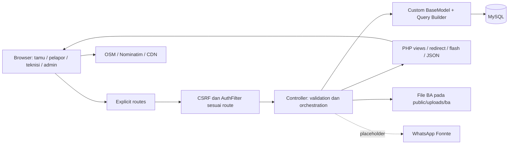

# Project Audit Report

Tanggal audit: **10 September 2026**. Project: **IPSRS RSUD Kota Yogyakarta — manajemen sarana, prasarana, dan aset nonmedis**.

Basis audit: working tree `D:\Skripsi\Project_App`, HEAD `9dfc1d4`, bukan hanya isi commit tersebut. Referensi `path:line` menunjuk posisi pada working tree saat audit. Laporan ini merupakan assessment, **bukan catatan bahwa perbaikannya sudah dilakukan**.

## Executive Summary

**Project ini sudah memiliki bentuk sistem CMMS yang saling terhubung, tetapi belum layak disebut sistem final yang solid atau production-ready.** Katalog dan unit fisik, laporan kerusakan, pekerjaan preventif, stok, kanibal, mutasi, peminjaman, penghapusan, dan pelaporan sudah memiliki implementasi nyata. Pilihan monolit CodeIgniter dan MySQL masuk akal untuk skala skripsi serta shared hosting.

Masalah utamanya berada pada sambungan antarmodul: siapa yang boleh melakukan tindakan, kapan tindakan boleh dilakukan, status aset yang harus dihasilkan, dan apa yang terjadi jika salah satu penulisan database gagal. Contoh paling jelas: konfigurasi lifecycle menetapkan lima status, tetapi penyelesaian LK masih menulis `Aktif`; form peminjaman tidak menyertakan CSRF; penghapusan LK bisa mengembalikan stok sebelum penghapusan tiket berhasil; beberapa isian pemeriksaan preventif hilang walaupun pengguna mendapat pesan berhasil.

**Klasifikasi: functional MVP dengan beberapa workflow inti yang masih partially implemented / implemented but problematic.** Fondasinya cukup untuk dilanjutkan, sehingga tidak ada alasan melakukan rewrite framework atau memecah menjadi microservices. Namun finalisasi harus mendahulukan correctness, authorization, keamanan unggahan, transaksi, dan evidence pengujian, bukan penambahan tampilan baru.

Laporan awal memuat **36 temuan: 1 P0, 19 P1, 14 P2, dan 2 P3**. Bukti logical dump database aktual yang diterima setelah audit menambahkan **F37 (P2)** tanpa mengubah severity awal 36 finding tersebut. P0 unggahan BA adalah blocker dengan dampak eksekusi kode **bersyarat pada konfigurasi hosting**; audit tidak membuktikan exploit production telah terjadi. ID temuan tetap dipertahankan meskipun urutannya dikelompokkan menurut prioritas.

Verifikasi yang dilakukan:

- Membaca struktur dan implementasi lintas seluruh kelompok modul: **17 file controller, 18 file model, 33 page view**, layout, helper, library, filter, konfigurasi, route, SQL/migration, script operasional, dan tests.
- Membandingkan kode dengan README, PROJECT_STATE, REVISION_LOG, UAT, panduan per modul, panduan gabungan, dan konteks di `AI/PROJECT_CONTEXT.md`. Dokumen Word diperiksa isi teks/strukturnya; ada 18 media tertanam. Kesesuaian visual setiap screenshot terhadap UI live belum diverifikasi.
- **142 file PHP di `app` dan `tests` lolos syntax lint.** PHPUnit: **47 tests, 50 assertions, PASS** dengan `--no-coverage --no-logging --do-not-cache-result`.
- Probe terisolasi memakai database SQLite `:memory:` dan framework lokal untuk menguji kalkulasi waktu, mutasi stok, nomor urut, tipe sel spreadsheet, pemilihan filter, dan penentuan ekstensi unggahan. Tidak ada fixture yang dimasukkan ke database aplikasi/production.
- Advisory dependency diperiksa melalui sumber resmi maintainer. Tidak ada `composer update`, instalasi dependency, migrasi, upload, atau exploit ke hosting.

Batas kesimpulan:

- Hosting sudah disebut dalam konteks project: `https://ipsrs-rsud-jogja.my.id`, cPanel/Rumahweb. **Deployment yang sedang berjalan, DDL production terbaru, konfigurasi PHP/Apache, cookie aktual, TLS, backup, dan data operasional tidak diinspeksi langsung dalam audit ini.** Ter-hosting tidak otomatis membuktikan kesetaraan source dan schema.
- `cpanel_constraints.txt`, `local_constraints.txt`, dump SQL, dan narasi eksekusi SQL adalah snapshot/evidence historis, bukan hasil introspeksi production tanggal audit.
- Tidak dilakukan E2E browser, uji perangkat mobile riil, concurrency MySQL dengan dua koneksi, atau load test. Temuan UI berasal dari kontrak HTML/JS/controller; dampak spesifik runtime diberi batas yang sesuai.
- Riwayat percakapan AI digunakan sebagai konteks keputusan, bukan sebagai bukti bahwa fitur berhasil. Tidak diklaim seluruh byte arsip percakapan, library vendor, atau aset biner ditelaah satu per satu. Framework vendor dibaca khusus ketika semantiknya menentukan validitas temuan.
- Perubahan working tree yang sudah ada sebelum audit, termasuk dua file unit test dan dokumen Word, tidak dianggap sebagai hasil perubahan audit. Source tidak diperbaiki pada tahap ini.

## 1. System Understanding

### Purpose dan pengguna

Sistem membantu IPSRS menerima keluhan kerusakan fasilitas, mendistribusikan pekerjaan, mencatat pemeriksaan/perbaikan, menjadwalkan pemeliharaan, memantau persediaan komponen, serta menelusuri lifecycle unit aset. Batas akademiknya adalah **sarana/prasarana dan alat nonmedis**, sesuai `REVISION_LOG.md:8` dan `docs/style_guide.md:11`.

Peran yang tampak dalam desain:

| Pengguna | Kebutuhan | Implementasi akses saat audit |
| --- | --- | --- |
| Tamu/staf tanpa akun | Lapor kerusakan; scan QR dan kirim lokasi perangkat | Portal dan scan/ping publik |
| Pelapor internal | Membuat dan memantau laporan sendiri/unit | Form khusus dan filter daftar; object authorization belum memadai |
| Teknisi | Klaim/disposisi, survei, perbaikan, penggunaan komponen, LKP | Akses berbasis session; kepemilikan tugas belum ditegakkan |
| Admin/IPSRS | Master data, penugasan, inventory, lifecycle aset | Menu tersedia, tetapi endpoint belum membedakan admin dari semua akun |
| Kepala/pemberi persetujuan | Pengawasan, laporan, persetujuan tertentu | Nama persetujuan/cetak tersedia; bukan workflow approval dengan identitas terverifikasi |

Tidak semua nama role di dokumentasi merupakan role khusus yang benar-benar dijaga backend. Kolom `pengguna.role` dan validasi tambah user belum menjadi permission model yang ketat.

### Architecture dan data flow

Monolit MVC **CodeIgniter 4.7.2 / PHP 8.2+**, render HTML server-side, MySQL melalui Query Builder. Lingkungan audit memakai PHP 8.3.30. Tidak ada frontend SPA terpisah atau API REST bisnis lengkap. Interaksi browser menggunakan JavaScript inline, jQuery, Select2, DataTables, SweetAlert2, Chart.js, Signature Pad, Leaflet, dan QRCode.js.

`BaseModel` **tidak mewarisi CI Model** (`app/Models/BaseModel.php:11`). Ia menyediakan CRUD, Query Builder, UUID, nomor urut, serta retry. Konsekuensinya: tidak ada otomatisasi `allowedFields`, timestamps, soft delete, callback, atau validation milik CI Model kecuali dibuat sendiri. Whitelist controller adalah pengaman payload yang benar-benar dipakai.

Hub domain utama adalah **unit fisik `aset_series`**, bukan katalog `aset`. Nama jenis/kategori milik katalog; identitas inventaris, spesifikasi unit, lokasi, kondisi, status, dan last-seen milik series. LK, komponen, mutasi, pinjam, dan BA seharusnya menunjuk unit fisik. Pemisahan ini sudah menjadi arah implementasi, tetapi beberapa view dan script masih membaca struktur sebelum pemisahan.

### Modul dan tabel

| Domain | Tabel/komponen utama | Relasi dan batas |
| --- | --- | --- |
| Aset | `aset`, `aset_series`, `master_lokasi` | Katalog 1:N series; series N:1 lokasi |
| Corrective maintenance | `laporan_kerusakan`, `detail_suku_cadang_lk`, `detail_vendor_lk` | LK dapat terkait series; detail terkait LK |
| Preventive maintenance | `jadwal_preventif`, `lembar_kerja_preventif`, `detail_checklist_lkp`, `template_checklist` | Jadwal → LKP → detail; kategori memuat template |
| Inventory | `barang_persediaan`, `riwayat_transaksi_stok` | Saldo tersimpan dan ledger per barang |
| Kanibal | `riwayat_kanibal`, `komponen_aset` | Donor/penerima series; pencatatan parts ke LK |
| Lifecycle | `riwayat_lokasi_aset`, `peminjaman_aset`, `penghapusan_aset` | Histori perpindahan, peminjaman, dan BA |
| Master/access | `pengguna`, `kategori_aset`, `kode_kerusakan`, `vendor` | User session; master dropdown |
| Evolusi spesifikasi | `atribut_spesifikasi_definisi`, kolom JSON/import | Ada pada script DDL; belum menjadi modul konfigurasi dinamis lengkap |

Ini pemetaan schema yang dimaksud kode dan script evolusi, **bukan klaim bahwa semua tabel/constraint sudah tersedia identik pada production**.

## 2. Requirement & Feature Completeness

Status di bawah menilai kontrak bisnis dan implementasi, bukan hanya keberadaan halaman. Requirement diturunkan dari revisi penguji, panduan modul, UAT, dan perilaku yang ditawarkan UI; belum ada satu SRS final dengan requirement ID dan acceptance criteria yang konsisten.

| Fitur | Assessment | Bukti / gap utama |
| --- | --- | --- |
| Login/logout | Implemented but problematic | Hash password dan session regeneration ada; throttling dan revocation akun aktif belum ada |
| Registrasi publik | Sengaja dinonaktifkan | `Auth::register/doRegister` melempar 404; view/route masih tersisa. Bukan missing fitur wajib |
| RBAC admin/teknisi/pelapor | Implemented but problematic | Sidebar dan sebagian guard LK ada, mayoritas endpoint hanya cek login [F02] |
| Katalog dan series CRUD | Implemented but problematic | Identitas unit/nomor unik ada; beberapa detail membaca field parent lama [F24] |
| Master lokasi | Partially implemented | Model/dropdown/relasi ada; tidak ada route pemeliharaan master lokasi, perubahan lokasi belum seragam [F12, F30] |
| Portal pelaporan publik | Implemented but problematic | Membuat LK nyata; dapat mengubah status/lokasi legacy aset sebelum tiket tersimpan [F07] |
| Laporan internal | Implemented but problematic | Relasi unit aset saat create sudah dipulihkan dan diuji HTTP terisolasi; browser smoke serta guard lifecycle/authorization masih terbuka [F08, F09] |
| Klaim/disposisi/survei | Implemented but problematic | Klaim ada; GET mutation, race claim, assignment dan state guard lemah [F09, F16] |
| Proses I/II/III | Implemented but problematic | Dipilih dari status/detail parts/vendor saat update status; tidak selalu langsung konsisten setelah tambah detail [F09] |
| Stok masuk/keluar | Implemented but problematic | Ada validasi qty/saldo awal; ledger dan saldo tidak atomik [F05] |
| Parts untuk LK | Implemented but problematic | Link parts dan pengurangan ada; duplicate request/failure/closed-ticket tidak aman [F05, F06, F09] |
| Vendor pekerjaan | Partially implemented | Tambah catatan vendor; tidak ada update entry untuk mencatat kepulangan pada entry kirim yang sama [F27] |
| Jadwal preventif | Implemented but problematic | Jadwal sekali waktu; aset tidak diwajibkan backend, belum ada edit/reschedule/cancel [F13, F30] |
| LKP checklist | Implemented but problematic | Inspeksi/service/pengukuran nyata; jawaban Teks dan beberapa field wajib UI hilang [F14] |
| PM → corrective | Implemented but problematic | Auto-LK ada; tidak atomik, tidak idempotent, tidak punya lineage LKP→LK eksplisit [F13] |
| TTD LK | Partially implemented | Gambar canvas base64; bukan persetujuan terautentikasi atau signature kriptografis [F15] |
| TTD/nama pengguna LKP | Partially implemented | Nama ada di UI/result, tidak disimpan; canvas TTD LKP tidak ditemukan [F14, F15] |
| Kanibalisasi | Implemented but problematic | History + detail parts ada; validasi donor/komponen/penerima/approval belum utuh [F11] |
| Mutasi | Implemented but problematic | History dan update lokasi ada; legacy status dan jalur edit melanggar kontrak [F10, F12] |
| Peminjaman/pengembalian | Partially implemented | Controller/tabel/list ada; form POST terhambat CSRF dan tidak ada guard lifecycle [F03, F10] |
| Rusak berat/penghapusan/BA | Partially implemented | Tombol route putus, upload tidak aman, EOL dapat diubah kembali [F01, F04, F10] |
| Approval formal | Missing sebagai workflow | `disetujui_oleh` berupa input string; tidak ada state permintaan/persetujuan/penolakan dengan actor dan timestamp [F11, F15] |
| Maintenance history | Partially implemented | Histori LK/kanibal/lokasi ada; riwayat perubahan status dan history PM terpadu per aset belum lengkap |
| Dashboard/SLA/rekap | Implemented but problematic | KPI dan export ada; response time dapat salah, periode campuran, snapshot tidak stabil [F17, F25] |
| Export Excel/print LK dan PM | Implemented but problematic | File/print benar-benar dibuat; formula injection dan N+1 perlu ditangani [F34, F25, F26] |
| Export stok/mutasi/custom date range | Missing dibanding panduan | Panduan admin mengklaimnya; route implementasi belum ditemukan |
| Notifikasi WhatsApp | Partially implemented / placeholder | Token/target placeholder dan caller tidak mengecek hasil [F22] |
| Sirene/real-time push | Missing dibanding panduan | Tidak ditemukan polling/websocket/event stream/audio untuk klaim tersebut [F22] |
| QR + lokasi browser | Implemented but problematic | GPS/radius UI nyata; display pakai parent lama, GPS bukan bukti posisi aset [F18, F24] |
| Import Excel | Script operasional, bukan fitur aplikasi aman | Path lokal hardcoded dan truncate data; jangan dianggap importer produksi [F21] |

Tidak adanya recurring scheduler, password reset email, atau approval berjenjang tidak otomatis salah untuk skala skripsi. Yang wajib adalah menyatakan scope final, menyediakan alternatif operasional yang masuk akal, dan tidak mengklaim fitur yang belum diimplementasikan.

## 3. End-to-End Workflow Audit

### A. Portal publik → laporan → survei → selesai

1. `Portal::lapor` memuat semua series ke dropdown (`Portal.php:11`). UI menawarkan aset opsional.
2. POST `/lapor` masuk tanpa auth dan tanpa filter CSRF yang terpasang pada route tersebut, meskipun form menampilkan `csrf_field()`.
3. Controller memvalidasi empat field wajib. Untuk aset terpilih, ia langsung mengubah status menjadi `Dalam Perbaikan` dan menulis kolom `lokasi` lama, **sebelum** membuat LK (`Portal.php:43`).
4. `LKModel::createWithRetry` membuat nomor order, lalu redirect ke sukses.
5. Teknisi membuka detail, klaim/disposisi, melengkapi data dan memperbarui status. Syarat kelengkapan dan tombol di view tidak semuanya diwajibkan server.
6. Saat selesai, controller menghitung waktu, menyinkronkan status aset, lalu menyimpan LK. Status aset hasilnya `Aktif`, yang tidak cocok dengan lifecycle baru.

**Assessment:** alur masuk tersedia, tetapi batas antara laporan belum diverifikasi dan perubahan master aset belum jelas. Laporan spam/duplikat terhadap aset dipinjam/dihapuskan bisa mengubah state bisnis. Jika insert LK gagal, aset dapat tetap berubah. Selesainya satu LK juga tidak memeriksa LK aktif lain pada series yang sama. Lihat [F07, F09, F10, F17].

### B. Pelaporan internal → link series → penanganan

Form admin/teknisi mengirim `id_aset` (`pages/lk/form.php:102`); `LK::store` tidak mengambil field tersebut dan membaca `$post` yang belum didefinisikan (`LK.php:97,112`). `empty()` menyebabkan jalur null tanpa warning wajib. **Aset yang sudah dipilih hilang relasinya.** Form pelapor yang memakai nama manual adalah keputusan UX berbeda dan tidak otomatis bug; bug berlaku pada form yang benar-benar menawarkan dropdown.

Di browser, `updateAsetInfo()` didefinisikan di dalam IIFE tetapi dipanggil inline dari HTML; `inpLokasi` juga belum didefinisikan (`form.php:154,180,185`). Auto-fill lokasi dan warning perpindahan tidak reliable. Workaround melengkapi detail setelah tiket dibuat bukan bukti create flow sudah benar. [F08]

### C. Gudang → parts LK → stok → pembatalan/penghapusan

Input qty dicek terhadap saldo yang dibaca controller. Detail parts diinsert, kemudian `StokModel::catatTransaksi` menulis ledger, baru memperbarui saldo dengan conditional update. Tidak ada satu transaksi yang meliputi ketiganya.

Contoh interleaving: saldo 5; request A dan B sama-sama membaca 5 dan meminta 4. A menyisakan 1. B membaca 1 di model, menghitung `max(0,1-4)=0` dan berhasil. Ledger mencatat keluar total 8 walaupun persediaan hanya 5. Probe model di memori mereproduksi keadaan akhirnya. Conditional update membantu menghindari lost update, tetapi **tidak menjamin stok cukup dan ledger konsisten**. [F05]

Penghapusan LK melakukan stok masuk untuk seluruh detail sebelum delete tiket. Detail kanibal mempunyai `id_barang=null`; ledger gudang mewajibkan ID barang. Pada tiket campuran, beberapa stok dapat sudah kembali sebelum error. FK history kanibal atau kegagalan delete lain juga bisa meninggalkan pengembalian parsial. Retry tindakan yang sama dapat menambah stok lagi. Penghapusan pekerjaan selesai juga menyamakan penghapusan arsip dengan kembalinya komponen secara fisik. [F06]

### D. Jadwal → LKP → template → LK temuan

Jadwal dibuat dari asset ID, nama/lokasi hidden, teknisi, tanggal/jam. Backend hanya mewajibkan teknisi/tanggal/jam. Saat LKP disimpan: create header → insert details → tambah template baru → jadwal selesai → jika perlu perbaikan, create LK.

Tidak ada commit atomik atau pembatasan satu submission per jadwal. Form berulang dapat menghasilkan LKP/LK berulang; kegagalan akhir bisa meninggalkan jadwal sudah selesai tanpa tindak lanjut. Endpoint `selesai` tetap dapat melewati checklist. Nama user dan kesesuaian lokasi tidak disimpan; hasil tipe Teks juga hilang. Tampilan hasil mengambil LKP terbaru, sehingga versi sebelumnya tidak mudah ditelusuri dari jadwal. [F13, F14]

Auto-template adalah aturan insert berbasis kategori/nama/jenis, **bukan machine learning**. Tabel detail sudah merupakan snapshot yang berguna; pertahankan sifat snapshot itu sambil memperjelas versi template dan approval perubahan jika dibutuhkan.

### E. Kerusakan berat → kanibal → penerima → LK

Desain revisi: donor `Rusak Berat`, komponen diambil tanpa otomatis menghapus unit, lalu unit bisa menjalani penghapusan ber-BA. Implementasi masih memakai filter donor `Kanibal` di sebagian UI, sedangkan config baru tidak memiliki status itu. POST menerima donor/penerima/order/nama komponen dari browser; hanya donor eksis dan donor berbeda penerima yang diperiksa secara khusus.

History tercipta, detail LK tercipta, lalu komponen donor pertama dengan substring nama cocok ditandai `Tidak Ada`. Tidak ada pencatatan instalasi komponen penerima, pengurangan `jumlah` komponen, pembatasan komponen yang sudah tidak ada, atau persetujuan berbasis session pemberi persetujuan. `id_lk` dan `no_order_lk` dapat merujuk pekerjaan berbeda. [F11]

### F. Mutasi → master lokasi → history

Form mutasi mengirim tujuan; controller mengambil data master lokasi, mencatat history dan kemudian mengubah series. Tetapi edit series dapat langsung mengganti `id_lokasi` tanpa history. Jalur LK/portal justru menulis string `lokasi` lama, sementara pembacaan mengambil `ml.nama_ruangan AS lokasi`. Akibatnya user bisa diberi pesan lokasi berhasil diperbarui, tetapi tampilan masih mengambil nilai master lama. [F12]

Histori teks yang disimpan saat kejadian adalah ide yang benar. Histori tidak boleh ditulis ulang dari kondisi master saat ini; laporan PM masih berpotensi melakukan hal itu. [F25]

### G. Peminjaman → pengembalian → penghapusan

UI memusatkan aksi di detail series, tetapi dua form modal tidak mengirim token CSRF. Pemanggilan native `form.submit()` juga melewati validasi constraint browser. Setelah request buatan dengan token valid, backend masih tidak memeriksa status asal, eksistensi pinjaman aktif, tanggal, atau hak admin. GET pengembalian menyelesaikan semua pinjaman aktif lalu menulis `Tersedia`, bahkan bila tidak ada pinjaman. [F03, F10, F16]

Tombol tandai rusak dan lihat BA menunjuk route yang tidak ada. Upload BA menerima file valid secara transport tanpa kebijakan jenis/ukuran. State `Dihapuskan` belum benar-benar terminal di backend. [F01, F04, F10]

### H. Dashboard → rekap → dokumen

Dashboard dan rekap memuat seluruh data lalu menghitung KPI di PHP. Formula matematika dasar ada, tetapi input KPI dapat tidak valid: RT 0 diperlakukan kosong; RT yang tidak tercatat diganti downtime; timestamp selesai dapat dikirim pada status yang belum selesai. PM memakai periode bulan berjalan walaupun filter LK minggu/tahun. Dokumen PM dapat membaca lokasi terbaru, sehingga laporan lama berubah setelah mutasi. [F17, F25, F26]

## 4. Business Logic

Invarian bisnis berikut belum dijaga seragam:

| Invarian yang diperlukan | Kondisi kode |
| --- | --- |
| Pelapor tidak boleh mengelola akun/master/stok | Mayoritas route hanya melalui auth session |
| Teknisi hanya mengerjakan tugas sesuai kewenangannya | Tidak ada assigned-user check pada update LK/LKP |
| Status aset berasal dari daftar lifecycle yang sama | Mapping LK/mutasi masih menghasilkan nilai lama |
| Aset dihapuskan tidak dapat dipinjam/diaktifkan kembali biasa | Return, pinjam, portal, mutasi, dan sync LK tidak memeriksa terminal state |
| Satu unit tidak mempunyai dua pinjaman aktif | Tidak ada guard atomik atau constraint khusus |
| Saldo = saldo awal + total masuk − total keluar sah | Ledger dan saldo dapat commit terpisah; pengurangan memakai clamp |
| Penggunaan komponen harus terkait LK dan aset penerima yang sama | ID dan nomor LK dikirim terpisah dan tidak dicocokkan |
| Jadwal selesai mempunyai hasil inspeksi sah | Endpoint selesai bisa bypass; items LKP boleh kosong/manipulatif |
| Penutupan membutuhkan evidence tindakan/serah-terima | Sebagian requirement hanya di browser |
| Perpindahan lokasi tercatat sebagai event | Update series bisa langsung mengubah FK lokasi |
| Informasi historis tidak berubah karena master berubah | Export membaca sebagian data terkini; tidak ada audit perubahan status |

Rekomendasi arsitektural yang proporsional: tetapkan satu permission matrix, satu kebijakan transisi per domain, dan operasi atomik untuk perubahan multi-tabel. Bisa dimulai dari method aplikasi yang terfokus. Tidak perlu generic workflow engine atau repository interface di setiap model.

## 5. Database & Data Integrity

### Yang sudah mendukung integrity

- SQL dasar mempunyai PK, unique email/kode/nomor inventaris/no-order, FK detail LK dan LKP, serta index status/tanggal (`2026-07-01-100000_full_mysql_schema.sql:72,116,150,244`). Tidak benar jika dikatakan database ini sama sekali tidak memakai constraint.
- Pemisahan `aset` dan `aset_series` serta FK series→katalog `RESTRICT` adalah arah normalisasi yang tepat.
- Ledger stok, snapshot nama barang/vendor, history lokasi, dan detail checklist memberi struktur penelusuran yang berguna.
- `ERD_FIX_SCRIPT.sql` mencoba menambahkan FK lifecycle, enum status, relasi lokasi, dan referensi template. `apply_ddl2.php` mencoba FK jadwal dan unique katalog. Status pemasangannya harus diverifikasi, bukan disimpulkan dari keberadaan script.

### Gap yang mempengaruhi bisnis

1. **Schema belum reproducible dari satu jalur instalasi.** Schema awal, tiga variasi migrasi series, satu migration PHP, script DDL root, serta patch ERD/TTD tidak membentuk urutan terversi yang terbukti dapat dijalankan dari database kosong. Folder `app/Database/igrations` duplikat dengan salah eja; raw SQL dalam `Migrations` bukan migration class yang otomatis dijalankan `spark migrate`. [F20]
2. **Status enum tidak menyelesaikan state machine.** Enum hanya membatasi nilai akhir; ia tidak memastikan `Dihapuskan` tidak kembali ke `Tersedia`. Dalam kasus ini enum justru berkonflik dengan nilai yang masih ditulis controller. Dengan strict mode dapat error; tanpa strict enforcement bisa coercion/warning. Mode server production belum diketahui. [F10]
3. **Relasi identitas pengguna masih berupa nama.** `pelapor`, `teknisi`, `petugas`, `disetujui_oleh` bukan FK actor yang stabil. Nama boleh sama/berubah. Snapshot nama bagus untuk cetakan, tetapi bukan pengganti ID untuk authorization. [F02, F11, F15]
4. **Tidak ada constraint per operasi untuk mencegah duplikasi bisnis.** Unique nomor order tidak mencegah dua LK untuk submission PM yang sama, dua pinjaman aktif, atau pengambilan komponen yang sama dua kali. [F05, F10, F11, F13]
5. **Cascade perlu kebijakan retensi.** Delete LK menghapus detail parts/vendor; delete barang pada schema dasar menghapus ledger; delete jadwal membuat FK LKP null. Tidak semua master mempunyai endpoint delete, sehingga risiko cascade tertentu laten, bukan insiden yang sudah terbukti. Retensi perlu diputuskan per tabel, bukan mengganti semuanya ke soft delete secara membabi buta.
6. **Natural key dan nullable unique.** FK kategori/kode yang ditambahkan manual dapat membantu konsistensi. Namun `master_lokasi` memakai unique gabungan dengan `lantai` nullable (`ERD_FIX_SCRIPT.sql:82`); rerun seed tidak boleh diasumsikan idempotent hanya karena `INSERT IGNORE`. MySQL dapat menyimpan lebih dari satu kombinasi dengan bagian NULL. Normalisasi nilai dan post-migration reconciliation diperlukan.
7. **Script import mengabaikan relasi operasional.** Truncate series/katalog dengan FK dimatikan dapat menyisakan LK/PM/history yang menunjuk ID lama. Ini risiko data loss bila script dijalankan pada database berisi transaksi, bukan tindakan yang dilakukan auditor. [F21]

Query audit data yang perlu dijalankan read-only pada salinan production: perbandingan saldo vs ledger, jumlah pinjaman aktif per series, aset terminal dengan transaksi aktif, LK selesai tanpa evidence/waktu sah, LKP tanpa detail, duplicate LKP per jadwal, donor komponen sudah tidak ada tetapi dipakai ulang, serta seluruh FK/index/enum terhadap schema final. Audit ini belum memiliki hasil reconciliation data production tersebut.

## 6. Security

| Area | Assessment evidence-based |
| --- | --- |
| Authentication | `password_verify`, hash dan regeneration ada. Login tidak mempunyai throttle aplikasi; akun nonaktif dicek saat login saja [F23] |
| Authorization/RBAC | Kelemahan nyata: akun biasa dapat mengakses fungsi admin; perubahan role tersedia tanpa admin guard [F02] |
| Object authorization | Detail LK tidak memeriksa ownership/unit; UUID bukan permission [F02] |
| CSRF | Sebagian POST internal dilindungi. Portal tidak termasuk; claim/return/logout adalah GET mutation; form lifecycle kehilangan token [F03, F16] |
| XSS | Mayoritas output memakai `esc`. Sink JS/DOM tertentu tetap tidak aman: flash `addslashes` dan satuan template ke `innerHTML` [F19] |
| SQL injection | Tidak ditemukan raw SQL yang menggabungkan input pengguna menjadi query bisnis secara jelas. Query Builder/parameter binding dominan. Ini hasil review, bukan pembuktian kebal semua payload |
| Mass assignment | Whitelist merupakan kontrol positif. Masalah utama justru field yang diizinkan tetapi tidak boleh diubah role tersebut, dan field yang tidak divalidasi secara semantik |
| Upload | Validasi tipe/ukuran hilang; file berada di web root; PHP extension dapat dipertahankan [F01] |
| Path traversal | Nama file BA dibuat server, mengurangi traversal melalui nama asli. Tidak ditemukan endpoint download memakai path mentah. Namun execution/content policy masih tidak aman |
| Command injection | Tidak ditemukan route aplikasi yang menjalankan perintah shell dari parameter user. Script root mempunyai risiko operasional terpisah [F21] |
| JSON endpoint | Ping memvalidasi angka/range/existence, tetapi tidak menjamin identitas pemindai atau kebenaran GPS; malformed JSON perlu contract 400 [F18] |
| Error/log | Banyak raw exception dikembalikan ke pengguna; diagnostic public terpisah dari filter [F23] |
| Session/cookie | File session wajar untuk satu host. `Cookie.secure=false` dan HTTPS enforcement perlu verifikasi deployment, terutama advisory framework [F23, F28] |
| Export | Field teks dapat menjadi formula Excel [F34] |

Koreksi penting terhadap asumsi yang mudah salah:

- **`old()` pada CI4 terpasang sudah memakai escaping HTML secara default** (`vendor/codeigniter4/framework/system/Common.php:847`). Penggunaan `old()` tanpa `esc()` tambahan tidak otomatis XSS. Tidak dimasukkan sebagai vulnerability.
- **Ping tetap mendapat filter CSRF.** `except` pada `Config\Filters::$filters['csrf']` tidak diproses sebagai exclusion oleh framework terpasang (`system/Filters/Filters.php:782`). Probe menunjukkan `before:["csrf"]`. View scan saat ini memang mengirim header CSRF (`scan.php:171`), sehingga tidak benar menyimpulkan semua ping selalu gagal karena tanpa token.
- Registrasi publik mengembalikan 404; tidak ada bukti akun admin dapat dibuat melalui register anonim. Jalur eskalasi yang ditemukan memakai **akun yang sudah login** dan endpoint manajemen pengguna.
- Tidak ada exploit destruktif, unggahan script, pembacaan data sensitif hosting, atau percobaan login kredensial contoh yang dilakukan.

## 7. Frontend & UX

UI mempunyai dasar yang layak: terminologi domain, layout/sidebar bersama, tabel dengan overflow horizontal, empty state pada sebagian besar daftar, badges, feedback flash, confirmation, dan form khusus pelapor. Memusatkan lifecycle di detail unit adalah keputusan yang baik.

Masalah yang benar-benar menghambat:

- **Action tanpa jalur lengkap:** tandai rusak, lihat BA, edit series dari header, delete vendor, dan tautan ambil komponen dari detail tidak membawa user ke workflow yang dijanjikan. [F04]
- **Validasi gagal di jalur normal:** modal lifecycle kehilangan CSRF dan memanggil `form.submit()` tanpa `reportValidity()`; required HTML tidak melindungi jalur itu. [F03]
- **Isian hilang:** nama perwakilan, lokasi sesuai, hasil Teks, dan catatan jadwal tidak mengikuti apa yang ditawarkan UI. Form pelapor juga tidak memulihkan isi keluhan setelah validation error. [F14, F29]
- **Kondisi/state membingungkan:** `Rusak Berat` sebagai kondisi tidak otomatis menghasilkan status yang membuka aksi EOL; selesai LK menghasilkan `Aktif` sementara tombol pinjam hanya untuk `Tersedia`. [F10]
- **Detail salah sumber:** merk/model/kapasitas/tahun serta scan lokasi/kondisi membaca variabel parent lama. Ini bukan sekadar warna/tata letak. [F24]
- **Tidak ada jalur resmi reschedule PM** walaupun dashboard mengatakan perlu dijadwalkan ulang. Vendor yang baru dikirim juga tidak mempunyai update entry kepulangan. [F27, F30]
- **Feedback global dapat menyesatkan:** listener loading mengunci tombol sebelum mengetahui submit dibatalkan; cancel confirmation dapat meninggalkan tombol loading. [F29]

Accessibility belum mempunyai evidence pengujian keyboard/screen reader. Banyak label tanpa pasangan `for/id`, icon action tanpa accessible name yang jelas, modal tanpa manajemen fokus yang eksplisit, dan scan melarang zoom (`scan.php:5`). Perlu pengujian terarah, bukan redesign besar. Responsiveness CSS ada, tetapi belum dapat diberi status lulus mobile tanpa pengujian perangkat/viewport. [F31]

## 8. Error Handling & Edge Cases

| Skenario | Perilaku / risiko saat ini | Target yang perlu dibuktikan |
| --- | --- | --- |
| Input required kosong | Banyak form memakai `validateOrFail`; lifecycle/parts nested lebih lemah | 422/redirect validasi, field error jelas, input tetap ada |
| Invalid enum/tanggal/ID | Sering hanya required, atau langsung bergantung DB | Domain validation sebelum mutation |
| Record tidak ditemukan | Sebagian redirect; `BaseModel::update` bisa return payload walau 0 record | 404/feedback missing resource, tanpa sukses palsu |
| Duplicate submit | Loading UI saja, tidak ada operation key | Efek satu kali atau duplicate ditolak aman |
| Dua teknisi klaim | Read-before-write tanpa conditional claim | Tepat satu pemenang, lainnya conflict |
| Stok berubah setelah form dibuka | Validasi snapshot terpisah; clamp dapat menyembunyikan shortage | Conditional debit/lock + transaksi ledger-detail |
| LK dihapus/gagal di tengah | Restock mendahului delete, tidak ada rollback | Tidak ada saldo berubah jika operasi dibatalkan |
| PM gagal membuat LK | Header/detail/jadwal mungkin sudah tersimpan | Atomik atau pending-followup dengan retry idempotent |
| File gagal upload | Invalid file dapat dilewati menjadi null; DB tetap diinsert | Error sesuai kebijakan BA wajib/opsional dan cleanup file |
| Session expired | Redirect login, URL asal GET tidak tersimpan karena case method | Kembali ke halaman tujuan dengan batas keamanan; data form dipulihkan seperlunya |
| Akun diblokir saat masih login | Session tidak membaca ulang status aktif | Session dicabut/dibuktikan invalid |
| API notifikasi gagal | Return false diabaikan; sukses tiket tetap diumumkan | Tiket berhasil dan notifikasi gagal dibedakan, ada retry bila scope memerlukan |
| CDN/network offline | Banyak fitur interaksi tergantung script eksternal | Fallback yang dapat dipakai atau resource build lokal |
| Refresh/back setelah selesai | PRG membantu; operasi ulang masih bisa dikirim manual | Guard status/version dan response conflict |

`validateOrFail()` sudah memberi dasar konsistensi yang bagus. Tetapi exception database mentah sebaiknya masuk log dengan identifier kejadian; UI menerima pesan yang bisa ditindaklanjuti. Mengganti semua exception dengan pesan sukses/gagal generik tanpa memperbaiki transaksi juga tidak cukup.

## 9. Testing

### Evidence yang tersedia

Command audit: `rtk php vendor/bin/phpunit --no-coverage --no-logging --do-not-cache-result`.

Hasil: **PASS, 47 tests / 50 assertions**, PHP 8.3.30, PHPUnit 10.5.63. Syntax lint `app` dan `tests`: **142 file, 0 failure**.

Coverage nyata yang terbaca:

- `MetricsTest`: batas stok, selisih menit normal/nol/lintas hari/invalid, nomor urut helper, SLA.
- `UiHelperTest`: formatting tanggal/jam dan kelas badge.
- `BaseModelTest`: `extractRow` dan format nomor LKP pada tabel kosong. Fixture test dibuat dalam database memori; bukan schema produksi penuh.
- `HealthTest`: bootstrap/base URL.
- `ExampleDatabaseTest` dan `ExampleSessionTest`: contoh framework, **bukan** integration test domain IPSRS. Soft delete pada example model tidak membuktikan model aplikasi memakai soft delete.
- UAT berupa daftar pemeriksaan belum tercentang dan tanpa identitas tester/tanggal/hasil/evidence. Tidak ditemukan suite E2E/browser atau CI workflow yang menjalankannya sebagai release gate.

Coverage persentase **tidak diukur**; eksekusi sengaja memakai `--no-coverage`. Tidak tersedia bukti bahwa 47 tests mencakup 47 workflow. `phpunit.xml.dist` meminta coverage dan `failOnWarning=true`; jalur default perlu environment driver coverage agar hasil exit code konsisten.

### Probe tambahan tanpa mengubah test/source

| Probe | Hasil |
| --- | --- |
| Nomor LKP, kosong → insert → nomor berikutnya | `LKP-202609-0001` → `LKP-202609-0002`: normal sequence bekerja |
| Nomor barang dengan B-999 dan B-1000 | Menghasilkan `B-1000` lagi: lexicographic boundary defect [F32] |
| Stok awal 5, model menerima dua debit 4 | Saldo 0, ledger keluar 8: konsistensi gagal untuk stale checks [F05] |
| RT sebelumnya 0, laporan 08:00, selesai 10:00 | RT menjadi 120, downtime 120: bug nol terkonfirmasi [F17] |
| `setCellValue` dengan teks `=1+1` | Cell data type `f`: teks diklasifikasikan sebagai formula, bukan string literal [F34]. Evaluasi di aplikasi spreadsheet tidak dijalankan |
| `request->getMethod()` | `GET`, sehingga perbandingan `'get'` di AuthFilter salah [F29] |
| Filter URL ping | CSRF masih terpasang meskipun ada `except` pada konfigurasi itu |
| UploadedFile extension, memakai file PHP lokal sebagai contoh metadata | Hasil `php`; nama random tidak otomatis menetralkan tipe executable [F01]. Tidak ada upload/move |

### Test yang wajib diprioritaskan

| Test | Mengapa / risiko | Jenis |
| --- | --- | --- |
| Seluruh mutation endpoint × tamu/pelapor/teknisi/admin | Eskalasi privilege dan akses lintas objek | Feature HTTP dengan session dan CSRF nyata |
| Corrective: create asset-linked → claim → survey → parts/vendor → sign → complete | Membuktikan satu workflow utuh, FK, status, SLA | Integration MySQL + browser |
| RT 0, null, lintas hari, timestamp mundur, close ulang | KPI skripsi bisa salah walaupun helper benar | Unit orchestration + feature |
| Dua debit bersamaan, shortage, insert gagal, retry | Saldo/ledger/detail harus tetap konsisten | Integration MySQL dua koneksi, fault injection |
| Delete/cancel LK dengan Gudang + Kanibal dan kegagalan FK | Mencegah stok bertambah tanpa pengembalian fisik | Integration transactional |
| Pinjam serentak, kembali tanpa loan, disposal lalu pinjam/portal/close LK | Menegakkan terminal state dan satu pinjaman aktif | Feature + DB constraints |
| LKP seluruh tipe termasuk Teks/0, lokasi tidak sesuai, submit dua kali | Mencegah jawaban hilang dan tiket duplikat | Feature + browser |
| BA type/size/content, failed move, unauthorized download | Execution/exposure/file orphan | Security feature test terisolasi |
| Migration dari kosong dan upgrade salinan schema lama | Reproducibility, FK/index/enum sinkron | Integration MySQL disposable |
| Export nilai berawalan formula, data kosong, setelah mutasi | Ketepatan laporan dan keamanan file | Export integration + verifikasi dokumen |
| Semua tombol/action termasuk cancel, validation fail, browser back | Bug route dan UX yang tidak tertangkap PHP lint | Browser smoke per role |

## 10. Documentation Consistency

Dokumentasi cukup luas sebagai narasi pengguna, tetapi belum dapat diperlakukan sebagai sumber kebenaran teknis final. Beberapa dokumen mendeskripsikan target revisi seolah sudah diterapkan menyeluruh. Contoh konkret:

| Dokumentasi mengatakan | Implementasi aktual | Assessment |
| --- | --- | --- |
| `REVISION_LOG.md:17`: lima status lifecycle | `IPSRS.php:95` dan `Aset::storeMutasi` masih menulis status lama | Konflik correctness, bukan kosmetik |
| `REVISION_LOG.md:20`: penghapusan read-only dengan BA | Endpoint lain dapat mengubah aset terminal; BA tidak divalidasi penuh | Requirement belum enforced |
| `REVISION_LOG.md:60`: constraint/enum/lokasi telah dieksekusi production | Ada script, tetapi tidak ada snapshot DDL final terkini yang diverifikasi audit | Klaim historis belum menjadi deployment evidence |
| `docs/01_modul_manajemen_aset.md:79`: semua perpindahan harus via mutasi | `Aset::updateSeries` langsung mengganti `id_lokasi`; LK menulis lokasi legacy | History tidak lengkap |
| `docs/01_modul_manajemen_aset.md:26`: merk/model katalog | Form/controller menyimpan spesifikasi di series; sebagian view tetap parent | Panduan dan view tertinggal migrasi |
| `docs/02_modul_laporan_kerusakan.md:35`: contoh nomor `PR...` | Nomor LK aktual `LK-YYYYMM-0001` | Contoh identifier salah |
| `docs/02_modul_laporan_kerusakan.md:36` dan `02b:40`: sirene segera berbunyi | Tidak ditemukan implementasi audio/push; WhatsApp placeholder | Fitur diklaim tetapi missing |
| `docs/02_modul_laporan_kerusakan.md:55`: teknisi lain tidak bisa mengambil pekerjaan | Klaim hanya read-check; assignment dapat ditulis ulang oleh akun nonpelapor | Jaminan concurrency/ownership berlebihan |
| `docs/02b_modul_user_pelapor.md:37`: memilih aset wajib dari dropdown | Form pelapor memakai nama manual opsional | Perbedaan workflow yang perlu diputuskan/didokumentasikan |
| `docs/03_modul_pemeliharaan_preventif.md:38`: istilah machine learning | Auto-save template berbasis string equality | Klaim akademik menyesatkan |
| `docs/04_modul_manajemen_suku_cadang.md:52`: pengurangan saat selesai | Stok dikurangi saat add parts, sebelum pekerjaan selesai | Waktu transaksi salah dalam panduan |
| `docs/04_modul_manajemen_suku_cadang.md:57`: setiap keluaran terkait tiket | Ada manual `stok/keluar`, nomor dokumen opsional | Scope penggunaan stok berbeda |
| `docs/05_modul_peminjaman_penghapusan.md:13`: Pinjam Baru dari daftar | Action berada di detail series; daftar hanya menampilkan catatan | Langkah panduan tidak dapat diikuti persis |
| `docs/06_modul_administrator.md:5,16`: admin-only, teknisi hanya tugas sendiri | Filter hanya auth, bukan role/assignment | Klaim keamanan belum benar |
| `docs/06_modul_administrator.md:52,56`: custom range, export mutasi/stok | Pilihan minggu/bulan/tahun; route export hanya LK/PM | Missing dibanding dokumentasi |
| `PROJECT_STATE.md:165`: tabel `lk`, `lkp`, `stok`, `mutasi` | Nama tabel aktual lebih lengkap di models | Dokumen teknis stale |
| `PROJECT_STATE.md:147`: export CSV | Route kini export Excel | Endpoint stale |
| `PROJECT_STATE.md:213`: selesai jadwal membuat LKP | `Preventif::selesai` hanya mengubah status | Perilaku tidak sesuai |
| `UAT_Checklist.md`: Nama Pengguna harus hilang | Field wajib masih di `lkp.php:159`, lalu diabaikan controller | Acceptance criteria saling bertentangan |
| `UAT_Checklist.md`: semua checklist lulus berarti siap 100% | Checklist tidak mencakup role matrix, transaksi/race, upload, deployment restore | Klaim kesiapan terlalu luas |
| README adalah CI starter | Tidak menjelaskan domain, schema final, akun bootstrap aman, deployment project | Onboarding belum mandiri |

Sebaliknya, implementasi memiliki manual stock-out, tipe checklist Teks, CSRF route khusus, sifat GPS browser, placeholder WA, FK lokasi, dan sifat nonkriptografis tanda tangan yang tidak dijelaskan memadai dalam panduan.

Dokumen Word berisi 18 media; **tidak disebut kosong atau tanpa screenshot**. Teks pembuka masih mempunyai placeholder nama penyusun/versi/tanggal. Layout dan ketepatan gambar terhadap build terbaru belum diverifikasi secara visual. Panduan gabungan dan Word adalah turunan, sehingga sumber konten per modul perlu ditetapkan agar koreksi tidak dilakukan terpisah pada banyak salinan.

Untuk skripsi, tambahkan matriks `requirement ID → desain → endpoint/model → constraint → test → evidence → limitation`, state diagram final, ERD yang dihasilkan dari schema final, runbook setup/deploy/restore, dan definisi KPI beserta rujukan SPO yang benar-benar dimiliki peneliti. `SLA_RESPONSE_TIME=15` di config membuktikan angka implementasi, bukan membuktikan validitas dokumen SPO eksternal.

## 11. Architecture & Code Quality

**Struktur monolit MVC layak dipertahankan.** Model per domain, layout bersama, helpers, dan konfigurasi status sudah memberikan organisasi awal yang baik. Kebutuhan sekarang adalah memperjelas kepemilikan aturan, bukan menambah lapisan abstraksi umum.

Debt yang paling berpengaruh:

- `Aset.php` menangani katalog, unit, mutasi, GPS, QR, pinjam, return, upload, BA, dan lifecycle. Raw database mutation dalam controller bercampur dengan model. Perubahan lifecycle mudah melupakan satu jalur.
- `LK.php` menggabungkan validation, assignment, status, stok, kalkulasi, sinkronisasi aset, dan notifikasi. Tidak ada batas transaksi tunggal.
- `Preventif::simpanLkp` menggabungkan lima operasi bisnis dan memperbarui template master dari hasil inspeksi tanpa domain boundary.
- `Laporan.php` menduplikasi filter/hydration antara Excel dan print. Drift periode, field, dan snapshot sudah menjadi akibat konkret.
- `pages/lk/show.php` sekitar 770 baris dan `pages/aset/show_series.php` sekitar 500 baris berisi presentasi sekaligus rule/action/JS. UI dan backend mempunyai definisi state sendiri.
- UUID dibentuk ulang di beberapa controller dan model dengan `mt_rand`. ID acak tidak boleh menjadi mekanisme authorization; gunakan generator standar ketika melakukan perbaikan terarah.
- `BaseModel` mengembalikan payload ketika update tidak menemukan record; `createWithRetry` menangkap semua RuntimeException, bukan hanya collision yang dapat diretry. Ini menyulitkan reasoning atas failure.
- Sisa API lama seperti `RiwayatKanibalModel::getByLk()` mencari PK history dengan ID LK, dan `JadwalModel::getByAset()` mencari kolom teks `aset`. Tidak ditemukan pemakaian aktif yang membuktikan bug user saat ini; tandai sebagai latent debt, bukan blocker aktif. [F33]

Tidak ditemukan bukti circular dependency yang menjadi masalah nyata. Menambah service container custom, event bus, CQRS, atau microservice belum beralasan. Ekstraksi kecil operasi stok/lifecycle/penyelesaian pekerjaan baru bernilai jika menjaga invarian dan memudahkan test.

## 12. Performance & Reliability

| Kategori | Bukti | Dampak / prioritas |
| --- | --- | --- |
| Pola aktual: fetch all | `Dashboard.php:22`, `LKModel.php:11`, `Preventif.php:21`, `Stok.php:18` | Semua history dimuat sebelum filter; SQL pagination belum ada. P2 |
| Pola aktual: payload yang tidak diperlukan | `LK::show` memuat seluruh daftar parts/aset/vendor/user, termasuk untuk pelapor | Waktu query/render dan memori membesar; kurangi sesuai role/kebutuhan. P2 |
| N+1 nyata secara struktur | `Laporan.php:122,194,225,271` lookup series/parent/detail per record | Query tumbuh proporsional jumlah row; Excel LK sekitar dua lookup tambahan per LK terkait aset, print dapat lebih. P2 |
| Loop bersarang view | `kanibal/riwayat.php:74` mencari donor di seluruh daftar aset | O(history × assets); map keyed-by-ID/join cukup. P2 |
| Risiko payload tanda tangan | `LKModel::getAll` SELECT seluruh kolom; `ttd_pelapor` LONGTEXT | List/dashboard ikut memuat gambar base64 walau tidak ditampilkan. P2 |
| Asset CDN runtime | `layout/main.php:7,19,30,33` | UI bergantung jaringan pihak ketiga; beberapa URL tidak dipin versi lengkap. P2 |
| Eksternal sinkron laten | `WhatsAppAPI.php:40` timeout 0 | Jika integrasi diaktifkan, request bisnis dapat menunggu tanpa batas yang ditetapkan aplikasi. P2 |
| Aggregate katalog | `AsetModel.php:14` GROUP_CONCAT status semua unit | Batas panjang agregat dapat membuat ringkasan tidak lengkap pada katalog besar; perlu ukur sebelum optimasi tambahan. P3/risk |

Belum ada angka latency, p95, throughput, memory peak hosting, EXPLAIN, atau dataset load test. Jadi laporan ini **tidak menyatakan situs live lambat dengan angka tertentu**. Pola query dan ketergantungan tersebut nyata; besarnya bottleneck belum diukur. DataTables client-side tidak mengurangi row yang sudah diambil dari database dan dikirim ke browser.

Caching semua halaman bukan solusi awal karena data role, CSRF, dan status pekerjaan bersifat personal/dinamis. Mulai dari proyeksi kolom, filter/query terarah, aggregation SQL, pagination, dan indeks yang didukung query plan. File cache/session di satu host masih wajar untuk skala project ini.

## 13. Academic / Thesis Readiness

| Pertanyaan penguji | Jawaban implementasi yang bisa dipertanggungjawabkan | Evidence/gap sebelum sidang |
| --- | --- | --- |
| Mengapa monolit MVC? | Satu sistem internal, deploy PHP shared hosting, domain saling terkait | Tulis trade-off dan deployment diagram; tidak perlu mengklaim distributed scalability |
| Mengapa parent/series? | Satu katalog mencakup banyak unit fisik dengan lokasi/riwayat berbeda | Rapikan view lama dan ERD final |
| Bagaimana authorization? | Session login dan beberapa pemeriksaan role manual | Belum layak mengklaim RBAC utuh sebelum matrix negatif lulus |
| Bagaimana integrity stok? | Saldo + ledger dan conditional update | Belum menjamin atomisitas/shortage; butuh proof transaksi bersamaan |
| Bagaimana response time? | Menit dari laporan ke pemeriksaan; target config 15 | Perbaiki RT nol/fallback; lampirkan SPO dan contoh perhitungan |
| Bagaimana downtime? | Saat ini dari laporan sampai selesai | Ini repair elapsed time dari waktu laporan, tidak otomatis sama dengan seluruh downtime fisik sebelum dilaporkan |
| Apa beda PM dan corrective? | PM dari jadwal/checklist; corrective dari keluhan atau temuan PM | Buktikan alur PM→LK satu kali dengan lineage |
| Bagaimana kanibal berbeda dari stok? | Parts donor dicatat tanpa item gudang | Penerima, jumlah, ketersediaan donor, dan persetujuan masih lemah |
| Bagaimana mutasi dapat ditelusuri? | Ada history lokasi + FK lokasi saat ini | Tutup jalur bypass history dan jangan ubah laporan lama dari master baru |
| Apakah TTD digital? | Gambar tanda tangan dari canvas disimpan sebagai base64 | Sebut sebagai tanda tangan elektronik berbasis gambar; tidak ada verifikasi kriptografis/nonrepudiation yang terbukti |
| Siapa menyetujui kanibal/BA? | Nama input dan actor pembuat transaksi | Nama yang diketik bukan bukti pihak tersebut memberi persetujuan |
| Bagaimana GPS memastikan posisi aset? | Browser mengirim posisi perangkat, radius dihitung di JS | Tidak membuktikan alat fisik berada di titik itu; QR dapat difoto/dibuka dari tempat lain |
| Apakah ada AI? | Auto-template adalah aturan deterministik | Jangan menyebut ML jika tidak ada model/data training/evaluasi |
| Bagaimana pengujian? | 47 unit/example tests lulus | UAT bertanggal, role/negative tests, integration dan browser evidence masih kurang |
| Bagaimana sistem dipasang ulang? | Composer dan kumpulan SQL/script | Belum ada clean-install proof serta restore drill |
| Apa bukti requirement terpenuhi? | Panduan dan revisi tersedia | Traceability matrix dan signed UAT belum ditemukan |

Sistem dapat menjadi skripsi yang layak setelah scope final dan acceptance criteria disepakati serta defect utama ditutup. Yang tidak dapat dibenarkan secara akademik adalah mengganti evidence dengan narasi "sudah aman", "real-time", "100%", atau "machine learning" yang tidak sesuai implementasi.

## 14. Findings

Prioritas adalah urutan penanganan project, bukan skor CVSS. **Terbukti kode/probe** berarti kondisi ditemukan pada source atau eksperimen terisolasi; **risiko bersyarat** berarti dampak memerlukan kondisi deployment/data tertentu. Tidak ada temuan yang menyatakan production telah dieksploitasi atau data production sudah rusak.

### P0 — Critical

#### F01 — Upload BA dapat menyimpan file executable pada web root

- **Location:** `app/Controllers/Aset.php:473`, terutama 478–482; `public/.htaccess:29`; `app/Views/pages/aset/show_series.php:354`.
- **Problem:** File hanya diperiksa `isValid()`/`hasMoved()`, lalu dipindah ke `public/uploads/ba`. Tidak ada allowlist MIME/extension, batas ukuran aplikasi, atau aturan repository yang menonaktifkan script execution pada direktori upload. `getRandomName()` mengubah nama, bukan menjamin isi/ekstensi aman.
- **Evidence:** Framework lokal `UploadedFile::getExtension()` dapat menghasilkan `php`; probe memakai file PHP lokal mengonfirmasi hasil tersebut tanpa melakukan upload. `.htaccess` melewatkan file yang memang ada, sehingga request file tidak melalui auth/controller. Endpoint upload tidak mempunyai admin-specific guard [F02].
- **Impact:** Akun biasa yang mengirim multipart request dengan CSRF valid dapat menyimpan file berbahaya. **Jika handler hosting mengeksekusi PHP dalam direktori tersebut**, URL file dapat menjadi eksekusi kode server. Jika script execution dinonaktifkan, masih ada risiko active content dan akses dokumen tanpa permission. Kemampuan eksekusi di hosting belum diuji.
- **Recommendation:** Allowlist format BA yang benar-benar diperlukan, validasi MIME/extension/content/size, simpan di luar web root, layani download melalui authorization, dan nonaktifkan execution sebagai defense tambahan. Tangani move gagal dan cleanup jika DB gagal. Verifikasi konfigurasi aktual sebelum fitur ini digunakan dengan data operasional.
- **Priority:** **P0 sebagai release blocker dengan potensi RCE bersyarat**; kelemahan upload terbukti pada kode, RCE production belum dibuktikan. Complexity: Medium.

#### Remediation status — 15 September 2026

**Status: `Implemented — unverified`; P0 belum ditutup sebagai `Verified`.** Upload baru dipindahkan ke `writable/uploads/ba` oleh `app/Libraries/BaDocumentStorage.php`, dengan MIME hasil deteksi server yang dibatasi ke PDF/JPEG/PNG dan ukuran maksimal 5 MB. `Aset::hapus()` sekarang hanya mengizinkan Admin untuk action ini, membatalkan record bila validasi atau move gagal, menjalankan insert disposal dan perubahan status dalam transaksi, serta menghapus file baru ketika transaksi gagal. Dokumen dibuka melalui `GET /ipsrs/aset/penghapusan/{id}/ba`, yang membutuhkan authentication dan guard Admin, memaksa attachment, dan mengirim header `nosniff`; kedua view tidak lagi membentuk URL langsung ke `/uploads/ba`. `public/uploads/ba/.htaccess` juga menolak akses langsung/eksekusi untuk file legacy di bawah web root.

Evidence lokal: `php vendor/bin/phpunit tests/unit/BaDocumentStorageTest.php --no-coverage --no-logging --do-not-cache-result` lulus **4 tests / 5 assertions**; full suite lulus **51 tests / 55 assertions**; lint file PHP terdampak dan `git diff --check` lulus. Test unit memverifikasi policy MIME/ukuran dan ekstensi attachment; CodeIgniter hanya menandai fixture multipart sebagai valid bila berasal dari HTTP upload, sehingga flow HTTP asli belum bisa dibuktikan oleh fixture unit ini.

Residual yang mencegah penutupan: belum ada browser/HTTP multipart proof untuk file valid dan PHP/HTML/SVG; belum diuji request anonymous/pelapor/non-Admin terhadap download; belum ada simulasi kegagalan database setelah file move; dan konfigurasi hosting harus membuktikan `writable/` tidak berada di document root serta `.htaccess` legacy aktif (`AllowOverride`). BA tetap optional mengikuti workflow lama. Kolom metadata file (MIME, ukuran, checksum, uploader) juga belum dipersist secara terpisah; bila dibutuhkan untuk audit formal, itu memerlukan migration kompatibel.

### P1 — High

#### F02 — RBAC dan object authorization belum menjadi pengaman backend

- **Location:** `app/Config/Routes.php:25,84`; `app/Filters/AuthFilter.php:23`; `app/Controllers/Pengguna.php:36,69,97`; `app/Controllers/LK.php:19,53`.
- **Problem:** Kelompok route hanya membutuhkan `user_id`. Endpoint manajemen pengguna/master/stok/aset/PM tidak mengecek role admin atau assignment. Detail LK tidak memeriksa apakah pelapor berhak melihat record tersebut.
- **Evidence:** Pelapor yang sudah login dapat membuka `/ipsrs/pengguna`, memperoleh ID/token dari UI, kemudian mengirim POST tambah/edit user dengan role administratif. `role` hanya `required`, bukan allowlist yang ditegakkan untuk actor berwenang. Filter daftar LK memakai kecocokan nama **atau** unit; `show()` tidak menerapkan scope tersebut. AuthFilter juga membebaskan GET katalog UUID/QR melalui pola URL, melampaui scan publik yang sudah punya route terpisah.
- **Impact:** Privilege escalation, perubahan/penonaktifan/penghapusan user oleh akun biasa, perubahan data lintas modul, dan pembacaan laporan lintas pemilik/unit. UUID tidak mengatasi masalah ini. Skenario ini berasal dari jalur kode; tidak dicoba pada akun production.
- **Recommendation:** Tetapkan matrix role/action; implementasikan guard server untuk setiap route sensitif dan object policy untuk LK/jadwal. Simpan actor/assignee ID yang stabil, pertahankan nama sebagai snapshot. Normalisasi role, batasi perubahan role, dan hindari penghapusan admin terakhir/self-delete tanpa kebijakan khusus. Publikasikan hanya field/route QR yang dimaksud.
- **Priority:** **P1**. Complexity: Medium–High karena lintas modul; bukan sekadar menyembunyikan sidebar.

#### F03 — Form lifecycle tidak memenuhi kontrak CSRF dan validasi browser

- **Location:** `app/Views/pages/aset/show_series.php:409,432,454,488`; `app/Config/Filters.php:113`.
- **Problem:** Modal peminjaman dan penghapusan tidak mempunyai hidden CSRF token. `form.submit()` pada callback SweetAlert melewati validasi HTML `required`.
- **Evidence:** Kedua action merupakan POST `ipsrs/*`, yang mendapat filter CSRF. Form tidak mengirim token melalui input/header; cookie CSRF sendiri tidak cukup. Label wajib dan atribut required tidak dieksekusi oleh native submit tersebut.
- **Impact:** Jalur normal dari UI dapat ditolak sebelum controller, atau pengguna mengalami redirect/error yang tidak menjelaskan form. Bila request dibentuk manual dengan token, field kosong masih harus ditolak backend tetapi validasi lifecycle juga lemah [F10].
- **Recommendation:** Sertakan token, gunakan submit/validation flow yang memeriksa validitas form, dan tambahkan validation server. Uji kedua modal pada environment dengan filter aktif. Jangan memperbaikinya dengan menonaktifkan CSRF.
- **Priority:** **P1**. Complexity: Low–Medium.

#### Remediation status — 15 September 2026 (F03)

**Status: `Implemented — unverified`; P1 belum ditutup sebagai `Verified`.** Modal pinjam, pengembalian, dan penghapusan aset sekarang mengirim `csrf_field()`; modal pinjam/penghapusan memakai `reportValidity()` lalu `requestSubmit()` sehingga field `required` tidak lagi dilewati. Form tandai rusak juga memakai token. Filter CSRF sekarang mencakup POST publik `/lapor`, logout, dan endpoint ping QR; JavaScript QR membawa token pada header serta memakai `csrfHash` baru dari respons setelah token diregenerasi.

Evidence HTTP lokal tanpa data bisnis: POST tanpa token ke `/login`, `/lapor`, dan route return aset ditolak **403**. GET `/login` menghasilkan cookie/input token yang sama; POST `/login` dengan pasangan valid mencapai validasi controller dan memberi **303**, bukan 403. POST return aset dengan token valid tanpa session juga memberi **303 /login**, membuktikan CSRF berjalan sebelum auth tanpa memanggil mutation. Full browser modal, upload multipart, dan request berulang dengan session nyata belum diuji.

#### Verification addendum — 15 September 2026

**Status diperbarui menjadi `Verified` untuk kontrak server dan rendered UI F03.** Pada SQLite sementara yang dibuat khusus dan kemudian dihapus, login sebagai Admin test berhasil. POST token-valid untuk pinjam membuat loan `Dipinjam` dan series `Dipinjam`; return mengubah loan menjadi `Selesai` beserta tanggal aktual dan series menjadi `Tersedia`; disposal token-valid membuat record BA dan mengubah series test menjadi `Dihapuskan`. Respons detail series yang dirender untuk sesi itu memuat token pada seluruh form dinamis dan `requestSubmit()` pada modal pinjam/pengembalian/penghapusan. Tidak ada database aplikasi atau hosting yang diubah.

Headless Chrome bawaan crash sebelum memuat halaman dan download Chromium Playwright terputus, sehingga tidak ada klaim click-through browser/device atau multipart BA. Itu tidak membatalkan bukti HTTP/rendered contract untuk finding ini, tetapi tetap menjadi limitation release/UAT yang tercatat.

#### F04 — Beberapa action utama mengarah ke route atau workflow yang tidak ada

- **Location:** `app/Views/pages/aset/show_series.php:40,48,63,493`; `app/Views/pages/vendor/index.php:95`; `app/Config/Routes.php:36,79`; `app/Config/Routing.php:97`.
- **Problem:** Tombol tandai rusak mengirim `/aset/series/{id}/tandai-rusak`, lihat BA menuju `/aset/ba/{id}`, dan delete vendor mengirim `/vendor/{id}/delete`; semuanya tidak mempunyai route eksplisit. Edit unit dari header justru menuju route edit katalog dengan ID series. Link Ambil Komponen hanya membuka daftar riwayat kanibal dan query ID tidak dipakai untuk menjalankan form kanibal.
- **Evidence:** Auto-routing nonaktif. `Aset::tandaiRusakBerat` dan `Vendor::delete` memang ada tetapi tidak terhubung. `Aset::edit` mencari katalog, sedangkan `editSeries` mempunyai route berbeda. `Kanibal::riwayat` hanya mengirim daftar/history.
- **Impact:** Lifecycle Rusak Berat→BA/kanibal dan maintenance master tidak dapat diikuti utuh dari tombol yang ditawarkan. Kegagalan tidak tertangkap lint maupun helper tests.
- **Recommendation:** Tetapkan action map UI↔route↔controller; sambungkan tindakan yang memang dalam scope, perbaiki konteks series, dan gunakan tautan dokumen BA yang ada atau authenticated download. Hapus janji tombol yang belum punya workflow, setelah keputusan scope. Tambahkan browser smoke untuk tiap action.
- **Priority:** **P1** untuk lifecycle; delete vendor sendiri P2. Complexity: Low–Medium.

#### Remediation status — 15 September 2026 (F04)

**Status: partially implemented.** Route POST eksplisit untuk `Aset::tandaiRusakBerat()` telah ditambahkan, form UI memakai CSRF, dan tombol BA detail series kini menuju download BA terproteksi memakai ID record penghapusan. Route delete vendor, konteks edit unit, serta flow kanibalisasi masih belum diselesaikan; F04 tetap terbuka sampai semua action yang ditawarkan UI memiliki browser proof dan workflow end-to-end.

#### F05 — Ledger, detail parts, dan saldo stok tidak atomik; stale check dapat menghasilkan over-issue

- **Location:** `app/Models/StokModel.php:16`; `app/Controllers/Stok.php:79`; `app/Controllers/LK.php:322`.
- **Problem:** Validasi shortage dilakukan sebelum operasi stok. Model menginsert ledger dahulu, lalu memperbarui saldo dengan `max(0,current-jumlah)`. Detail parts LK juga diinsert terpisah sebelum ledger/saldo.
- **Evidence:** Probe memori: saldo 5, dua pemanggilan model Keluar 4 → ledger total keluar 8, saldo 0. Ini merepresentasikan dua controller request yang sama-sama sudah lulus pemeriksaan saldo lama. Tidak ada transaction boundary di ketiga operasi; retry conditional update tidak mengecek ulang `current >= jumlah`.
- **Impact:** Persediaan terlihat tidak negatif tetapi pemakaian melebihi stok fisik, ledger tidak cocok saldo, dan detail LK dapat ada walau pengurangan gagal. Retry user dapat memperbanyak detail/ledger.
- **Recommendation:** Satukan debit, ledger, dan detail LK dalam transaksi. Pakai conditional debit `stok >= qty` atau row lock; shortage harus gagal seluruhnya, bukan clamp. Tambahkan operation key/idempotency dan verifikasi rollback dengan dua koneksi MySQL.
- **Priority:** **P1**. Complexity: Medium–High.

#### F06 — Penghapusan LK dapat mengembalikan stok sebagian/berulang dan salah secara bisnis

- **Location:** `app/Controllers/LK.php:152`; `app/Models/StokModel.php:22`; schema `riwayat_transaksi_stok.id_barang` dan FK history kanibal.
- **Problem:** Semua detail parts direstock sebelum LK dihapus, tanpa membedakan sumber Kanibal dan Gudang. Tidak ada transaksi, status restriction, atau bukti barang benar-benar dikembalikan.
- **Evidence:** Detail Kanibal dibuat dengan `id_barang=null` (`Kanibal.php:78`), sedangkan ledger stok mewajibkan `id_barang`. Bila item Gudang sudah diproses lalu item Kanibal/delete FK gagal, stok sebelumnya tetap naik. FK `no_order_lk RESTRICT` dalam patch ERD juga dapat menolak delete setelah restock. Efek bergantung urutan item dan constraint terpasang.
- **Impact:** Retry dapat menggandakan pengembalian stok, atau menghapus histori pekerjaan selesai sambil menganggap parts terpasang telah kembali ke gudang. Kasus FK tertentu adalah risiko bersyarat; tidak ada transaksi pembatalan yang dapat menjamin aman pada semua schema.
- **Recommendation:** Pisahkan pembatalan pekerjaan, koreksi pemakaian, dan penghapusan arsip. Batasi delete; untuk pengembalian sah gunakan transaksi reversal tepat satu kali, hanya barang Gudang yang benar-benar kembali. Kanibal memerlukan reversal domain sendiri bila memang diperbolehkan.
- **Priority:** **P1**. Complexity: Medium–High.

#### F07 — Laporan anonim langsung mengubah master aset sebelum tiket berhasil

- **Location:** `app/Controllers/Portal.php:19,43,55`; `app/Config/Routes.php:9`; `app/Config/Filters.php:114`.
- **Problem:** Endpoint publik tidak membatasi laju laporan dan langsung mengubah status/lokasi legacy series terpilih sebelum insert LK, tanpa memeriksa lifecycle aset atau tiket aktif lain.
- **Evidence:** Asset ID tersedia dalam dropdown publik. `Portal::storeLapor` menulis `Dalam Perbaikan` untuk setiap aset ditemukan. Tidak ada auth, CSRF route portal, throttle, transaction, atau larangan untuk `Dipinjam`/`Dihapuskan`.
- **Impact:** Pelaporan palsu/duplikat dapat mempengaruhi master dan workload. Insert tiket gagal tetap dapat meninggalkan status berubah. Tidak diperlukan pembuktian identitas pelapor untuk mengirim laporan; ini dapat merupakan scope yang sah, tetapi tidak semestinya sama dengan izin mengubah lifecycle resmi.
- **Recommendation:** Pertahankan portal mudah diakses bila itu requirement, namun bedakan laporan masuk dari keputusan status master, validasi state/ID, batasi rate/duplikasi, dan buat operasi konsisten. Terapkan CSRF sesuai flow browser; gunakan anti-abuse terpisah karena CSRF bukan anti-bot.
- **Priority:** **P1**. Complexity: Medium.

#### F08 — Pilihan aset laporan internal hilang dan auto-fill JS gagal

- **Location:** `app/Views/pages/lk/form.php:102,154,180,185`; `app/Controllers/LK.php:97,112`.
- **Problem:** Field `id_aset` dari form admin/teknisi tidak di-whitelist/disalin ke `id_aset_series`; `$post` belum didefinisikan. JS memanggil fungsi scope lokal dari inline HTML dan mereferensikan `inpLokasi` yang tidak ada.
- **Evidence:** Jalur `empty($post['id_aset'])` menghasilkan pengisian null. `updateAsetInfo` berada di dalam IIFE, bukan global yang dipanggil `onchange`. `inpLokasi` tidak dideklarasikan dalam script tersebut.
- **Impact:** User memilih unit tetapi LK tidak masuk maintenance history unit, sinkronisasi status tidak berjalan, dan nama manual belum tentu terisi. Lokasi otomatis/warning berpindah dapat gagal. Ini berbeda dengan form pelapor yang sengaja memakai nama manual opsional.
- **Recommendation:** Peta input↔FK secara eksplisit, lookup series server-side, dan satukan event binding JS pada elemen yang benar. Uji create dengan aset terpilih dan tanpa aset.
- **Priority:** **P1**. Complexity: Low–Medium.

#### Remediation status — 16 September 2026 (F08)

**Status: `Implemented — partially verified`.** `LK::store()` sekarang menerima `id_aset`, memisahkannya dari payload mentah, memastikan series tersebut ada melalui lookup server-side, lalu menyimpannya sebagai `id_aset_series`. Referensi `$post` yang tidak ada dihapus. Form tidak lagi memanggil fungsi IIFE melalui inline `onchange`; event aset dan lokasi dipasang di script yang sama, dan referensi `inpLokasi` yang tidak dideklarasikan telah dihilangkan.

Verifikasi HTTP memakai SQLite sementara berisi Admin, parent aset, master lokasi, dan unit series: login → GET form LK → POST token-valid dengan `id_aset=series-1` → query memastikan LK baru memiliki `id_aset_series=series-1`, status LK `Laporan Masuk`, dan series `Dalam Perbaikan`. Database, helper test, server, dan override `.env` dihapus/dipulihkan sebelum suite penuh dijalankan. PHPUnit kemudian PASS **53 test / 65 assertion**. Belum ada browser JavaScript smoke untuk Select2/autofill/warning lokasi dan belum ada test pilihan tanpa aset atau authorization/state guard; karena itu belum `Verified` penuh.

#### F09 — Transisi LK, assignment, dan mutasi detail tidak dibatasi state yang sah

- **Location:** `app/Controllers/LK.php:186,218,248,322,374`; `app/Views/pages/lk/show.php:21`.
- **Problem:** Status update hanya memeriksa nilai nonempty dan LK ada. Tidak ada allowlist/transisi berdasarkan state sebelumnya, assignment ownership, atau immutable closure. Claim memakai read-check-write tanpa conditional update. Detail/parts/vendor dapat diubah lewat request pada LK selesai.
- **Evidence:** `status_baru` langsung menjadi `status`; semua akun nonpelapor dapat mengganti `teknisi`. UI mempunyai `canAssign/canProgress/isSelesai`, tetapi aturan tersebut tidak direplikasi pada controller. `proses` dihitung saat updateStatus, sementara add parts/vendor tidak langsung memperbaruinya.
- **Impact:** State tidak dikenal, pekerjaan dilompati/dibuka ulang tanpa event, dua teknisi menganggap klaim berhasil, dokumen selesai berubah diam-diam, dan proses I/II/III tertinggal dari detail.
- **Recommendation:** Tetapkan transisi yang diizinkan beserta prasyaratnya. Claim harus atomik. Jika reopen diperlukan, buat aksi beralasan dengan actor/waktu dan histori. Derive klasifikasi proses konsisten dari domain facts atau sinkronkan dalam transaksi.
- **Priority:** **P1**. Complexity: Medium.

#### Remediation status — 16 September 2026 (F09)

**Status: `Implemented — partially verified` untuk claim dan `updateStatus()`.** Konfigurasi sekarang memiliki graph transition LK eksplisit. Backend menolak status di luar daftar, lompat state, perubahan dari `Selesai`, dan update oleh teknisi yang bukan pemegang assignment. Hanya Admin/Teknisi yang dapat claim atau mengubah status. Penyelesaian juga mensyaratkan tindakan dan tanda tangan pelapor di server. `LKModel::claimAvailable()` melakukan update kondisional pada ID, `Laporan Masuk`, dan teknisi kosong agar dua request claim tidak sama-sama berhasil.

Unit contract menguji setiap state/target terdaftar dan memastikan state `Selesai` terminal. Status series yang disinkronkan dari LK kini selalu satu dari lima nilai enum deployment; state tunggu tetap membuat series `Dalam Perbaikan` sampai migration lifecycle yang lebih lengkap dibuat. Suite setelah perubahan: **56 test / 90 assertion PASS**. Belum ada HTTP concurrent claim dua sesi, assignment Admin target-teknisi, transition/close end-to-end, transaction atomic LK–series, atau guard parts/vendor/detail; F09 dan F10 tetap belum `Verified` penuh.

**Technical-UAT addendum:** authenticated local HTTP flow kemudian membuktikan create → claim → Survei → Dalam Perbaikan → Selesai dengan CSRF token pada setiap mutation dan assertion persistence untuk assignment, FK series, completion fields, serta series kembali `Tersedia`. Evidence memakai SQLite sementara yang sudah dihapus; ia tidak menggantikan browser/responden UAT, MySQL concurrent claim, atau test ketepatan metric F17.

#### F10 — Lifecycle aset berkonflik antarmodul; status terminal dapat diaktifkan kembali

- **Location:** `app/Config/IPSRS.php:48,95`; `app/Controllers/Aset.php:279,426,448,473`; `app/Controllers/LK.php:456`; `REVISION_LOG.md:17`.
- **Problem:** Daftar baru memakai `Tersedia/Dipinjam/Dalam Perbaikan/Rusak Berat/Dihapuskan`, tetapi mapping LK dan mutasi menulis `Aktif`, `Tidak Aktif`, `Menunggu Suku Cadang`, `Kanibal`, `Di Gudang`, dan `Dibuang`. Tidak ada guard state asal pada pinjam/return/disposal/mutasi.
- **Evidence:** GET kembali selalu menulis `Tersedia`, termasuk tanpa pinjaman aktif. Pinjam tidak mengecek pinjaman existing; penghapusan tidak mengecek Rusak Berat atau kelengkapan BA. Selesai satu LK tidak mengecek pekerjaan lain. Series baru selalu `Tersedia`, walaupun kondisi dipilih Rusak Berat, tanpa aturan yang menjelaskan hubungan kondisi dan status.
- **Impact:** Jika enum baru aktif, mutation status lama dapat gagal/coerce sesuai SQL mode; jika masih string bebas, tombol lifecycle menghilang atau state tidak konsisten. Aset dapat punya pinjaman aktif ganda, BA penghapusan sekaligus status tersedia, atau dipulihkan oleh penutupan LK lama.
- **Recommendation:** Pisahkan kondisi teknis, availability, dan lokasi bila memang berbeda makna; tetapkan vocabulary final sederhana dan satu kebijakan lifecycle. Guard terminal state, satu loan aktif, seluruh pekerjaan aktif, serta BA. Migrasi data dilakukan setelah seluruh writer selaras dan teruji.
- **Priority:** **P1**. Complexity: High karena menyentuh kontrak antarmodul dan schema.

#### Remediation status — 16 September 2026 (F10)

**Status: `Implemented — partially verified` untuk writer sinkronisasi LK.** `LK_TO_ASET_STATUS` tidak lagi menulis `Aktif` atau `Tidak Aktif`, yang tidak diterima enum database aktual. `Selesai` memetakan ke `Tersedia`; status tunggu tetap `Dalam Perbaikan` karena availability unit masih tidak tersedia. Ini mencegah kegagalan SQL pada jalur update status LK, tetapi tidak menyelesaikan writer lifecycle lain, schema enum target, history perubahan, atau aturan terminal pada portal/mutasi/edit/loan/disposal.

#### F11 — Kanibalisasi belum menjaga identitas komponen, penerima, dan approval

- **Location:** `app/Controllers/Kanibal.php:26`; `app/Models/KomponenAsetModel.php:17`; `app/Views/pages/lk/show.php:371`.
- **Problem:** Input nama komponen bebas dipakai mencari substring pertama di donor. Tidak ada cek donor layak, komponen masih tersedia/jumlah cukup, penerima sesuai LK, atau pemberi persetujuan autentik. `id_lk` dan `no_order_lk` dipercaya terpisah. Komponen penerima tidak diinsert/update.
- **Evidence:** Controller hanya memeriksa required dasar, donor≠penerima, dan donor ditemukan; setelah history/parts ditulis, komponen donor pertama yang cocok menjadi `Tidak Ada`. `disetujui_oleh` disalin dari POST. View donor mengambil HTML route katalog untuk ID series dan mencari `.komponen-nama`, yang tidak disediakan sebagai kontrak data tersebut.
- **Impact:** Komponen dapat tercatat dipanen dua kali, komponen yang salah ditandai hilang, trace LK/history silang, penerima tidak punya riwayat komponen terpasang, dan approval dapat berupa klaim sepihak.
- **Recommendation:** Gunakan ID komponen donor beserta kuantitas; validasi status, recipient-LK, dan saldo komponen dalam transaksi. Ambil nomor LK dari record server. Catat pemasangan pada penerima dan identitas/waktu persetujuan bila approval requirement. Sediakan data komponen melalui kontrak terstruktur, bukan scraping HTML.
- **Priority:** **P1**. Complexity: High.

#### F12 — Perubahan lokasi mempunyai dua sumber kebenaran dan dapat melewati history

- **Location:** `app/Controllers/Aset.php:163,279`; `app/Controllers/LK.php:239`; `app/Controllers/Portal.php:48`; `app/Models/AsetSeriesModel.php:12,35`.
- **Problem:** Edit series mengubah `id_lokasi` langsung; LK/portal mengubah string `lokasi`; pembacaan memakai join master lokasi yang menimpa alias lokasi lama. Mutasi menulis history dan update state terpisah.
- **Evidence:** Tidak ada insert riwayat pada `updateSeries`. `getById/getAllWithParent` memilih `ml.nama_ruangan AS lokasi`. `storeMutasi` tidak mewajibkan tujuan sesuai jenis mutasi sebelum semua penulisan; destination tidak ditemukan dapat berujung nilai kosong/null atau history parsial.
- **Impact:** Perpindahan tidak tercatat, UI tidak berubah walau write berhasil, audit trail tidak merepresentasikan semua perubahan, dan lokasi historis/current dapat berbeda tanpa alasan tercatat.
- **Recommendation:** Tentukan `id_lokasi` sebagai current location resmi; semua perubahan lewat satu operasi mutasi dengan snapshot asal/tujuan, actor, waktu, alasan dan transaksi. Laporan lokasi yang belum diverifikasi disimpan pada tiket, bukan langsung master. Tentukan konsekuensi lokasi tidak sesuai pada LKP.
- **Priority:** **P1**. Complexity: Medium.

#### F13 — Penyelesaian preventif dan auto-LK tidak atomik/idempotent

- **Location:** `app/Controllers/Preventif.php:44,71,105,191`; `app/Models/LkpModel.php:11`.
- **Problem:** Jadwal tidak mewajibkan asset valid; selesai dapat dilakukan tanpa LKP. Penyimpanan LKP mengubah header/detail/template/jadwal/LK secara berurutan tanpa transaksi dan tanpa guard jadwal selesai. Tidak ada relasi eksplisit dari LK temuan ke LKP sumber.
- **Evidence:** Validation store hanya teknisi/tanggal/jam; simpanLkp hanya kategori dan hasil keseluruhan. `selesai()` hanya memanggil `markSelesai`. Insert LK terjadi sesudah jadwal selesai; repeat POST membuat header baru lagi. Saat ID series lama invalid, header LKP dinullkan, tetapi auto-LK memakai kembali `jadwal.id_aset` mentah.
- **Impact:** Jadwal selesai tanpa evidence, hasil pemeriksaan berulang, multiple follow-up LK, dan kegagalan akhir yang memerlukan koreksi manual. Aset dapat belum berstatus perbaikan walau temuan PM menghasilkan LK.
- **Recommendation:** Validasi referensi/actor/item, tetapkan satu completion event, transaksi seluruh hasil dan tindak lanjut, serta idempotency/unique relation sesuai kebijakan revisi. Simpan source LKP pada LK. Endpoint selesai harus mengikuti aturan yang sama atau dihapus dari surface aktif bila tidak diperlukan.
- **Priority:** **P1**. Complexity: Medium–High.

#### F14 — Data yang diminta form preventif tidak tersimpan

- **Location:** `app/Views/pages/preventif/lkp.php:120,159,223`; `app/Views/pages/preventif/index.php:80`; `app/Controllers/Preventif.php:59,118,148`; `app/Views/pages/preventif/lkp_hasil.php:74,107`.
- **Problem:** `lokasi_sesuai` dan `nama_user_ttd` diabaikan whitelist LKP; `keterangan` jadwal juga tidak disimpan. Tipe `Teks` ditawarkan UI, tetapi nilai `hasil` hanya dipetakan untuk Inspeksi/Service/Pengukuran.
- **Evidence:** Untuk `jenis=Teks`, seluruh `hasil_inspeksi`, `hasil_service`, `nilai_pengukuran` diisi null. Tidak ada field hasil teks pengganti. Halaman hasil tetap mencoba menampilkan nama pengguna yang tidak disimpan.
- **Impact:** User mendapat sukses tetapi jawaban pemeriksaan, konfirmasi lokasi, atau nama penerima hilang. Evidence pemeriksaan skripsi tidak lengkap walaupun header LKP ada.
- **Recommendation:** Putuskan field yang memang diperlukan, simpan dan validasi secara end-to-end; jika nama pengguna memang harus dihapus sesuai UAT, hapus kontraknya secara konsisten setelah keputusan scope. Jangan mempertahankan field wajib yang dibuang backend. Tambahkan test round-trip semua tipe jawaban termasuk 0 dan Teks.
- **Priority:** **P1**. Complexity: Medium.

#### F15 — TTD/serah-terima belum menjadi evidence persetujuan yang dapat diverifikasi

- **Location:** `app/Controllers/LK.php:248,284,288`; `app/Views/pages/lk/show.php:624,757`; `fix_ttd.sql`; `app/Controllers/Preventif.php:118`.
- **Problem:** TTD LK hanya string base64 dari browser tanpa validation format/size/content, required server, signer identity, waktu persetujuan khusus, atau pengikatan pada versi hasil pekerjaan. Pelapor dilarang update status di awal controller, sehingga cabang pencatatan ID pelapor saat selesai tidak dapat tercapai. TTD LKP belum punya alur canvas/persistence.
- **Evidence:** Backend menerima penutupan tanpa TTD; pemeriksaan kosong ada pada JavaScript tombol. Pengirim status nonpelapor dapat mengirim gambar apa pun. Nilai status/detail masih dapat diubah setelah penutupan lewat request. Keberadaan kolom TTD pada patch SQL tidak membuktikan penerimaan/validasi fitur utuh.
- **Impact:** Gambar tidak membuktikan siapa menyetujui pekerjaan atau bahwa isi dokumen tidak berubah sesudah ditandatangani. Klaim approval/digital signature akan mudah dipertanyakan penguji.
- **Recommendation:** Nyatakan assurance level yang realistis: tanda tangan gambar sebagai bukti serah-terima operasional. Validasi wajib sesuai state, ukuran/format, actor/waktu/signer, serta versi/snapshot dokumen. Jika persetujuan pelapor mandiri diperlukan, buat alur authorized khusus. Sertifikat kriptografis bukan kewajiban otomatis untuk skripsi ini.
- **Priority:** **P1**. Complexity: Medium.

#### F16 — Perubahan bisnis melalui GET dan cakupan CSRF tidak konsisten

- **Location:** `app/Config/Routes.php:20,38,55`; `app/Config/Filters.php:113`; `app/Filters/AuthFilter.php:15`.
- **Problem:** Claim LK, pengembalian aset, dan logout menggunakan GET. Portal POST tidak mendapat CSRF meskipun form mengirim token. Komentar konfigurasi menyebut ping dilindungi auth, tetapi route ping memang publik.
- **Evidence:** CI CSRF tidak memperlakukan GET sebagai mutation yang diverifikasi token. Navigasi top-level dengan cookie SameSite Lax dapat membawa session; route return langsung mengubah state tanpa confirmation server. `except` di konfigurasi filter tidak bekerja sebagaimana komentar.
- **Impact:** Link/navigasi dapat memicu klaim atau return tanpa niat eksplisit user; GET dapat diulang, dicrawl, atau dibuka dari sumber lain. Cakupan proteksi sulit diaudit karena komentar dan implementasi berbeda.
- **Recommendation:** Gunakan POST untuk mutation dengan CSRF dan permission/state guard. GET claim dari notifikasi boleh membuka halaman konfirmasi, kemudian POST untuk mengklaim. Definisikan route publik dan exemption dengan mekanisme framework yang benar serta test filter matrix.
- **Priority:** **P1** untuk mutation bisnis; logout sendiri lebih rendah. Complexity: Low–Medium.

#### Remediation status — 15 September 2026 (F16)

**Status: `Implemented — unverified`; P1 belum ditutup sebagai `Verified`.** Claim LK, pengembalian aset, tandai rusak, dan logout telah dipindahkan ke POST dengan token CSRF. Notifikasi WhatsApp sekarang membuka detail LK, kemudian pengguna mengirim form claim POST yang dikonfirmasi. Inventaris route `spark routes` tidak lagi memuat GET untuk mutation tersebut; public `/lapor` dan QR ping juga melewati filter CSRF. Yang belum dibuktikan adalah browser smoke untuk semua form/modal, rotasi token QR pada perangkat nyata, dan authorization/state guard pada endpoint (F02/F09/F10).

#### Verification addendum — 15 September 2026

**Status diperbarui menjadi `Verified` untuk F16.** Local HTTP membuktikan POST tanpa token ke login, portal, return, dan logout menerima 403. Dengan token dan sesi Admin sementara, return mengubah dua record yang terkait; claim mengubah LK `Laporan Masuk` menjadi `Didisposisi` serta menyimpan teknisi; logout memberi 303, menghapus cookie session, dan request berikutnya ke `/ipsrs` kembali diarahkan ke login. `spark routes` mengonfirmasi claim, return, tandai-rusak, dan logout adalah POST dengan filter CSRF. Browser/device QR rotation, RBAC, dan state guard tetap berada di luar scope F16 dan tetap tercatat pada F02/F09/F10.

#### F17 — Response time dan waktu selesai dapat salah walaupun helper matematika lulus test

- **Location:** `app/Controllers/LK.php:419,434`; `app/Views/pages/lk/show.php:614`; `app/Controllers/Dashboard.php:42`.
- **Problem:** `empty(response_time)` menganggap 0 belum tercatat; saat close, RT kosong diganti downtime. Timestamp selesai boleh disimpan pada status yang belum selesai. Tidak ada invariant urutan waktu yang menolak penutupan invalid.
- **Evidence:** Probe reflection pada kalkulasi controller: laporan 08:00, RT=0, selesai 10:00 → RT berubah menjadi 120. Helper `selisihMenit` sendiri memberi hasil valid/null, tetapi caller tetap dapat menyimpan status selesai ketika selisih null. Form mengirim tanggal/jam selesai default meskipun status yang dipilih Survei.
- **Impact:** SLA/average response menjadi salah, missing response tercampur repair duration, dan laporan bisa menunjukkan selesai sebelum semestinya. Ini berdampak langsung pada pembahasan hasil skripsi.
- **Recommendation:** Bedakan null dari 0; RT adalah event respons pertama yang immutable kecuali koreksi teraudit. Jangan substitusi dengan downtime. Simpan tanggal selesai hanya ketika selesai, validasi kronologi, dan tampilkan missing data secara eksplisit dalam denominator SLA.
- **Priority:** **P1**. Complexity: Medium.

#### F19 — Output JavaScript/DOM mempunyai jalur XSS yang tidak tertutup escaping HTML

- **Location:** `app/Views/layout/main.php:155,158`; `app/Views/pages/preventif/lkp.php:219,226,266`; `app/Controllers/Preventif.php:177`; `app/Controllers/LK.php:198`.
- **Problem:** Flash diinterpolasi ke script memakai `addslashes`; template `satuan` diinterpolasi langsung ke atribut HTML dalam `innerHTML`. JSON_HEX pada serialization template hanya melindungi konteks script awal, bukan penggunaan berikutnya dalam DOM.
- **Evidence:** Nilai satuan dari POST LKP dapat tersimpan dalam template lalu dipakai kembali sebagai `prefilledSatuan` tanpa attribute escaping. Flash dapat menyertakan nama/input/database error; misalnya nama teknisi yang tersimpan muncul pada pesan claim. `addslashes` tidak menetralkan penutup elemen script dan SweetAlert `title` bukan kontrak plain-text eksplisit.
- **Impact:** Konten yang dikendalikan pengguna dapat berpindah menjadi markup/event handler/script pada browser pengguna yang membukanya. Jalur source→sink teridentifikasi; payload tidak dijalankan pada browser/hosting production.
- **Recommendation:** Gunakan `json_encode` dengan flags aman untuk data dalam script, plain-text property seperti `titleText`/`textContent`, serta DOM `.value` atau escaping atribut yang sesuai. Audit setiap sink `innerHTML`, bukan mengganti seluruh output `old()` yang sebenarnya sudah escaped.
- **Priority:** **P1**. Complexity: Medium.

#### Remediation status — 16 September 2026 (F19)

**Status: `Implemented — partially verified`.** Flash message di `layout/main.php` sekarang diserialisasi sebagai literal JavaScript JSON dengan `JSON_HEX_*` dan ditampilkan melalui properti SweetAlert `text`; tidak lagi dirangkai ke string JavaScript dengan `addslashes`. Pada LKP, setiap nilai dinamis yang masuk ke atribut `value` pada markup `innerHTML` melewati `escapeHtmlAttribute()` untuk `&`, `<`, `>`, tanda petik tunggal, dan tanda petik ganda. Template awal tetap diserialisasi dengan `JSON_HEX_*`.

Lint PHP seluruh file yang diubah dan PHPUnit suite penuh lulus, tetapi browser engine lokal tetap belum tersedia untuk menjalankan payload smoke pada DOM nyata. Karena itu belum ada klaim bahwa perilaku SweetAlert, parsing atribut browser, dan seluruh alur template LKP telah diverifikasi end-to-end. Audit sink `innerHTML` lain tetap diperlukan bila view baru ditambahkan.

#### F20 — Jalur migrasi/instalasi belum menghasilkan schema final secara reproducible

- **Location:** `app/Database/Migrations/`; `app/Database/igrations/`; `sql/migrate_aset_cpanel_final.sql`; `apply_ddl.php`; `apply_ddl2.php`; `ERD_FIX_REMAINING.sql`; `ERD_FIX_REMAINING_V2.sql`; `FIX_TTD_COLUMNS.sql`.
- **Problem:** Raw SQL, script root, dan migration PHP saling melengkapi tetapi tidak mempunyai urutan final yang tervalidasi. Beberapa patch berisi identifier rusak/control character. Ada file alternatif dengan tujuan sama dan schema berbeda.
- **Evidence:** `ERD_FIX_REMAINING_V2.sql:9` menyebut kolom `o_order`; bagian lain `iwayat_kanibal`, `ama_ruangan`, dan control character pada nama aset. `FIX_TTD_COLUMNS.sql:8` mempunyai nama kolom TTD yang rusak oleh tab; `fix_ttd.sql` berbeda dan memakai nama benar. Schema dasar belum memuat master lokasi/lifecycle/spec terbaru; hanya satu migration PHP bisnis ditemukan.
- **Impact:** Fresh install atau pemindahan hosting dapat gagal/parsial, aplikasi tidak cocok enum/kolom/FK, dan developer harus menebak SQL yang sudah dijalankan. DDL MySQL tidak boleh dianggap dapat rollback penuh hanya karena file dibungkus `START TRANSACTION`.
- **Recommendation:** Tetapkan baseline final dan urutan upgrade yang terversi; arsipkan SQL lama dengan label tidak untuk dijalankan. Validasi prasyarat dan hasil DDL, simpan schema snapshot, uji fresh install serta upgrade salinan data lama, dan dokumentasikan rollback/restore. Jangan mengeksekusi patch rusak saat audit.
- **Priority:** **P1**. Complexity: High.

#### F21 — Script import/reset operasional dapat memutus relasi data

- **Location:** `script_import_excel.php:5,12`; `deduplicate_aset.php:21`; `apply_ddl.php:14,19`.
- **Problem:** Importer memakai path/database lokal hardcoded, mematikan FK, lalu truncate komponen/series/katalog. Tabel LK/jadwal/history yang merujuknya tidak dipetakan ulang secara aman. Script DDL menangkap error per langkah dan tetap melanjutkan.
- **Evidence:** SQL truncate terlihat eksplisit; ID series baru dihasilkan ulang saat import. Tidak ada dry-run, transaction domain, mapping old→new lengkap, atau assertion referential integrity sebelum selesai. Root script tidak berada di route normal jika document root benar.
- **Impact:** **Risiko operasional jika script dijalankan pada DB berisi transaksi:** kehilangan master dan orphan logical references. Tidak diklaim script ini bisa dieksekusi anonim dari hosting yang document root-nya benar, atau bahwa data sudah hilang.
- **Recommendation:** Klasifikasikan sebagai script bootstrap destruktif yang tidak boleh menjadi runbook rutin. Buat import idempotent dengan staging/dry-run/mapping, backup/restore proof, dan batas environment eksplisit sebelum dipakai lagi.
- **Priority:** **P1** untuk keamanan deployment/data. Complexity: Medium–High.

### P2 — Medium

#### F18 — GPS adalah telemetry perangkat yang dapat dipalsukan, dengan feedback simpan yang kurang akurat

- **Location:** `app/Controllers/Aset.php:345,382,398`; `app/Views/pages/aset/scan.php:128,169,175,201`.
- **Problem:** Koordinat berasal dari client dan dapat dikirim manual; radius hanya dihitung browser. Identitas last-seen memakai session key `nama`, padahal login memakai `user_name`. Spam protection mengembalikan sukses tanpa update, sementara UI menganggap lokasi baru tersimpan.
- **Evidence:** Backend hanya memvalidasi numeric/range/existence; response dalam 10 detik tetap `ok=true`. UI memeriksa HTTP `res.ok`, bukan isi/status update. `accuracy` tidak dikirim/disimpan. Semua pemegang URL/CSRF publik dapat mengirim posisi.
- **Impact:** Dashboard/history dapat mengasosiasikan titik dan actor yang tidak benar dengan aset. Scan dari foto QR di lokasi lain tetap mungkin. Halaman dapat menyatakan tersimpan walau server mempertahankan posisi sebelumnya.
- **Recommendation:** Dokumentasikan sebagai observasi posisi perangkat pemindai. Simpan actor/accuracy/time/source yang sesuai, bedakan skipped vs updated response, dan beri tingkat kepercayaan. Jika lokasi digunakan sebagai kontrol bisnis, tambahkan verifikasi server dan prosedur fisik; GPS browser saja tidak cukup.
- **Priority:** **P2**; naik bila GPS dipakai sebagai bukti custody/approval. Complexity: Medium.

#### F22 — Notifikasi yang dijanjikan belum operasional dan failure tidak tercermin ke UI

- **Location:** `app/Libraries/WhatsAppAPI.php:10,16,29,40`; `app/Controllers/LK.php:130,298`; `docs/02_modul_laporan_kerusakan.md:36`.
- **Problem:** Token/target placeholder membuat broadcast batal; caller mengabaikan hasil. Tidak ditemukan implementasi sirene atau push status real-time. Portal publik dan auto-LK PM juga tidak memakai jalur notifikasi yang sama.
- **Evidence:** `sendBroadcast` return false ketika placeholder. Ketika diaktifkan, cURL timeout 0 dan success log tidak memeriksa keberhasilan bisnis response provider.
- **Impact:** Pengguna/penguji mengira pekerjaan terkirim padahal teknisi harus refresh/cek daftar manual. Aktivasi tanpa perbaikan timeout dapat menahan request bisnis.
- **Recommendation:** Putuskan notifikasi bagian scope final atau limitation. Bila diperlukan, konfigurasi environment, timeout/error handling, delivery status/retry, dan trigger konsisten dari seluruh sumber LK. Jangan klaim sirene/real-time sampai ada evidence.
- **Priority:** **P2**; menjadi P1 bila SLA bergantung sepenuhnya notifikasi. Complexity: Medium.

#### F23 — Session revocation, anti-abuse login, dan error exposure belum memadai

- **Location:** `app/Controllers/Auth.php:35`; `app/Models/PenggunaModel.php:33`; `app/Filters/AuthFilter.php:23`; `app/Controllers/Pengguna.php:69`; `app/Controllers/BaseController.php:49`; `public/check.php:1`; `app/Config/Cookie.php:57`.
- **Problem:** Akun aktif hanya dicek saat login; pemblokiran/perubahan role tidak mengubah session yang sudah ada. Tidak ada throttle login aplikasi. Banyak exception mentah ditampilkan. File diagnostic public melewati filter dan dapat mengeluarkan schema/error. Cookie secure default false, setting hosting belum diverifikasi.
- **Evidence:** AuthFilter hanya memeriksa `user_id`; session menyimpan snapshot role. `public/check.php` membuat PDO dan mencetak SHOW CREATE TABLE. `validateOrFail` AJAX mengembalikan JSON failure dengan status HTTP default, sementara ping memakai status yang lebih tepat. Dokumentasi menyertakan kredensial contoh yang belum dibuktikan sudah diganti pada deploy.
- **Impact:** Akun yang dinonaktifkan masih dapat beroperasi sampai session berakhir; brute force tidak dibatasi aplikasi; schema/detail internal bocor melalui error. Kredensial contoh tidak dicoba dan tidak disalin ulang ke laporan ini.
- **Recommendation:** Revocation atau validasi session-version/status akun, throttle login, error publik terkontrol dengan correlation ID, status response konsisten, keluarkan diagnostic dari release, dan verifikasi cookie/TLS/akun bootstrap production. Tidak ada alasan mengubah password production tanpa otorisasi lanjutan.
- **Priority:** **P2**; revocation dapat P1 untuk penggunaan operasional sensitif. Complexity: Medium.

#### F24 — View aset masih membaca field parent dan nama kolom sebelum migrasi

- **Location:** `app/Views/pages/aset/show_series.php:91,95,235`; `app/Views/pages/aset/show.php:25`; `app/Views/pages/aset/scan.php:49,62,69`; `apply_ddl.php:6`; `app/Models/AsetSeriesModel.php:35`.
- **Problem:** Spesifikasi kini disimpan pada series tetapi detail memakai `$aset` parent; tahun memakai `series.tahun`, bukan `tahun_perolehan`. Scan menerima `$series` tetapi menampilkan nomor/kondisi/lokasi dari parent. Arah kanibal masih memeriksa `id_aset_donor/penerima`, bukan `id_series_*`.
- **Evidence:** Kontrak controller mengirim parent dan series sebagai variabel berbeda. Script pemindahan field serta form series menunjukkan pemilik field baru. RiwayatKanibalModel memakai kolom series, view arah tidak.
- **Impact:** Informasi aset kosong/salah walaupun DB menyimpan data, arah donor/penerima tidak tampil, dan halaman verifikasi lokasi tidak menunjukkan unit fisik yang tepat. Besar efek bergantung apakah kolom lama masih ada, tetapi pembacaan salah objek sudah nyata.
- **Recommendation:** Satu mapping data view yang eksplisit setelah normalisasi. Uji satu katalog dengan dua series berbeda merk/model/lokasi untuk memastikan tidak tertukar.
- **Priority:** **P2**. Complexity: Low–Medium.

#### F25 — Periode dan snapshot laporan tidak konsisten

- **Location:** `app/Controllers/Laporan.php:12,52,225,271`; `app/Config/IPSRS.php:17`; `app/Views/pages/laporan/print_preventif.php`.
- **Problem:** Filter minggu berarti tanggal ≥ hari ini−7 tanpa batas atas; PM KPI tetap bulan berjalan untuk pilihan minggu/tahun. Export PM membaca lokasi/spesifikasi terkini, sementara LKP hasil memakai jadwal snapshot. Rentang preventif di Excel ditulis 1 Bulanan tanpa sumber interval jadwal.
- **Evidence:** Filter/hydration diduplikasi; `series.ruangan` diprioritaskan saat membentuk laporan PM. Nama/NIP kepala pada konfigurasi masih nilai contoh. Beberapa label nomor seri memakai nomor inventaris terlebih dahulu.
- **Impact:** Dokumen untuk periode yang sama dapat berbeda dari KPI, laporan lama berubah setelah mutasi, dan periode pemeliharaan yang dicetak tidak didukung data jadwal.
- **Recommendation:** Definisikan batas periode inklusif/eksklusif dan tanggal acuan, gunakan satu dataset laporan, simpan snapshot kejadian yang diperlukan, bedakan nomor inventaris/serial, dan isi identitas pejabat melalui konfigurasi yang benar. Interval yang tidak diketahui harus ditampilkan sebagai tidak tersedia.
- **Priority:** **P2**. Complexity: Medium.

#### F26 — Query dan payload tumbuh tanpa pagination server

- **Location:** `app/Controllers/Dashboard.php:22`; `app/Controllers/LK.php:53`; `app/Controllers/Laporan.php:122,194,225`; `app/Models/LKModel.php:11`; `app/Views/pages/kanibal/riwayat.php:74`.
- **Problem:** Query mengambil seluruh record termasuk kolom signature, filter dilakukan di PHP, export melakukan lookup per record, dan view mencari donor dengan nested loop. Semua library UI dimuat pada layout bersama.
- **Evidence:** `getAll/getResultArray` tanpa limit/filter SQL dominan; `select *` mengikuti struktur tabel. Pola N+1 teridentifikasi langsung pada loop export. Tidak ada bukti latency production yang diukur.
- **Impact:** Risiko memori/waktu render bertambah seiring history dan gambar TTD, terutama shared hosting. Pagination DataTables hanya memotong tampilan browser.
- **Recommendation:** Proyeksi field daftar, SQL filtering/pagination/aggregation, join/batch hydration, map donor by ID, dan load script sesuai halaman. Ukur query count/p95 pada dataset representatif sebelum optimasi lebih jauh.
- **Priority:** **P2**. Complexity: Medium.

#### F27 — Siklus vendor tidak menyediakan update entry pengiriman

- **Location:** `app/Controllers/LK.php:374`; `app/Models/LKModel.php:59`; `app/Views/pages/lk/show.php:393`; `app/Config/Routes.php:61`.
- **Problem:** Ada create vendor detail yang memuat tanggal kirim/estimasi/kembali, tetapi tidak ada update detail vendor untuk pekerjaan yang kemudian kembali. Tidak ada validasi kronologi atau gate close terhadap pekerjaan vendor yang belum kembali.
- **Evidence:** Route pekerjaan vendor hanya POST tambah; edit vendor di master mengubah identitas vendor, bukan entry pengiriman LK. Pengguna harus mengisi tanggal masa depan sejak awal atau menambah entry baru untuk mencatat kepulangan.
- **Impact:** Riwayat pengiriman terduplikasi/tidak selesai, status vendor dan LK bisa berbeda, serta proses III tidak memberi jejak perjalanan pekerjaan yang utuh.
- **Recommendation:** Tambahkan update entry terotorisasi dengan validasi kronologi dan aturan close yang disepakati. Jika scope hanya catatan vendor sederhana, nyatakan batas tersebut dan hilangkan klaim invoice/approval yang belum ada.
- **Priority:** **P2**. Complexity: Medium.

#### F28 — Dependency dan konfigurasi release belum mempunyai baseline keamanan terkini

- **Location:** `composer.lock`; `app/Config/App.php:160`; `app/Config/Cookie.php:57`; `app/Views/layout/main.php:7,26,30,33`.
- **Problem:** Lock memakai CI4 4.7.2 dan PhpSpreadsheet 5.8.0. Ada advisory upstream yang mencakup versi tersebut; dependency browser sebagian memakai URL bergerak tanpa lock/build manifest. Versi terpasang bukan bukti aman hanya karena Composer install berhasil.
- **Evidence:** Advisory resmi [CI4 GHSA-7wmf-pw8j-mc78](https://github.com/codeigniter4/CodeIgniter4/security/advisories/GHSA-7wmf-pw8j-mc78) menyebut versi <4.7.4 mempercayai forwarded HTTPS header; dampaknya bergantung proxy/backend HTTP. [PhpSpreadsheet GHSA-xh5m-36r6-47m3](https://github.com/PHPOffice/PhpSpreadsheet/security/advisories/GHSA-xh5m-36r6-47m3) mencakup 5.8.0 dan ditambal 5.8.1 untuk memory exhaustion saat membaca XLS/OLE berbahaya. Sumber diakses 10 September 2026.
- **Impact:** Risiko HTTPS decision pada deployment yang rentan dan DoS pada pembacaan spreadsheet tak tepercaya. App web memakai writer export; reader ditemukan pada script import lokal, **bukan endpoint upload XLS publik**, sehingga advisory reader tidak langsung berarti export bisa dieksploitasi demikian.
- **Recommendation:** Periksa seluruh lock terhadap advisory registry, update ke release terpelihara yang memuat patch, lalu regression-test kompatibilitas. Pin dependency browser dan gunakan build CSS yang dapat direproduksi. Verifikasi HTTPS di web server/proxy. Tidak ada dependency yang diupgrade dalam audit.
- **Priority:** **P2**; naik jika reachability deployment terbukti. Complexity: Medium.

Catatan advisory: [GHSA-2gr4-ppc7-7mhx](https://github.com/codeigniter4/CodeIgniter4/security/advisories/GHSA-2gr4-ppc7-7mhx) membahas bypass `ext_in` dengan original filename dan prasyarat tertentu. Audit **tidak** menggunakannya untuk menyatakan F01 otomatis merupakan CVE yang sama; endpoint BA bahkan belum memakai validation tersebut. Review advisory di sini terarah, bukan klaim full dependency vulnerability scan sudah bersih.

#### F29 — Recovery UX dan error contract mempunyai kegagalan konkret

- **Location:** `app/Views/layout/main.php:179,199`; `app/Views/pages/preventif/index.php:165`; `app/Views/pages/lk/form_pelapor.php:88`; `app/Filters/AuthFilter.php:25`; `app/Controllers/Stok.php:67`.
- **Problem:** Loading listener tetap mengunci tombol saat confirmation membatalkan submit; keluhan pelapor tidak diisi ulang dari old input; redirect URL memakai perbandingan method lowercase; tautan history barang mengirim `?id=` tetapi controller hanya membaca `jenis`.
- **Evidence:** Listener submit tidak memeriksa `event.defaultPrevented` dan tidak mengembalikan state tombol pada cancel. Framework probe mengembalikan `GET`, bukan `get`. `Stok::riwayat` memanggil `getRiwayat()` tanpa ID barang.
- **Impact:** User perlu refresh setelah cancel, kehilangan keluhan saat validasi gagal, tidak kembali ke halaman tujuan setelah login, dan melihat seluruh history saat mengharapkan history satu barang.
- **Recommendation:** Loading dipasang setelah keputusan submit, pulihkan state pada cancel/error/back, isi ulang field, perbaiki method comparison, dan teruskan filter ID ke model dengan validasi. Uji cancel/failed validation/session expiry secara browser.
- **Priority:** **P2**. Complexity: Low–Medium.

#### F30 — Beberapa kebutuhan operasional tidak mempunyai jalur pemeliharaan

- **Location:** `app/Config/Routes.php:63`; `app/Models/MasterLokasiModel.php`; `app/Controllers/Dashboard.php:93`; `app/Views/pages/preventif/lkp.php:46`.
- **Problem:** Tidak ada edit/reschedule/cancel jadwal, master lokasi hanya bisa dipilih tanpa jalur pemeliharaan aplikasi, dan form LKP tidak tersedia ketika template awal kosong. History PM tidak digabung pada detail series, sementara history LK/lokasi/kanibal sudah ada.
- **Evidence:** Route PM hanya tambah/selesai/hapus/LKP; dashboard menyarankan jadwal ulang. LKP view menampilkan instruksi import SQL alih-alih form jika kategori template kosong. Controller detail series tidak mengambil history LKP.
- **Impact:** Jadwal tertunda dan lokasi baru memerlukan hapus/buat ulang atau akses DB, bootstrap PM tidak mandiri, dan riwayat pemeliharaan aset tersebar.
- **Recommendation:** Sediakan jalur minimum reschedule dengan alasan, pengelolaan lokasi yang terotorisasi atau runbook master data yang jelas, bootstrap template yang reproducible, dan tautan history PM per unit. Recurrence otomatis hanya ditambahkan bila requirement final membutuhkannya.
- **Priority:** **P2**. Complexity: Medium.

#### F32 — Nomor urut gagal setelah melewati lebar padding

- **Location:** `app/Models/BaseModel.php:151,171`; `app/Models/StokModel.php:11`; `app/Libraries/Metrics.php:45`.
- **Problem:** Nomor terakhir dipilih dengan urutan string descending. Sesudah B-999 dan B-1000 ada, B-999 tetap dianggap terakhir, sehingga generator menghasilkan B-1000 lagi. Pola serupa berlaku saat no-order melewati 9999 per prefix.
- **Evidence:** Probe database memori menghasilkan `B-1000` ketika dua nilai tersebut sudah ada. Increment biasa LKP 0001→0002 berhasil. Pada versi CI terpasang, `like(...,'right')` menghasilkan pola contains, bukan penyebab selalu kembali ke 0001 yang sempat dicurigai.
- **Impact:** Pembuatan barang/tiket bisa terhenti pada batas nomor karena unique collision berulang, bukan karena concurrent traffic. Batas 1000 jenis barang mungkin belum dekat, sehingga tidak ditempatkan sebagai P1 saat ini.
- **Recommendation:** Pisahkan sequence numerik dari display code atau gunakan alokasi counter yang aman. Pertahankan unique constraint dan retry khusus collision. Test rollover aktual query/database, bukan hanya helper string.
- **Priority:** **P2**, bergantung ukuran dataset. Complexity: Medium.

#### F34 — Teks laporan dapat diekspor sebagai formula spreadsheet

- **Location:** `app/Controllers/Laporan.php:129`, terutama 135–139; `app/Controllers/Portal.php:34`.
- **Problem:** Data teks pengguna seperti lokasi/keluhan/tindakan diberikan ke `setCellValue()` tanpa explicit string type. Nilai berawalan `=` dapat dianggap formula.
- **Evidence:** Probe PhpSpreadsheet lokal terhadap `=1+1` menghasilkan tipe cell `f`. Keluhan dapat berasal dari portal publik dan kemudian diekspor admin. Tidak ada escaping/type binding khusus di exporter.
- **Impact:** Integritas isi laporan berubah; formula/link berbahaya dapat disisipkan dalam file yang dipercaya pengguna. Dampak lanjutan bergantung spreadsheet viewer dan fitur formula yang diizinkannya; tidak diklaim ada eksekusi shell otomatis.
- **Recommendation:** Gunakan explicit string type untuk seluruh field teks tak tepercaya; numeric/date yang sah diberi tipe sesuai. Uji nilai formula sebagai teks literal pada file hasil.
- **Priority:** **P2**. Complexity: Low.

#### Remediation status — 16 September 2026 (F34)

**Status: `Implemented — partially verified`.** `Laporan::exportExcelLK()` dan `exportExcelPreventif()` sekarang menulis seluruh nilai data per baris selain nomor urut melalui `App\Libraries\SpreadsheetText::set()`, yang memakai `setCellValueExplicit(..., DataType::TYPE_STRING)`. Unit test menguji input `=1+1`, `+CMD()`, `-10+5`, dan `@SUM(A1:A2)` dan membuktikan nilai serta tipe sel adalah string literal (bukan formula); `null` menjadi string kosong. Suite lokal setelah perubahan: **53 test / 65 assertion PASS**.

Belum dilakukan download workbook melalui route report dengan data database realistis dan pembukaan di Excel/LibreOffice. Karena itu status tidak dinaikkan menjadi `Verified` end-to-end; format angka/durasi laporan juga sekarang literal text, yang aman untuk laporan display tetapi bukan basis perhitungan spreadsheet.

#### F35 — Test suite belum menguji invarian sistem dan tidak menjadi release gate

- **Location:** `tests/unit/`; `tests/database/ExampleDatabaseTest.php`; `phpunit.xml.dist`; `UAT_Checklist.md`; tidak ditemukan `.github` workflow.
- **Problem:** Test yang lulus dominan pure helper/view badge dan contoh framework. Tidak ada feature authorization matrix, transaksi stok, lifecycle, LKP round-trip, atau browser action suite yang ditemukan.
- **Evidence:** 47 tests/50 assertions lulus pada audit, tetapi F03/F08/F14/F17 tidak diuji oleh suite. UAT belum berisi hasil aktual dan bahkan acceptance criteria berbeda dari UI.
- **Impact:** Revisi tampilan/schema dapat merusak workflow tanpa terdeteksi; klaim readiness tidak mempunyai evidence yang cukup. Tidak ada coverage persentase yang dapat dipertanggungjawabkan dari run ini.
- **Recommendation:** Jalankan matriks test terarah di bagian 9 dan jadikan subset kritis release gate. Simpan build/commit/schema/tester/tanggal serta screenshot/hasil DB yang relevan untuk UAT skripsi.
- **Priority:** **P2 sebagai finding QA**, tetapi pengujiannya menjadi syarat penutupan seluruh P0/P1. Complexity: Medium–High.

#### F36 — Dokumentasi final, requirement traceability, dan runbook belum konsisten

- **Location:** `README.md:1`; `PROJECT_STATE.md:147,165,213`; `REVISION_LOG.md:17,60`; `docs/01_modul_manajemen_aset.md:79`; `docs/03_modul_pemeliharaan_preventif.md:38`; `docs/06_modul_administrator.md:52`; `UAT_Checklist.md`.
- **Problem:** Dokumen teknis stale, panduan menjanjikan fitur/security/workflow yang belum sesuai kode, dan urutan setup/deploy/restore final tidak tersedia sebagai prosedur teruji. Traceability requirement→test belum ada.
- **Evidence:** Matrix discrepancy di bagian 10 mencantumkan perbandingan spesifik; Word memiliki placeholder metadata dan sumber panduan yang belum diverifikasi terhadap build. Narasi "100%"/ML/real-time tidak punya evidence implementasi setara.
- **Impact:** Developer baru dan penguji memperoleh pemahaman yang salah; demo mengikuti panduan dapat gagal; pemulihan deployment bergantung ingatan percakapan.
- **Recommendation:** Tetapkan satu sumber dokumentasi final, perbarui turunan, tandai archive, hubungkan requirement ID ke test/evidence, dan buktikan setup/restore dari runbook. Scope yang sengaja tidak dibuat harus menjadi limitation, bukan janji tersembunyi.
- **Priority:** **P2** untuk readiness akademik/operasional. Complexity: Medium.

### P3 — Low / Nice-to-have

#### F31 — Accessibility dan konsistensi interaksi belum diverifikasi

- **Location:** `app/Views/pages/aset/scan.php:5`; `app/Views/layout/topbar.php`; modal pada `app/Views/pages/lk/show.php`; label/icon form lintas view.
- **Problem:** Scan melarang zoom; banyak label tidak terasosiasi lewat for/id, icon action dan modal belum mempunyai accessibility contract konsisten. Warna status masih bercampur vocabulary lama.
- **Evidence:** Atribut viewport, label, dan JS modal terlihat pada source. Belum ada hasil keyboard/screen-reader/mobile test. Tidak dinyatakan seluruh layout mobile rusak.
- **Impact:** Pengguna yang memakai zoom/keyboard/assistive technology dapat kesulitan, dan badge baru kurang konsisten. Mayoritas tidak memerlukan redesign.
- **Recommendation:** Izinkan zoom, beri accessible name, label association, fokus modal/Escape yang benar, dan uji kontras/keyboard pada alur kritis. Selaraskan badge setelah vocabulary final.
- **Priority:** **P3** pada audit ini; naik sesuai kebutuhan pengguna rumah sakit. Complexity: Low–Medium.

#### F33 — Sisa kode/schema lama dan coupling menambah risiko perubahan berikutnya

- **Location:** `app/Models/RiwayatKanibalModel.php:29`; `app/Models/JadwalModel.php:21`; `app/Models/BaseModel.php:129`; `app/Controllers/Home.php`; `app/Views/pages/auth/register.php`; controller/view besar pada bagian 11.
- **Problem:** Method query lama memakai kolom/ID yang tidak sesuai tujuan, view route nonaktif tersisa, ada duplikasi UUID/status/filter, serta folder SQL lama ambigu. Pemakaian aktif sebagian method tidak ditemukan.
- **Evidence:** `getByLk($idLk)` memfilter PK history `id`; `Jadwal::getByAset` memfilter kolom teks `aset`. Registrasi sengaja 404 tetapi view masih lengkap. Query helper `extractRow` mempertahankan kompatibilitas transport lama.
- **Impact:** Developer dapat memakai method yang tampak benar tetapi semantik salah; perubahan domain berisiko diterapkan hanya di sebagian jalur. Ini latent debt, bukan semua bug aktif yang berdampak sekarang.
- **Recommendation:** Setelah correctness teruji, hapus/tandai API tidak aktif, konsolidasikan writer status dan operasi multi-tabel, pisahkan bagian view/JS yang punya tanggung jawab nyata. Jangan melakukan refactor luas sebelum regression evidence tersedia.
- **Priority:** **P3** untuk cleanup; bagian coupling transaksi ikut prioritas P1 saat memperbaiki F05/F10/F13. Complexity: Low–Medium untuk cleanup, Medium untuk ekstraksi domain.

## 15. What Is Already Good

Bagian berikut layak dipertahankan. Perbaikannya harus memperkuat desain yang sudah ada dan menjaga perilaku yang memang benar.

1. **Domain sudah saling terhubung secara nyata.** LK dapat mengacu ke unit fisik; parts mempunyai detail penggunaan; jadwal mempunyai LKP; mutasi, pinjam, dan kanibal mempunyai tabel history. Ini fondasi sistem pemeliharaan, bukan sekadar kumpulan halaman statis. Masalah utamanya adalah konsistensi operasi dan kelengkapan hubungan, bukan ketiadaan model domain.
2. **Pemisahan katalog dan unit fisik tepat.** `aset` mewakili jenis, sedangkan `aset_series` mewakili unit inventaris. Pendekatan ini mendukung banyak unit sejenis dengan lokasi, kondisi, dan riwayat berbeda. Jangan kembali menyatukan keduanya untuk menutup bug view lama.
3. **Monolit MVC sesuai skala dan deployment.** Controller/model/view CodeIgniter mudah dijalankan pada shared hosting. Memindahkan framework atau membuat frontend SPA tidak menyelesaikan stok, state, maupun authorization yang menjadi blocker saat ini.
4. **Route eksplisit dan auto-routing nonaktif membantu mempersempit permukaan aplikasi.** Route inventory dapat dipakai langsung untuk menyusun test permission. Perbaikan yang diperlukan adalah guard pada route/action tersebut, bukan membuka auto-routing agar tombol yang salah terlihat bekerja.
5. **Dasar autentikasi sudah menggunakan mekanisme yang benar.** Password diperiksa dengan password verification dan session diregenerasi saat login. Ini perlu dilengkapi revocation/throttling/authorization, bukan diganti dengan autentikasi buatan sendiri.
6. **Ada validation helper, whitelist payload, Query Builder, dan escaping pada banyak view.** Hal ini mengurangi penyebaran validation boilerplate serta risiko mass assignment/SQL injection langsung. Tetap audit whitelist per action dan escaping sesuai konteks JS/HTML; manfaat dasarnya sudah ada.
7. **CSRF memang aktif pada kelompok route internal.** Bug form tanpa token menunjukkan integrasi yang belum konsisten, bukan alasan mematikan filter. Pertahankan proteksi dan perbaiki kontrak form/AJAX.
8. **Ada dasar constraint dan pemisahan saldo/ledger.** FK, unique identifier, serta tabel history merupakan arah yang benar. Lengkapi schema final dan transaksi agar jaminan tersebut berlaku lintas operasi.
9. **PRG, flash, confirmation, pencarian tabel, QR, dan form pemeriksaan sudah membantu pekerjaan pengguna.** UX dapat diperbaiki melalui action yang berfungsi, recovery input, dan feedback yang benar; redesign visual besar belum diperlukan.
10. **Pengujian dasar sudah dapat dijalankan dan dokumentasi domain cukup banyak.** Hasil 47 tests/50 assertions memberi baseline regresi helper. Dokumen revisi dan panduan menyediakan bahan untuk menyusun requirement final. Keduanya perlu diperluas dan diselaraskan, bukan dibuang.

## 16. Finalization Checklist

Checklist ini adalah **pekerjaan yang belum dibuktikan selesai**, bukan daftar perbaikan yang telah dilakukan oleh audit. Tanda centang baru layak diberikan setelah evidence sesuai build dan schema final tersedia.

### Must Have — syarat final sistem

- [ ] **Tutup jalur unggahan berbahaya F01.** File BA dibatasi tipe/ukuran/konten, tidak dapat dieksekusi, akses unduh mempunyai kebijakan yang jelas, dan kegagalan file/DB tidak meninggalkan state penghapusan yang salah.
- [ ] **Tegakkan role dan akses objek F02/F09.** Matriks actor × action × ownership diuji lewat request langsung. Pelapor tidak dapat mengelola akun/master/stok, melihat tiket di luar kebijakan, atau memodifikasi pekerjaan lewat endpoint alternatif.
- [ ] **Pulihkan seluruh action inti F03/F04/F08/F14.** Pinjam, BA, penandaan rusak, edit series, pemilihan aset internal, dan semua tipe jawaban LKP harus melalui UI sampai DB lalu terbaca kembali tanpa kehilangan data.
- [ ] **Selesaikan kontrak lifecycle F07/F09/F10/F12/F13.** Satu vocabulary final dan transition matrix digunakan semua writer. Aset terminal tidak dapat diaktifkan kembali lewat portal, mutasi, return, atau penyelesaian LK tanpa operasi koreksi yang memang dirancang dan diaudit.
- [ ] **Jadikan stok dan detail pekerjaan atomik F05/F06.** Saldo, ledger, dan detail memiliki hasil konsisten saat shortage, double submit, delete/cancel, serta kegagalan penulisan. Barang kanibal tidak berubah menjadi stok gudang tanpa proses penerimaan yang sah.
- [ ] **Tegakkan integrity donor/penerima F11.** Komponen donor dipilih dengan identitas stabil, jumlah tersedia divalidasi, penerima/LK terkait tercatat, dan tindakan serta persetujuan mengikuti scope final.
- [ ] **Pastikan close/PM tidak dapat menghasilkan penyelesaian palsu F09/F13/F15.** Aturan kelengkapan, actor, assignment, status, dan signature/persetujuan berlaku di server. Auto-LK dari LKP mempunyai lineage dan tidak terduplikasi ketika retry.
- [ ] **Benarkan angka yang dibawa ke skripsi F17/F25.** Definisi response time, downtime, periode, dan sumber timestamp ditetapkan; RT nol tetap nol; dataset export/cetak sesuai periode dan identitas unit.
- [ ] **Tutup mutation GET, XSS, dan formula injection F16/F19/F34.** Verifikasi request manual, konteks JavaScript, dan tipe cell hasil export; jangan hanya mengandalkan disabled/hidden button.
- [ ] **Sediakan schema dan upgrade yang dapat diulang F20/F21.** Fresh install dan upgrade salinan DB lama menghasilkan constraint/kolom yang dimaksud; script import tidak dipakai sebagai jalan pintas yang menghapus riwayat.
- [ ] **Lengkapi evidence QA dan requirement final F35/F36.** Seluruh blocker mempunyai regression test yang relevan; UAT per role memuat hasil aktual, build, schema, tester, tanggal, dan limitation.
- [ ] **Cocokkan deployment final dengan repository.** Catat commit, versi runtime/dependency, schema, environment, direktori upload, TLS/cookie, backup dan restore yang benar-benar diuji. Keberadaan hosting saja belum memenuhi item ini.

### Should Have — penting bagi operasi berkelanjutan

- [ ] Putuskan dan implementasikan jalur reschedule/cancel PM, pemeliharaan master lokasi, serta bootstrap template; hindari kebutuhan mengedit DB untuk pekerjaan pengguna rutin [F30].
- [ ] Sediakan update pengiriman/kepulangan vendor pada entry yang sama dan kronologi yang valid [F27].
- [ ] Pisahkan status sukses transaksi utama dari kegagalan notifikasi; tentukan apakah WA/sirene masuk scope final, lalu implementasikan dan uji atau koreksi klaim panduan [F22].
- [ ] Batasi percobaan login/pelaporan, cabut session akun nonaktif, rapikan error publik, dan verifikasi cookie/HTTPS aktual [F23/F28].
- [ ] Selaraskan data series pada detail/scan/history dan jelaskan keterbatasan GPS perangkat; jangan menyebutnya bukti lokasi fisik aset [F18/F24].
- [ ] Tambahkan filtering/pagination/proyeksi kolom serta hilangkan N+1 export berdasarkan pengukuran dataset realistis [F26].
- [ ] Pulihkan form saat validasi gagal/cancel/session expiry, benarkan filter history barang, dan uji browser back/double click [F29].
- [ ] Atasi rollover nomor urut sebelum batas dataset tercapai; uji alokasi serentak dan unique collision [F32].
- [ ] Jalankan pemeriksaan advisory seluruh lock dan regression test dependency; review terarah audit ini bukan pengganti pemeriksaan release lengkap [F28].

### Nice to Have — sesudah correctness dan final evidence

- [ ] Konsolidasikan partial view/JS berukuran besar dan hapus helper/route/view yang dipastikan tidak digunakan [F33].
- [ ] Perbaiki label, keyboard navigation, fokus modal, kontras, dan zoom; naikkan prioritas bila kebutuhan pengguna menjadikannya hambatan nyata [F31].
- [ ] Tambahkan recurring PM, notifikasi antrean, atau dashboard analitik tambahan hanya bila requirement dan kapasitas operasional mendukung.
- [ ] Otomatiskan pembuatan panduan turunan dan diagram dari sumber final untuk mengurangi dokumentasi yang berbeda versi.

### Roadmap perbaikan yang disarankan

Estimasi di bawah adalah **kompleksitas relatif**, bukan janji durasi. Low berarti perubahan lokal dengan kontrak jelas; Medium melibatkan beberapa layer; High melibatkan aturan domain, penyesuaian data/schema, dan regression lintas modul. Tahap ini tidak memberi izin otomatis menjalankan migrasi atau perubahan production.

| Phase | Priority / item | Complexity | Affected area | Reason dan acceptance evidence |
| --- | --- | --- | --- | --- |
| 1 — Critical | P0: upload BA [F01] | Medium | Aset, file storage, hosting | Menutup potensi eksekusi file. Uji format/size/content/akses pada lingkungan terisolasi dan buktikan direktori tidak mengeksekusi file |
| 1 — Critical | P1: RBAC/IDOR dan endpoint mutation [F02/F09/F16] | High | Routes, filter, controller, session | Menghentikan bypass aturan lewat request manual. Matriks izin dan object scope lulus, GET tidak mengubah bisnis |
| 1 — Critical | P1: transaksi stok dan penghapusan LK [F05/F06] | High | LK, stok, ledger, schema | Mencegah saldo dan history berbeda. Uji dua koneksi, rollback failure, shortage, retry, Gudang/Kanibal |
| 1 — Critical | P1: schema final dan jalur deploy aman [F20/F21] | High | SQL, upgrade/import, deployment | Perbaikan berikutnya harus berdiri pada schema yang diketahui. Fresh install/upgrade/restore dapat direproduksi pada DB disposable |
| 2 — Important | P1: action rusak dan persistensi form [F03/F04/F08/F14] | Medium | Aset, LK, LKP, browser | Workflow wajib bisa dipakai. Browser smoke dan round-trip seluruh field lulus |
| 2 — Important | P1: lifecycle, lokasi, kanibal [F07/F10/F11/F12] | High | Aset, portal, lokasi, komponen | Membentuk satu sumber aturan status dan history. Semua alternatif writer diuji terhadap terminal state, lokasi, donor/penerima |
| 2 — Important | P1: close, PM, signature, KPI [F09/F13/F15/F17] | High | Corrective/preventive, approval, metrics | Penyelesaian valid dan bisa dipertanggungjawabkan. Duplicate/stale submit tidak mengubah hasil; RT nol dan lineage LKP→LK terbukti |
| 2 — Important | P1/P2: output security [F19/F34] | Medium | JS/view, export | Input pengguna tidak menjadi kode JS/formula. Test encoding kontekstual dan explicit string cell lulus |
| 3 — Quality Improvement | P2: release tests dan UAT [F35] | High | HTTP, MySQL, browser, QA | Dikerjakan bersama Phase 1–2; pada phase ini menjadi gate otomatis dan evidence final, bukan baru mulai dites |
| 3 — Quality Improvement | P2: dokumentasi/justifikasi akademik [F36] | Medium | SRS, ERD, workflow, panduan, skripsi | Requirement→test dapat ditelusuri; tidak ada klaim ML/TTD/real-time yang melampaui implementasi |
| 3 — Quality Improvement | P2: operasi, feedback, laporan [F18/F22/F24/F25/F27/F29/F30] | Medium–High | GPS, vendor, PM, reporting, UX | Pengguna bisa menyelesaikan pekerjaan sehari-hari tanpa workaround DB; error/limitation dikomunikasikan benar |
| 3 — Quality Improvement | P2: deployment dan dependency [F23/F28] | Medium | Session, error, hosting, dependencies | Verifikasi akun nonaktif, HTTPS, advisory, logging, backup/restore pada konfigurasi release |
| 3 — Quality Improvement | P2: query dan numbering [F26/F32] | Medium | Models, export, nomor dokumen | Dataset realistis tidak membebani daftar/export; rollover dan concurrency nomor lulus |
| 4 — Nice to Have | P3: cleanup dan accessibility [F31/F33] | Low–Medium | View, JS, helper, dokumentasi | Menurunkan biaya maintenance dengan perilaku yang tetap teruji; tanpa rewrite atau desain baru yang tidak diminta |

### Technical debt yang perlu dikelola

| Location | Debt / mengapa akan menyulitkan | Impact | Difficulty | Priority |
| --- | --- | --- | --- | --- |
| `Aset.php`, `LK.php`, `Preventif.php`, `IPSRS.php` | Banyak writer menentukan status dan side effect sendiri | Perbaikan satu workflow meninggalkan pelanggaran melalui workflow lain | High untuk aturan/data; Medium untuk ekstraksi terbatas | P1, mengikuti F09–F13 |
| `LK.php`, `StokModel.php` | Operasi multi-tabel tanpa pemilik transaksi dan aturan reversal | Retry/failure menciptakan ledger yang sulit direkonsiliasi | High | P1, F05/F06 |
| `BaseModel.php` | Kontrak sukses update/retry terlalu longgar, implementasi transport lama tersisa | Controller sulit membedakan sukses, missing record, dan failure yang boleh diretry | Medium | P2 untuk kontrak aktif; P3 untuk cleanup |
| `AsetSeriesModel.php`, controller/view lokasi | Lokasi ID dan teks legacy sama-sama ditulis | Riwayat dan tampilan berbeda; laporan masa lalu ikut berubah | Medium–High | P1, F12 |
| SQL di `app/Database`, root scripts, dump | Beberapa baseline/schema patch tanpa urutan versi tunggal | Setup developer baru dan upgrade hosting tidak dapat diprediksi | High | P1, F20/F21 |
| `Laporan.php` | Filter dan hydration Excel/print terduplikasi | Periode/KPI/data identitas mudah berbeda antarbentuk laporan | Medium | P2, F25/F26 |
| `pages/lk/show.php`, `pages/aset/show_series.php`, `preventif/lkp.php` | HTML, state rule, dan JavaScript saling bercampur | Route/field berubah tanpa semua consumer ikut berubah | Medium | P1 untuk bug aktif; P3 untuk pemecahan file |
| `docs/`, panduan gabungan, DOCX, `PROJECT_STATE.md` | Banyak salinan klaim tanpa sumber final dan versi build | Koreksi panduan tidak menyebar, evidence akademik tidak cocok | Medium | P2, F36 |

### Bukti minimum penutupan audit

Paket final sebaiknya berisi commit release, manifest schema/versi, hasil lint/test, matriks permission, hasil UAT per role, contoh export yang benar, contoh history lengkap, serta catatan restore pada lingkungan terpisah. Setiap F01–F37 diberi status **open / fixed + evidence / accepted limitation + alasan / not applicable + bukti**, bukan sekadar ditandai selesai dari ingatan.

Tidak semua P2/P3 harus dibuat menjadi fitur baru sebelum sidang. Scope boleh dipersempit jika disepakati dan dokumentasi mengikutinya. Namun perubahan scope tidak dapat menggantikan keamanan endpoint yang tetap tersedia, integritas data yang benar-benar disimpan, atau akurasi angka yang digunakan sebagai hasil penelitian.

## 17. Final Verdict

### Overall Score

Score merupakan penilaian engineering terhadap working tree yang diaudit, bukan persentase requirement yang terpenuhi atau pengukuran reliabilitas statistik. Area yang belum diuji runtime tidak dianggap otomatis gagal; tetapi blocker yang terbukti dari kode tetap mempengaruhi nilai.

| Area | Score | Reason |
| --- | ---: | --- |
| Completeness | **6/10** | Modul domain utama dan banyak output nyata sudah ada; loan/BA, signature/approval, vendor return, beberapa isian PM, dan operasi jadwal masih partial/bermasalah |
| Architecture | **6/10** | Monolit MVC dan katalog→series sesuai kebutuhan; kepemilikan transaksi/lifecycle belum jelas dan controller mempunyai banyak tanggung jawab |
| Business Logic | **4/10** | Happy path terlihat, tetapi assignment, terminal state, duplicate action, close, stock reversal, dan hubungan PM→LK belum mempunyai aturan konsisten |
| Security | **3/10** | Ada password hashing, session regeneration, Query Builder dan CSRF; upload BA serta role/object authorization menjadi blocker serius |
| Data Integrity | **4/10** | FK/unique/history memberi dasar; transaksi stok, lokasi ganda, status lama, sequence, dan schema reproducibility belum memadai |
| UX | **5/10** | Navigasi/form/tabel/QR cukup berkembang; action route putus, CSRF modal, kehilangan isian, dan feedback tidak sesuai menghambat tugas nyata. Visual/mobile belum diuji langsung |
| Testing | **3/10** | Suite dasar lulus 47 tests/50 assertions, tetapi belum membuktikan critical E2E flow, permission, concurrency, upload, dan UAT final |
| Documentation | **4/10** | Dokumentasi domain luas, tetapi banyak klaim stale/berlebihan, README generik, schema/setup belum tunggal, dan traceability belum tersedia |
| Maintainability | **5/10** | Organisasi modul dapat dipahami, namun rule/status/SQL/view duplikatif membuat perubahan lintas modul rawan regresi |
| Thesis Readiness | **5/10** | Cukup sebagai bahan demonstrasi MVP dan pembahasan penelitian; belum kuat untuk klaim sistem final lengkap, aman, serta tervalidasi end-to-end |

**Rata-rata indikatif: 4,5/10.** Nilai ini tidak berarti hanya 45% kode berfungsi. Skor turun terutama karena beberapa titik pusat yang mempengaruhi banyak workflow sekaligus. Memperbaiki satu batas transaksi atau satu kontrak authorization yang benar dapat meningkatkan keandalan banyak modul tanpa menulis ulang keseluruhan project.

Sebagai tambahan terhadap score yang diminta: **production readiness dinilai 3/10 pada bukti repository**, dengan batas bahwa konfigurasi dan data hosting aktual belum diperiksa. Blocker upload/authorization/integrity serta belum adanya bukti restore dan release gate cukup untuk menahan persetujuan production saat ini; tidak perlu mengasumsikan insiden sudah terjadi.

### Final Assessment

**Kalau project ini diserahkan sekarang sebagai hasil akhir yang diklaim solid, complete, dan production-ready, saya belum akan menyetujuinya.** Saya akan menerimanya sebagai **functional MVP yang mempunyai fondasi domain dan arsitektur layak**, dengan syarat finalisasi yang konkret.

Keraguan saya bukan karena tampilan kurang modern atau karena tidak memakai arsitektur rumit. Keraguannya adalah pengguna masih dapat menemui tombol yang tidak menyelesaikan tugas; field wajib dapat hilang setelah sukses; user yang login mempunyai akses lebih luas daripada perannya; status aset dapat ditulis dalam vocabulary berbeda; dan stok/history dapat berubah sebagian ketika operasi gagal. Angka response time serta narasi panduan juga belum selalu sesuai implementasi.

Dilihat sebagai satu kesatuan, project ini **sudah mempunyai arah satu sistem**, dengan `aset_series`, LK, dan jadwal sebagai penghubung domain. Tetapi ia **belum konsisten sebagai satu sistem** pada batas yang paling penting: actor yang sah, transisi yang sah, side effect yang atomik, history yang dapat ditelusuri, dan evidence bahwa seluruhnya bekerja bersama. Karena itu beberapa fitur yang secara individual tampak selesai masih menghasilkan kombinasi data yang secara bisnis tidak masuk akal.

Untuk skripsi, kualitas final dapat dicapai tanpa menambah banyak fitur: tetapkan scope yang jujur, tutup blocker, buktikan workflow utama, dan selaraskan dokumen. Approval formal, sirene, recurring PM, atau integrasi notifikasi boleh menjadi limitation jika memang di luar scope yang disetujui. Sebaliknya, RBAC, integritas stok/status, penyimpanan hasil pemeriksaan, dan akurasi KPI pada fitur yang tetap diklaim harus benar.

### Top Priorities Before Final

1. **Amankan upload BA dan akses endpoint:** F01/F02/F16/F19; validasi juga ownership/assignment pada F09.
2. **Jaga uang/data operasional yang paling sensitif terhadap inkonsistensi:** saldo, ledger, parts, delete/reversal, lifecycle, dan history lokasi — F05/F06/F07/F10/F11/F12.
3. **Buktikan dua workflow utama sampai selesai:** pelaporan→survei→parts/vendor→TTD→close, serta jadwal→LKP→temuan→LK; perbaiki action/field/duplikasi pada F03/F04/F08/F13/F14/F15.
4. **Pastikan hasil yang dibawa ke sidang akurat:** response time/downtime, periode laporan, identitas unit, approval/signature claims, dan requirement traceability — F17/F24/F25/F36.
5. **Bangun baseline release yang bisa direproduksi:** schema final, test negatif/concurrency, UAT nyata, dependency check, backup/restore dan kesetaraan hosting — F20/F21/F28/F35/F36.

Audit ini tidak memperbaiki source, menjalankan migrasi, mengubah stok/aset/tiket, atau menguji exploit pada hosting. Laporan adalah dasar keputusan dan urutan pekerjaan berikutnya; penutupan temuan memerlukan implementasi serta verifikasi terpisah.

## Remediation Addendum — 16 September 2026 (F17)

**Status: `Implemented — partially verified`.** `LK::updateStatus()` now accepts a survey timestamp only for the `Survei` transition and rejects a missing, malformed, or pre-report survey time on the server. `calcResponseTime()` records only that first survey; a stored `0` is treated as a real value and remains immutable. Completion no longer accepts `tanggal_selesai` or `jam_selesai` from the request: `calcDownTime()` writes the server date/time when entering `Selesai`, validates that it is not before the report, and never uses down time as a substitute for a missing response time. The status UI exposes the survey fields only after `Survei` is chosen and explains that close time is server-recorded.

`LkTimingContractTest` directly proves the zero-RT regression, first-survey calculation, server-owned close timestamp, absence of down-time substitution, and future-report close rejection; focused test PASS (**4 tests / 7 assertions**) and the full suite PASS (**60 tests / 97 assertions**). The prior local HTTP primary-flow UAT predates this exact patch, so it does not prove that a malicious client close timestamp is ignored. Browser behavior, MySQL concurrency, historical metric repair, dashboard/export denominator policy, and formal KPI methodology remain open; F17 must not yet be called fully verified.

Verifikasi penutupan laporan awal: seluruh 17 bagian tersedia; 36 ID temuan awal unik dan seluruhnya memiliki Location, Problem, Evidence, Impact, Recommendation, Priority; 61 path lokal eksplisit yang diperiksa tersedia dan referensi nomor baris awalnya tidak melewati panjang file. Hash gabungan konten/path `app`, `tests`, `composer.json`, dan `composer.lock` sama sebelum dan sesudah audit: `e3751cdb67edddfa030dfb134f1b1a11eb497daea6bb2c95c4a14b7939e44d20`. Kesamaan hash ini membuktikan audit tidak mengubah kelompok source/test/dependency tersebut; perubahan working tree yang sudah ada tetap dipertahankan.

## 18. Post-Audit Database Dump Addendum — 15 September 2026

Sesudah laporan awal selesai, project menyediakan logical dump `ipsc7141_ipsrs_db (6).sql` yang dibuat 15 September 2026 pada MariaDB 10.11.14. Audit membaca dump secara read-only. Addendum lengkap tersimpan pada [`DB-DUMP-ADDENDUM-2026-09-15.md`](DB-DUMP-ADDENDUM-2026-09-15.md).

Dump mengubah batas bukti, bukan menghapus finding awal. Ia mengonfirmasi database aktual sudah memiliki `aset_series`, `master_lokasi`, relation series pada LK/LKP/jadwal/kanibal/lifecycle, kolom TTD, dan sejumlah FK. Dengan demikian, F20 bukan lagi ketidakpastian schema aktual; ia menjadi **drift repository migration terhadap schema deployment yang belum reproducible**, tetap P1. F12, F14, dan F10 masing-masing mendapat bukti lebih kuat: lokasi masih memiliki ID dan teks ganda; kolom LKP yang dipakai form memang ada sehingga kehilangan data ada di application layer; dan enum status series tidak mencakup status tunggu yang dipakai workflow LK.

### F37 — Historical detail/history records use empty-string primary keys

- **Location:** Logical dump 15 September 2026; satu row masing-masing pada `detail_checklist_lkp`, `detail_suku_cadang_lk`, `riwayat_lokasi_aset`, dan `riwayat_transaksi_stok`.
- **Problem:** Empat row memakai string kosong sebagai primary key `CHAR(36)`, bukan UUID aplikasi.
- **Evidence:** Dump mendefinisikan PK `id` pada table terkait dan memuat empat insert dengan identifier kosong. Tidak ada perubahan database atau import saat audit.
- **Impact:** Migration UUID/reference/idempotency dan reconciliation dapat melewatkan, salah memetakan, atau tidak dapat mereferensikan row tersebut. Ini bukan bukti langsung adanya kegagalan user aktif.
- **Recommendation:** Sebelum migration schema/data, jalankan preflight read-only di live DB, petakan seluruh referensi ke row ini, backup, lalu lakukan repair ID melalui migration yang diaudit dan verifikasi ulang relasi.
- **Priority:** **P2**. Complexity: Medium, karena tergantung inbound/outbound reference nyata.

Dump memiliki `DROP TABLE`, PII, dan password hash. Ia adalah backup sensitif, bukan migration; tidak boleh di-commit, diunggah publik, atau diimport ke database existing. Status addendum ini belum membuktikan hosting tidak berubah setelah waktu dump atau bahwa restore/deployment final telah diuji.

## Remediation Addendum — 16 September 2026 (F25)

**Status: `Implemented — partially verified`.** `ReportPeriod` now defines an inclusive Monday–Sunday week and calendar month/year boundaries. `Laporan` uses the same range object for LK rows (report `tanggal`) and PM KPI (scheduled `jadwal_preventif.tanggal`), so a selected report period no longer mixes LK week/year data with the current-month PM total. Both preventive exports consume `getPreventiveData()`, which filters LKP by `tanggal_pemeriksaan`, labels the exact range and source timestamp, removes the unsupported “1 Bulanan” claim, and prefers the stored schedule name/location before live series/master fallbacks. The report view also renders response time `0` as `0 mnt`, rather than a missing value.

`ReportPeriodTest` PASS (**4 tests / 7 assertions**) covers week, month, year, inclusive boundaries, and bad-period fallback. Full PHPUnit PASS (**64 tests / 104 assertions**) with lint and `git diff --check` PASS. This does not prove printed/Excel output in a spreadsheet app, production timezone configuration, query performance, or immutable historical asset snapshots: LKP still relies on the related schedule text where available and falls back to current master data for legacy/missing links.

## Remediation Addendum — 16 September 2026 (F13/F14)

**Status: `Implemented — partially verified`.** Preventive completion now validates the complete checklist on the server and atomically reserves a `Belum` schedule before writing its LKP header, detail rows, template additions, final schedule status, and any corrective LK. A second submission cannot acquire the schedule after the first completion. `nama_user_ttd` is now stored in the LKP header; `lokasi_sesuai` is stored as a readable Teks checklist row; and Teks answers retain both the answer and note instead of silently dropping the answer. A generated LK includes the LKP number in its complaint as available lineage.

Direct unit proof PASS (**3 tests / 6 assertions**) confirms Teks preservation, zero measurement, and invalid checklist rejection. A disposable SQLite database proof PASS (**1 test / 6 assertions**) confirms one schedule creates one LKP/detail, reaches `Selesai`, and cannot be claimed again. The direct full PHPUnit command PASS (**68 tests / 116 assertions**). This does not create a database FK from LK to LKP, prove MySQL transaction/race behavior, execute a forced auto-LK failure, or validate the dynamic browser form/CSRF/respondent flow. Therefore F13/F14 remain partially verified.

## Remediation Addendum — 16 September 2026 (F15)

**Status: `Implemented — partially verified`; F15 belum `Verified` penuh.** Penutupan LK tetap mensyaratkan tindakan dan bukti tanda tangan pelapor di server. `SignatureEvidence` kini hanya menerima PNG data URL yang base64-nya valid, dapat dibaca sebagai gambar PNG, dan tidak melebihi 1 MiB setelah didekode. Payload selain gambar atau payload rusak ditolak sebelum update. UI mengganti klaim menjadi **bukti serah-terima operasional**, menampilkan pelapor/unit asal serta timestamp penyelesaian yang dicatat server, dan secara eksplisit menyatakan bahwa bukti tersebut bukan tanda tangan digital tersertifikasi. Nama pada LKP juga dinyatakan sebagai perwakilan unit, bukan TTD digital.

Batas assurance yang masih terbuka: gambar tetap dapat diserahkan oleh Teknisi/Admin yang melakukan close, tidak ada akun pelapor yang mengautentikasi persetujuan sendiri, actor close terpisah/timestamp persetujuan khusus tidak tersedia di schema, dan tidak ada hash/snapshot immutable dari tindakan/detail kerja yang diikat ke bukti. `ttd_user` LKP yang ada di database belum mempunyai alur canvas atau persistence. Jadi jangan menyebut fitur ini sebagai approval formal, non-repudiation, atau tanda tangan digital kriptografis. Unit contract `SignatureEvidenceTest` dan full direct PHPUnit lulus (**70 tests / 120 assertions**); browser canvas, HTTP tampering, dan database-production proof masih diperlukan.

## Remediation Addendum — 16 September 2026 (F02)

**Status: `Implemented — partially verified`; original severity P1.** `AuthFilter` now reloads the authenticated `pengguna` row on each internal `/ipsrs/*` request, rejects inactive/missing/unknown-role sessions, and refreshes role/name/unit from that source. It blocks Pelapor from non-LK internal modules, blocks Teknisi from administrator/master/report/loan/kanibal routes, makes Teknisi read-only on asset and stock routes, and permits preventive mutation only through the LKP route. Login normalizes and rejects unsupported role values.

`AccessPolicy` adds server-side object checks for LK and preventive work. Pelapor can list/view only LK whose stored `pelapor` equals their session name. Teknisi can view unclaimed LK to claim or LK assigned to their session name, and can mutate details/status/parts/vendor only after assignment. Preventive schedules and LKP results are filtered/guarded for the assigned technician; schedule creation, direct completion, and deletion require Admin. LK deletion now requires Admin.

Direct policy contracts and the full direct PHPUnit suite PASS (**73 tests / 133 assertions**). This is a substantial reduction of route-level and IDOR exposure, but it is **not** full closure: legacy ownership/assignment still uses mutable, non-unique display names rather than user-ID foreign keys; endpoint-level HTTP allow/deny tests, active-session revocation HTTP proof, and guards for every admin mutation remain required. Do not mark F02 `Verified` before those schema and HTTP evidence gaps are closed.

## Remediation Addendum — 16 September 2026 (F05/F06)

**Status: `Implemented — partially verified`; original severity P1.** Gudang stock movement now uses one conditional SQL debit (`stok_tersedia >= jumlah`) before inserting its ledger row. It no longer clamps a concurrent shortage to zero and it never writes an outgoing ledger when the conditional debit fails. Controller stock input, LK part addition, and LK deletion each wrap stock ledger/balance/detail writes in a single database transaction. An exception rolls back the complete operation.

Parts from Gudang are explicitly marked `sumber=Gudang`; a duplicate Gudang part for the same LK is rejected, and a completed LK cannot receive a new part. Deleting an LK credits only its Gudang detail rows, never `Kanibal` rows, then removes the LK in the same transaction. If a referenced stock item is absent or any credit/write fails, deletion rolls back rather than deleting the LK without restoring its stock.

Disposable SQLite database contracts PASS (**3 tests / 7 assertions**) for successful debit, shortage with no balance/ledger write, and source-specific rollback selection. Full direct PHPUnit PASS (**76 tests / 140 assertions**) plus lint and `git diff --check` PASS. Remaining limits: no MySQL two-connection concurrency proof, no DB constraint/idempotency key, hard-delete remains the product workflow, and controller-level forced rollback/HTTP tests are still required. Therefore F05/F06 remain partially verified.

## Remediation Addendum — 16 September 2026 (F07/F10/F12)

**Status: `Implemented — partially verified`; original severity P1.** A single `AsetLifecycle` policy now defines the server rules used in asset actions: only `Tersedia` may be borrowed or relocated; only `Dipinjam` with exactly one active loan may be returned; only `Tersedia`/`Dalam Perbaikan` may become `Rusak Berat`; only `Rusak Berat` may enter formal disposal; `Dihapuskan` and `Rusak Berat` cannot be automatically revived by LK status sync. Pinjam/kembali/disposal/mutasi use conditional lifecycle writes and transactions, so stale or competing requests fail without creating half a loan/disposal/history operation.

Asset mutation is deliberately narrowed to **Pindah Ruangan** with a real `master_lokasi` target and a `riwayat_lokasi_aset` entry in the same transaction. Legacy actions that wrote `Aktif`, `Di Gudang`, `Kanibal`, and `Dibuang` are removed from the mutation UI/server because those values conflict with deployed canonical enum values. Disposal is the formal route to `Dihapuskan`; kanibal candidates are now read from canonical `Rusak Berat` while legacy `Kanibal` remains readable for history only.

`AsetLifecycleTest` PASS (**3 tests / 12 assertions**) and full direct PHPUnit PASS (**79 tests / 152 assertions**), with lint and `git diff --check` PASS. Remaining limits: no migration reconciles legacy status rows, location text and `id_lokasi` are still duplicated in old records, portal/LK creation still needs full transaction-safe lifecycle integration, and no MySQL/HTTP multi-request proof has been run. These findings remain partially verified.

## Remediation Addendum — 16 September 2026 (F11)

**Status: `Implemented — partially verified`; original severity P1.** `KanibalTransfer` now owns one transaction for a physical component transfer: kanibal history, Kanibal-sourced LK part detail, donor component removal, and recipient component installation/update. The server ignores the posted LK number and approver text. It derives the LK number from the referenced LK and records both execution and approval name from the authenticated Admin session. The controller independently requires Admin even though the central route filter also denies this module to Pelapor and Teknisi.

Before any write, the service requires the LK to be in a processing state and linked to the submitted recipient series; donor must be `Rusak Berat`; recipient must exist and cannot be `Rusak Berat` or `Dihapuskan`; the donor component name must exactly match an available component. A conditional `kondisi != Tidak Ada` donor update rejects a second concurrent claim after its read. The recipient component is updated as `Hasil Kanibal` with its `id_riwayat_kanibal`, or created when it does not yet exist. The form shows only canonical `Rusak Berat` donors and loads component choices through an authenticated JSON endpoint instead of scraping an HTML asset page. All server checks remain authoritative against a manually forged request.

Disposable SQLite contract PASS (**3 tests / 12 assertions**) proves a valid four-sided transfer and proves invalid donor/cross-linked LK failures leave donor, history, and part detail unchanged. Full direct PHPUnit PASS (**82 tests / 164 assertions**); targeted PHP lint and `git diff --check` PASS. Remaining limits: approval identity is still a mutable display name rather than a user FK and separate approval event, no MySQL multi-connection lock test exists, and browser/HTTP UAT remains pending. F11 must therefore remain partially verified.

## Remediation Addendum — 17 September 2026 (F28)

**Status: `Implemented — partially verified`; original severity P2.** A locked-dependency audit discovered seven advisories affecting the previous lock: CodeIgniter 4.7.2 carried critical/high framework advisories, while PHPSpreadsheet 5.8.0 carried high-risk reader advisories. The application only creates spreadsheets and does not use its reader API; BA uploads use a server-generated storage key. Those usage facts reduce exposure but do not justify retaining vulnerable framework packages.

The lock now resolves to CodeIgniter **4.7.4** and PHPSpreadsheet **5.9.0**, with compatible transitive updates, under the pre-existing `^4.7` and `^5.8` Composer constraints. `composer validate --no-check-publish`, `composer audit --locked`, route compilation, full direct PHPUnit (**82 tests / 164 assertions**), and `git diff --check` pass. The re-run audit reports no advisory.

Release evidence remains incomplete: local PHP CLI lacks `ext-zip`, which PHPSpreadsheet needs to create XLSX files. No production code was changed to hide that mismatch; the hosted runtime must enable `ext-zip` and complete the deployment checks in `docs/TECHNICAL_DEPLOYMENT_CHECKLIST.md`. Production environment mode, HTTPS/cookie settings, database credentials, writable upload path, backup/restore, and deployed-build equality are still open, so F28 remains partially verified.

## Remediation Addendum — 17 September 2026 (F02/F03/F16)

**Status: `Implemented — partially verified`; original severity P1.** A new feature-level HTTP contract runs through the actual CodeIgniter route collection and configured filters, using only disposable SQLite test tables. It proves that an authenticated Teknisi is redirected from `/ipsrs/kanibal` and cannot open another technician's LK, preventive LKP form, or preventive LKP result by direct ID; a Pelapor is redirected from `/ipsrs/aset`; and an inactive account session is redirected from `/ipsrs/lk` to login. This validates central `AuthFilter` and object-level enforcement beyond the previous unit-only policy checks.

The same contract posts to public `/lapor` without a CSRF token. CodeIgniter throws `SecurityException` in the CSRF filter before the controller executes, proving that a missing-token request cannot create a report. It also sends a valid CSRF-tokened claim request as a Pelapor: the controller rejects it and the LK remains unassigned in `Laporan Masuk`. A valid-CSRF administrative schedule-delete request as a Teknisi is rejected by the route authorization and leaves the schedule intact. These prove authorization remains server-side after CSRF passes. Explicit route compilation continues to list active mutations as POST routes with the configured CSRF/auth filters. Focused feature proof PASS (**9 tests / 20 assertions**); direct full PHPUnit PASS (**91 tests / 184 assertions**).

The evidence is intentionally narrow. It does not prove every route/object pair, valid CSRF token/cookie rotation, HTTPS cookie flags, record ownership stored as stable user IDs, browser behavior, or MySQL production behavior. F02/F03/F16 must remain partially verified.

## Remediation Addendum — 17 September 2026 (F04)

**Status: `Implemented — partially verified`; original severity P1.** A static inventory of form/fetch actions against the compiled route table found a broken Vendor deletion path. The view submitted `POST /ipsrs/vendor/{id}/delete` and `Vendor::delete()` existed, but `Routes.php` did not register the endpoint. The route now explicitly maps that POST to `Vendor::delete/$1`; route compilation confirms it receives `csrf auth` filters.

PHP lint, route compilation, direct full PHPUnit (**91 tests / 184 assertions**), and `git diff --check` pass. This verifies that the prior immediate 404 route defect is closed. It does not prove an authenticated valid-CSRF submission, database FK error behavior, confirmation dialog behavior, other dynamic UI actions, or user-visible feedback. F04 remains partially verified.

## Remediation Addendum — 17 September 2026 (F02 asset-route bypass)

**Status: `Implemented — partially verified`; concrete bypass closed with request-level regression proof.** `AuthFilter` had a legacy special case that returned before session validation for UUID-shaped `/ipsrs/aset/{id}` and `/ipsrs/aset/{id}/qr`. Both routes are declared in the authenticated `ipsrs` group, so this allowed an anonymous request to enter the internal controller. A new feature test first reached `Aset::show()` without a session, evidenced by its attempt to query the disposable database; after removing the early return, that same request redirects to `/login` before controller/database access.

The genuine public routes retain their intended access model without this exception: `/ipsrs/aset/scan/{id}` and `/ipsrs/aset/{id}/ping` are explicitly outside the authenticated route group; ping remains covered by the configured CSRF filter. PHP lint, route compilation, focused feature proof (**10 tests / 22 assertions**), and direct full PHPUnit (**92 tests / 186 assertions**) pass. This does not close display-name ownership, public GPS telemetry spoofing, all object-level authorization, or browser/UAT evidence, so F02 remains partially verified.

## Remediation Addendum — 17 September 2026 (F02/F09/F16 LK mutation matrix)

**Status: `Implemented — partially verified`; request-level authorization coverage expanded.** Valid-CSRF feature requests now prove that a Teknisi cannot modify another technician's LK via detail, spare-part, or vendor endpoints, and that a Pelapor cannot delete LK. Assertions after the requests prove the foreign LK's complaint and technician are unchanged and the deletion target still exists. This matters because CSRF has already passed: the denial comes from server authorization/object checks rather than a missing token.

Focused feature proof PASS (**12 tests / 33 assertions**) and full direct PHPUnit PASS (**94 tests / 197 assertions**). The evidence does not prove user-ID-based ownership, all successful browser routes, status mutation matrix, MySQL concurrency, or data on hosting. F02/F09/F16 therefore remain partially verified.

## Remediation Addendum — 17 September 2026 (F02/F13/F14/F16 preventive POST scope)

**Status: `Implemented — partially verified`; cross-technician LKP submission denial proven.** A Teknisi with a valid CSRF token now has request-level proof that they cannot POST LKP data to another technician's schedule. The controller redirects before checklist/LKP writes, and the target schedule remains `Belum`. Focused feature proof PASS (**13 tests / 36 assertions**) and full direct PHPUnit PASS (**95 tests / 200 assertions**). Successful browser LKP submit, duplicate submission over MySQL, and stable actor identifiers remain outside this evidence.

## Remediation Addendum — 17 September 2026 (F01/F18/F24 narrow contracts)

**Status: `Implemented — partially verified`.** A Teknisi direct request for a BA record URL now has feature-test proof of redirect denial before document lookup. Separately, `Aset::ping()` now writes `session('user_name')`, the canonical login key, rather than the unused `nama` key. A valid-CSRF JSON ping contract proves coordinates, timestamp, and session actor persist in disposable SQLite. Focused proof PASS (**15 tests / 43 assertions**); full direct PHPUnit PASS (**97 tests / 207 assertions**).

This does not prove multipart content handling, hosting download isolation, GPS accuracy, public device behavior, rate-limit UX, or resistance to spoofed client coordinates. BA P0 and GPS F18/F24 remain partially verified.

## Remediation Addendum — 17 September 2026 (F09/F18/F24 terminal and telemetry contracts)

**Status: `Implemented — partially verified`.** Completed LK now rejects detail and vendor writes at the controller, aligning those routes with the existing terminal spare-part guard. Valid-CSRF tests prove detail, parts, vendor, and status-reopen attempts leave the completed ticket unchanged. GPS tests cover valid persistence, invalid range, missing series, and rate limiting; a rate-limited request returns `updated=false`, preserves previous telemetry, and the scan UI no longer presents the new client point as stored.

Focused affected proof PASS (**19 tests / 66 assertions**) and full direct PHPUnit PASS (**101 tests / 230 assertions**). Browser/device behavior, GPS authenticity, stable actor IDs, and MySQL concurrency remain outside this evidence.

## Remediation Addendum — 17 September 2026 (F07/F10 loan/return runtime)

**Status: `Implemented — partially verified`; two functional blockers closed.** Both loan and return controller paths referenced a nonexistent model namespace and would fail at runtime for Admin. They now use the canonical `AsetSeriesModel`. Valid-CSRF HTTP feature tests prove an available series becomes `Dipinjam` with one loan row and that returning exactly one active loan marks it `Selesai`, records its actual date, and restores the series to `Tersedia`.

Focused lifecycle proof PASS (**5 tests / 21 assertions**) and full direct PHPUnit PASS (**103 tests / 239 assertions**). This is disposable SQLite evidence; browser UX, invalid-state matrix breadth, hosting schema parity, and MySQL concurrency remain open.

## Remediation Addendum — 17 September 2026 (F01/F07/F10 rollback and storage)

**Status: `Implemented — partially verified`.** Borrow requests now validate required business input before lifecycle mutation. Feature tests prove missing input and non-available state produce no loan, while a corrupted duplicate-active-loan return is detected and rolled back without completing either loan or releasing the series. BA storage proof uses a controlled CLI test double at the SAPI boundary: PNG content with a `.php` client name receives a random `.png` storage key under `WRITEPATH/uploads`, resolves outside public root, and is cleaned through the storage API.

Focused proof PASS (**10 tests / 31 assertions**) and full direct PHPUnit PASS (**107 tests / 256 assertions**). Real multipart handling, cPanel document-root isolation, and MySQL concurrent transactions are still external gates; F01/F07/F10 remain partially verified.

## Remediation Addendum — 17 September 2026 (automated phase release gate)

The authorized automated phase is complete at **107 tests / 256 assertions PASS**. Route compilation and Composer manifest validation pass; a fresh locked dependency audit reports no known security advisories. `AI/REQUIREMENT-EVIDENCE-TRACEABILITY.md` now separates automated proof from browser, device, hosting, and MySQL evidence for each thesis claim.

This is a local release gate, not a production-ready declaration. Real multipart behavior, document-root isolation, `ext-zip`, HTTPS/cookie settings, backup/restore, UAT acceptance, and concurrency remain external evidence. Migration/import/notification scope work listed as number 8 was explicitly deferred and was not performed.

## Remediation Addendum — 18 September 2026 (production hardening)

Follow-up audit found a production-critical debug artifact: `public/check.php` connected with privileged defaults and printed schema metadata from the web document root. It was removed, and a regression contract now allows only `public/index.php` as public PHP. Public registration routes were also removed because registration is explicitly outside scope.

Authentication now rate-limits five attempts per account and 20 attempts per IP per 60 seconds, preserves generic errors for unknown/inactive accounts, destroys the old session on regeneration, and emits baseline security headers. Default database credentials fail closed instead of silently selecting root. Focused proof passes at **8 tests / 40 assertions**, and the full suite passes at **115 tests / 296 assertions**.

Operational evidence is now repeatable: the read-only preflight reports **23 PASS / 5 FAIL / 3 MANUAL** on the local development machine; disposable SQLite backup/restore passes; HTTP smoke proves login 200, anonymous internal redirect 302, and removed debug probe 404. Chrome headless also rendered the login title, POST form, CSRF token, required email/password inputs, and submit action. A synthetic 20,000-LK benchmark measured the existing load-all pattern at 38.082 ms versus 2.224 ms for SQL filtering plus a 50-row page, confirming F26 as a realistic growth risk.

These results improve local production readiness but do not close hosting parity. The five local preflight failures are `ext-zip`, development environment, HTTP base URL, non-secure local cookie, and root local DB user. Browser automation, hosted multipart/document root, HTTPS cookies, production-equivalent MySQL restore/concurrency, and user acceptance remain external gates.
