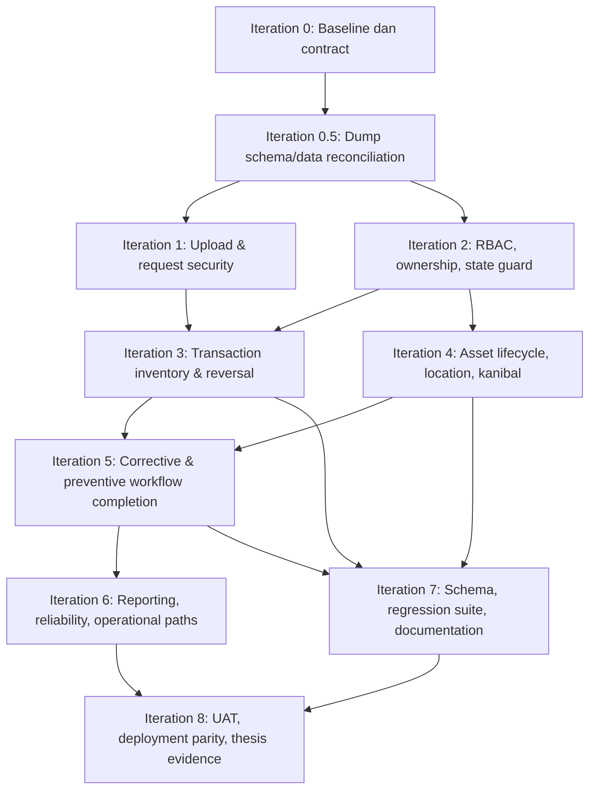

# IPSRS Remediation & Finalization Plan

Tanggal dibuat: **11 September 2026**  
Status saat ini: **Iteration 0.5 completed; F03 dan F16 Iteration 1B telah `Verified` melalui HTTP authenticated dan rendered UI pada environment SQLite sementara. F01 masih `Implemented — unverified` sampai upload HTTP dan hosting diverifikasi. F19 dan F34 Iteration 1C telah `Implemented — partially verified`; browser DOM dan export route end-to-end masih menjadi evidence yang belum ada.**  
Dokumen acuan: [`PROJECT-AUDIT-REPORT.md`](PROJECT-AUDIT-REPORT.md)  
Project: **IPSRS RSUD Kota Yogyakarta — manajemen sarana, prasarana, dan aset nonmedis**

## 1. Tujuan dan cara memakai dokumen ini

Dokumen ini adalah rencana teknis untuk merespons audit, bukan pengganti audit dan bukan daftar fitur baru. Audit menetapkan fakta, risiko, prioritas, dan bukti awal. Dokumen ini mengubah temuan tersebut menjadi iterasi implementasi yang dapat diuji sampai project memiliki bukti cukup untuk disebut final skripsi.

Pada awal setiap iterasi, baca dua file berikut secara berurutan:

1. `AI/PROJECT-AUDIT-REPORT.md`, khususnya finding yang dikerjakan dan bagian Finalization Checklist.
2. Dokumen ini, khususnya status saat ini, keputusan desain, acceptance criteria, dan log iterasi terakhir.

Setelah setiap iterasi selesai, update dokumen ini dalam commit/perubahan yang sama dengan implementasi. Update audit hanya dilakukan jika bukti baru mengubah kesimpulan finding secara material. Audit tidak boleh dihapus atau ditulis ulang untuk membuat kondisi project tampak lebih baik; tambahkan status penutupan dan rujukan evidence yang dapat diperiksa.

### Definisi status

| Status | Arti |
| --- | --- |
| `Planned` | Belum mulai; scope dan evidence awal sudah diketahui. |
| `Investigating` | Kontrak, schema, atau dampak lintas modul sedang dipastikan sebelum edit. |
| `In progress` | Implementasi sedang berjalan; tidak boleh dianggap aman hanya karena sebagian UI berubah. |
| `Implemented — unverified` | Kode sudah diubah tetapi acceptance test/evidence belum lengkap. |
| `Verified` | Acceptance criteria, test, dan review regression untuk finding selesai telah lulus. |
| `Accepted limitation` | Fitur/risk tidak dibuat dalam scope final; endpoint/claim terkait sudah dihapus, dinonaktifkan, atau diamankan dan alasan dicatat. |
| `Not applicable` | Bukti baru menunjukkan finding tidak berlaku pada build/schema/deployment final. Alasan dan evidence wajib dicatat. |
| `Blocked` | Tidak dapat diselesaikan tanpa keputusan requirement, akses deployment, atau data yang belum tersedia. |

`Verified` bukan berarti seluruh project production-ready. Finding hanya boleh ditutup jika bukti menunjukkan bug/risk yang sama tidak lagi bisa terjadi melalui UI **dan** request langsung.

## 2. Batas kerja dan prinsip keputusan

### In scope

- Memperbaiki P0 dan P1 terlebih dahulu, lalu P2/P3 sesuai roadmap.
- Menambah test yang membuktikan rule bisnis dan security yang diperbaiki.
- Menambah migration yang reversible atau memiliki prosedur backup/restore teruji.
- Menyelaraskan dokumentasi dengan perilaku yang benar-benar diimplementasikan.
- Memverifikasi deployment final setelah source, schema, dan test lokal siap.

### Out of scope sampai ada requirement eksplisit

- Rewrite framework, microservice, SPA baru, atau redesign UI besar.
- Klaim digital signature kriptografis, approval berjenjang, ML, real-time sirene, atau recurring scheduler jika tidak benar-benar diimplementasikan dan diuji.
- Menjalankan import/reset, migration, upload, atau perubahan data pada hosting tanpa backup dan otorisasi terpisah.

### Prinsip teknis yang tidak boleh dilanggar

1. Semua mutation bisnis memakai request non-GET, CSRF, authentication, authorization, validasi server, dan feedback error yang tidak membocorkan detail internal.
2. Hidden field, tombol disabled, pilihan menu, dan JavaScript tidak dihitung sebagai enforcement bisnis. Endpoint harus aman terhadap request manual.
3. Operasi yang mengubah lebih dari satu record domain harus memiliki batas transaksi database atau desain state yang menjamin recovery/idempotency.
4. Status aset dan LK hanya boleh ditulis melalui aturan transisi yang sama; tidak ada string status bebas di controller/view lain.
5. Data historis tidak boleh mengikuti perubahan master saat arti historis perlu dipertahankan. Gunakan foreign key plus snapshot yang diperlukan.
6. Perubahan schema diperlakukan sebagai bagian dari fitur. Fresh install, upgrade database lama, dan rollback/restore harus mempunyai prosedur yang bisa diuji.
7. Tidak ada finding ditutup hanya karena lint PHP atau test helper lulus. Bukti harus relevan dengan attack scenario atau workflow yang diaudit.

## 3. Target kondisi final

Project dapat diposisikan sebagai final project skripsi jika seluruh kondisi berikut dipenuhi.

| Area | Target final yang dapat dibuktikan |
| --- | --- |
| Security | BA tidak executable; route mutation tidak dapat diakses actor salah; CSRF berlaku konsisten; output JS/export aman terhadap input pengguna. |
| Authorization | Ada matriks peran dan scope objek; pelapor, teknisi, admin, dan tamu menerima hasil yang tepat pada seluruh endpoint kritis. |
| Corrective maintenance | Pelaporan sampai penyelesaian mempunyai state valid, assignment sah, parts/vendor/history konsisten, dan tidak duplikat saat request diulang. |
| Preventive maintenance | Jadwal, LKP, seluruh jawaban, tindak lanjut corrective, dan history unit tersimpan lengkap serta tidak menghasilkan LK ganda. |
| Inventory | Saldo, ledger, detail parts, cancellation/delete, dan kanibal konsisten pada shortage, failure, dan concurrent submit. |
| Asset lifecycle | Satu vocabulary status dipakai semua modul; lokasi/history/loan/disposal/kanibal tidak dapat menciptakan kondisi aset yang kontradiktif. |
| Reporting | Response time, downtime, periode, identitas unit, dan export menggunakan definisi serta data yang konsisten. |
| QA | Ada test feature/integration untuk rule kritis, UAT per role dengan evidence, serta smoke test browser untuk action utama. |
| Documentation | Requirement, state diagram, ERD, workflow, limitation, deploy/restore, dan panduan menggambarkan build final. |
| Deployment | Commit release, schema version, dependency/runtime, environment hardening, backup dan restore telah diverifikasi pada lingkungan yang sesuai. |

## 4. Urutan iterasi dan dependency



Iterasi boleh memiliki patch kecil tambahan hanya jika patch itu dibutuhkan untuk membuktikan acceptance criteria iterasi tersebut. Pekerjaan yang tidak terkait dicatat sebagai backlog, bukan dimasukkan diam-diam agar diff tetap dapat direview.

## 5. Iteration 0 — Baseline, requirement contract, dan safety rail

### Scope

- Tetapkan baseline commit, hash source, schema MySQL yang akan dipakai, dan daftar file SQL yang menjadi jalur resmi.
- Buat matriks role × endpoint × ownership × allowed state.
- Tetapkan vocabulary status aset dan LK, state transition matrix, serta definisi response time/downtime yang disetujui.
- Tentukan kebijakan BA: format legal, ukuran, lokasi storage, siapa yang dapat melihat/mengunduh, retention, dan apakah signature berarti bukti gambar atau approval formal.
- Siapkan database disposable MySQL untuk migration/integration test; SQLite boleh dipakai hanya untuk unit test yang semantiknya setara.

### Deliverable

| Deliverable | Isi minimum |
| --- | --- |
| `AI/ROLE-ACCESS-MATRIX.md` | Actor, route/action, scope objek, kondisi yang diizinkan, respons untuk penolakan. |
| `AI/STATE-TRANSITION-MATRIX.md` | Status awal, action, guard, status tujuan, side effect, actor, cancellation/reversal. |
| `AI/SCHEMA-BASELINE.md` | Satu urutan migration resmi, schema version, cara fresh install, upgrade, backup, restore. |
| Test fixture strategy | User per role, unit assets, stok, LK, LKP, donor/penerima, vendor, file dummy aman. |
| Baseline release record | Commit, PHP/CI/Composer version, DB engine/version, test command, known limitation. |

### Acceptance criteria

- Tidak ada istilah role atau status yang ambigu di dokumen contract.
- Setiap route mutation aktif dapat dipetakan ke actor, ownership, state guard, dan CSRF expectation.
- Satu schema path final dipilih; script lama diberi status archive/diagnostic/import berbahaya, bukan dianggap migration resmi.
- Tidak ada source/business data production yang diubah dalam tahap baseline.

### Findings yang dilayani

F02, F03, F05, F06, F07, F09, F10, F11, F12, F13, F15, F16, F17, F20, F21, F25, F30, F35, F36.

## 5.1 Iteration 0.5 — Logical dump schema/data reconciliation

### Objective

Menyelaraskan baseline repository dengan snapshot database aktual tanpa mengubah database, source aplikasi, atau data. Iterasi ini memastikan Iteration 1–7 tidak membuat migration berdasarkan asumsi bahwa schema deployment masih sama dengan raw SQL lama.

### Evidence reviewed

- Logical dump MariaDB `ipsc7141_ipsrs_db (6).sql`, dibuat 15 September 2026 19:58.
- Schema aktual sudah memakai `aset_series`, `master_lokasi`, FK series di LK/LKP/jadwal/kanibal/lifecycle, dan kolom TTD.
- Schema tetap memiliki enum availability aset yang tidak kompatibel dengan sebagian status workflow LK.
- Empat row historical memakai ID primary key string kosong, sehingga preflight data wajib mendahului migration data.

### Deliverable dan result

| Deliverable | Result |
| --- | --- |
| Database-evidence addendum | `AI/DB-DUMP-ADDENDUM-2026-09-15.md` dibuat; batas snapshot, schema terkonfirmasi, F37, dan preflight live dicatat. |
| Schema baseline update | `AI/SCHEMA-BASELINE.md` diperbarui dengan delta actual schema dan jalur migration target yang kompatibel. |
| Contract alignment | Role matrix dan state matrix diberi evidence schema aktual terkait actor ID/role casing dan enum lifecycle. |
| Audit update | Section 18 dan F37 ditambahkan tanpa menghapus fakta audit awal. |

### Exit criteria

- Snapshot dump sudah dicatat sebagai evidence sensitif dan tidak diperlakukan sebagai file migration/import.
- Perbedaan utama source/raw schema versus dump telah mempunyai keputusan target yang tercatat.
- Tidak ada migration/data repair dilakukan dari dump ini.
- Sebelum Iteration 7, preflight read-only live dan backup/restore evidence wajib dilakukan.

## 6. Iteration 1 — Upload BA, CSRF, XSS, dan keamanan output

### Objective

Tutup risiko input/file yang dapat mengubah interpretasi server, browser, atau spreadsheet sebelum workflow lain diperluas.

### Work package 1A — BA upload dan download [F01]

1. Tentukan apakah BA wajib pada penghapusan atau opsional dengan alasan yang tercatat.
2. Validasi server menggunakan allowlist format yang memang dibutuhkan, batas ukuran, MIME yang diperiksa melalui server, serta verifikasi konten sesuai format bila library tersedia dan tepat untuk format tersebut.
3. Simpan file di direktori yang tidak dieksekusi web server. Nama internal harus random; metadata asli tidak dipakai sebagai path atau nama executable.
4. Simpan metadata file minimal: ID record, storage key, nama tampilan aman, mime terdeteksi, ukuran, checksum, uploader, waktu upload.
5. Sajikan melalui controller download yang memeriksa authentication/authorization dan mengirim `Content-Disposition: attachment` untuk format berisiko aktif.
6. Bila database write gagal setelah file tersimpan, hapus file yang baru dibuat atau catat orphan yang dapat direkonsiliasi. Bila file wajib dan move gagal, jangan buat record disposal sukses.
7. Konfigurasi web server harus melarang eksekusi script di storage bila storage sementara tetap berada di bawah document root.

**Test wajib:** upload PHP/HTML/SVG sesuai kebijakan harus ditolak; file terlalu besar ditolak; file valid dapat dibuka hanya oleh actor sah; path traversal tidak mungkin; gagal simpan DB tidak meninggalkan record/file yang dianggap sukses; anonymous dan pelapor tidak dapat mengunduh BA lain.

#### Status implementasi — 15 September 2026

**Status: `Implemented — unverified`.** BA tetap **opsional** agar perilaku workflow lama tidak berubah; jika disediakan, file hanya boleh berupa PDF, JPG, atau PNG yang terdeteksi server dan berukuran paling besar 5 MB.

- `BaDocumentStorage` menyimpan upload baru ke `writable/uploads/ba`, menggunakan storage key acak, menolak MIME selain allowlist, dan hanya mengizinkan nama aman saat resolve/delete.
- `Aset::hapus()` kini admin-only untuk tindakan ini, membatalkan disposal ketika validasi/move gagal, memakai transaksi untuk record penghapusan dan status aset, serta menghapus file baru bila transaksi gagal.
- Dokumen disajikan oleh route download authenticated `aset/penghapusan/{id}/ba`; controller membatasi akses sementara pada Admin, memaksa attachment, dan mengirim `X-Content-Type-Options: nosniff`. Link UI tidak lagi menunjuk langsung ke `/uploads/ba`.
- `public/uploads/ba/.htaccess` memblokir direct access dan script execution untuk BA legacy yang masih berada di web root. Ini hanya efektif bila Apache/cPanel mengizinkan `.htaccess` pada direktori tersebut.
- Validasi lokal: `phpunit tests/unit/BaDocumentStorageTest.php` **4 tests / 5 assertions passed**; full suite **51 tests / 55 assertions passed**; lint PHP untuk file terdampak dan `git diff --check` lulus.

Masih wajib sebelum status `Verified`: browser/HTTP multipart test memakai file valid dan PHP/HTML/SVG yang ditolak; request anonymous, pelapor, dan non-owner ke download; simulasi kegagalan DB setelah move; serta deployment check bahwa `writable/` tidak berada di document root dan aturan `.htaccess` legacy benar-benar aktif. Metadata MIME, ukuran, checksum, dan uploader belum memiliki kolom persistence tersendiri; bila kebutuhan audit dokumen formal mengharuskannya, tambahkan melalui migration kompatibel, bukan perubahan database manual.

### Work package 1B — CSRF dan HTTP method [F03, F16]

1. Inventaris seluruh form dan AJAX mutation untuk pinjam, return, disposal, BA, claim, status LK, parts, vendor, kanibal, jadwal, LKP, stok, master, dan user.
2. Ubah action GET yang memodifikasi state menjadi POST/PATCH/DELETE sesuai route eksplisit; tautan UI menjadi form dengan token CSRF dan confirmation bila diperlukan.
3. Pastikan form dinamis/modal menyisipkan token valid dan refresh token sesuai konfigurasi framework bila token regenerate.
4. Hapus atau perbaiki pengecualian CSRF yang tidak benar-benar diterapkan. Endpoint publik tetap membutuhkan strategi anti-abuse yang eksplisit; CSRF bukan pengganti rate limit/CAPTCHA bila anonymous POST diizinkan.
5. Feature test harus mengirim POST tanpa token dan memastikan request ditolak, lalu mengirim token valid dan memastikan mutation berfungsi.

#### Status implementasi — 15 September 2026

**Status: `Implemented — unverified`.** Inventory route menunjukkan mutation bisnis yang sebelumnya memakai GET (claim LK, pengembalian aset, dan logout) telah dipindahkan ke POST. Pengembalian sekarang mengirim form/token dari modal; claim LK menggunakan form POST setelah notifikasi WhatsApp hanya membuka halaman detail; logout memakai form token pada topbar dan sidebar. Modal pinjam/penghapusan memakai token dan `requestSubmit()` setelah `reportValidity()`. `/lapor` dan QR ping juga masuk cakupan CSRF; QR menyimpan token respons terbaru agar bekerja dengan token regeneration.

Evidence awal HTTP lokal tanpa mutasi data: POST tanpa token ke `/login`, `/lapor`, dan `/ipsrs/aset/kembali/not-a-real-id` menghasilkan 403. Pasangan cookie/input token valid pada POST `/login` mencapai controller dan menghasilkan 303 validasi, sementara POST return dengan token valid namun tanpa session menghasilkan 303 ke login. `php spark routes` memverifikasi route claim/return/tandai-rusak/logout adalah POST.

**Verification addendum — 15 September 2026: `Verified` untuk F03/F16.** SQLite sementara berisi Admin, series, loan, dan LK isolasi. Login Admin HTTP berhasil; pinjam, return, disposal tanpa file, claim, dan logout dikirim sebagai POST dengan token yang valid. Query setelah request mengonfirmasi perubahan status loan/series, record disposal, dan teknisi/status LK. GET detail series untuk sesi tersebut merender token dalam form dinamis dan `requestSubmit()` untuk tiga modal. Database sementara kemudian dihapus dan `.env` MySQL/HTTPS dipulihkan. Chrome headless crash dan download Playwright terputus, sehingga browser/device smoke serta QR token rotation tidak diklaim; keduanya adalah limitation UAT, bukan blocker untuk bukti server/rendered contract ini.

### Work package 1C — Contextual output encoding dan export [F19, F34]

1. Audit input yang masuk ke JavaScript literal, HTML attribute, URL, HTML body, dan `innerHTML`.
2. Ganti interpolation yang mengandalkan `addslashes` atau raw HTML untuk data tak tepercaya dengan encoding sesuai konteks atau DOM API aman seperti `textContent`.
3. Jangan menyimpan markup ke field yang seharusnya teks biasa. Jika rich text memang diperlukan, tentukan sanitizer server-side dan policy tag/attribute.
4. Pada `Laporan`, bind seluruh teks tak tepercaya sebagai explicit string cell. Hanya numeric/date tervalidasi yang memakai tipe numeric/date.
5. Uji string berisi quote, tag HTML, JavaScript-like string, dan prefix spreadsheet `=`, `+`, `-`, `@` menurut kebijakan viewer yang ditetapkan.

### Definition of done Iteration 1

- F01, F03, F16, F19, dan F34 memiliki patch, feature/browser test relevan, serta evidence file/export yang dapat direview.
- Tidak ada action mutation yang masih dipicu route GET tanpa justifikasi read-only yang terdokumentasi.
- Tidak ada BA user-controlled yang dapat diakses sebagai path file langsung pada web root.
- Audit update mencatat status setiap finding, test command, hasil, commit, dan limitation yang tersisa.

## 7. Iteration 2 — RBAC, object authorization, assignment, dan state guard

### Objective

Jadikan backend sebagai sumber enforcement untuk siapa dapat membaca atau mengubah objek serta kapan action valid dilakukan.

### Design keputusan yang harus dibuat dulu

| Decision | Pilihan yang harus ditetapkan |
| --- | --- |
| Role final | Nama role canonical dan permission setiap role; normalisasi case harus tunggal. |
| Pelapor | Boleh melihat hanya tiket miliknya, satu unitnya, atau semua tiket unit; policy harus tertulis. |
| Teknisi | Boleh klaim bebas dari antrean atau hanya ditugaskan; apakah teknisi lain dapat membantu; siapa boleh reassign. |
| Admin/IPSRS | Siapa mengelola user/master/stok/disposal dan apakah ada role kepala terpisah. |
| Approval | Jika belum menjadi scope, hapus klaim approval formal dan gunakan metadata catatan yang jujur. |
| Terminal state | Action yang tidak boleh dilakukan setelah disposed/closed/cancelled/returned. |

### Implementasi inti [F02, F09, F15, F23]

1. Buat policy/guard terpusat atau fungsi domain yang memeriksa role, ownership, assignment, existence, dan state. Pilih solusi sederhana yang digunakan konsisten oleh controller; jangan membuat permission framework kedua yang tidak dipakai route.
2. Pastikan `Pengguna` dan master hanya dapat dimutasi role sah. Semua controller, bukan hanya sidebar, memakai guard tersebut.
3. Pencarian UUID publik dibatasi tepat pada endpoint yang memang publik. UUID tidak menjadi bukti bahwa peminta berhak mengakses objek internal.
4. Klaim pekerjaan memakai conditional update dalam transaksi: ubah hanya jika belum diklaim/masih state yang tepat. Respons conflict harus jelas untuk teknisi kedua.
5. Update status LK, assignment, detail parts/vendor, close, dan delete memeriksa allowed transition serta actor yang sah di server.
6. Session memeriksa akun aktif secara periodik/per request kritis, atau memiliki mekanisme revoke session setelah akun dinonaktifkan. Tambahkan throttling login dan event log yang tidak menyimpan password/token.
7. Untuk TTD, jangan menyebut gambar canvas sebagai approval terverifikasi. Jika scope hanya bukti visual, ikat ke actor login, timestamp server, status record, dan checksum/version payload. Jika approval formal dibutuhkan, desain workflow actor/state terpisah.

### Test wajib

- Setiap mutation kritis diuji oleh tamu, pelapor lain, pelapor pemilik, teknisi tidak ditugaskan, teknisi ditugaskan, dan admin sesuai matriks final.
- Akses object dengan UUID/ID milik user lain menghasilkan 403 atau 404 yang konsisten tanpa bocor data.
- Dua request claim bersamaan menghasilkan satu berhasil dan satu conflict.
- Close/parts/vendor/delete pada state salah ditolak dan tidak mengubah DB.
- Akun nonaktif tidak dapat mempertahankan akses session.

### Definition of done Iteration 2

- F02, F09, F15, dan bagian authorization F23 berstatus `Verified` atau `Accepted limitation` dengan endpoint/claim yang relevan sudah dihapus/diamankan.
- Semua route mutation mempunyai test aktor salah dan state salah.
- Role matrix serta state matrix diperbarui berdasarkan implementasi, bukan aspirasi UI.

## 8. Iteration 3 — Inventory, parts, delete/cancel, dan atomicity

### Objective

Jamin saldo stok, ledger, detail penggunaan, dan reversal tidak dapat divergen pada retry, failure, shortage, atau akses serentak.

### Kontrak inventory yang harus ditetapkan

| Konsep | Kontrak final |
| --- | --- |
| Saldo | Tidak boleh negatif kecuali backorder memang didukung dan terlihat eksplisit. |
| Ledger | Immutable append-only; satu transaksi mempunyai tipe, qty, sumber, actor, waktu, dan reference yang stabil. |
| Detail parts LK | Satu line tidak boleh tercatat dua kali dari duplicate submit; barang dan qty tervalidasi. |
| Goods source | Gudang dan kanibal memiliki aturan berbeda. Kanibal tidak otomatis menambah stok gudang. |
| Reversal | Hanya reversal terotorisasi dengan reference ke transaksi asal; delete/cancel tidak boleh mengembalikan semua tipe sumber secara buta. |
| Closed work | Policy jelas: tambah/hapus parts setelah close ditolak atau membuka kembali secara auditable. |

### Implementasi inti [F05, F06, F11]

1. Bungkus perubahan saldo, insert ledger, dan insert/delete detail LK dalam satu transaksi database.
2. Debit saldo menggunakan conditional update yang membuktikan saldo mencukupi pada saat update, atau lock row yang sesuai pada MySQL. Jangan hanya mengecek saldo di PHP lalu clamp hasil negatif menjadi nol.
3. Beri unique operation/reference key atau idempotency guard untuk submit parts agar retry browser tidak membuat line/ledger kedua.
4. Saat delete/cancel LK, tentukan side effect yang benar untuk setiap source. Kembalikan gudang hanya bila debit gudang sebelumnya benar-benar terjadi dan belum pernah direversal. Riwayat kanibal diperlakukan sebagai asset-component transfer, bukan `id_barang` null.
5. Jika delete LK tidak dapat menjadi operasi bisnis yang aman, gunakan state cancelled dan reversal eksplisit daripada hard delete.
6. Validasi komponen donor dengan ID stabil, availability quantity, donor/penerima berbeda, status donor/penerima sah, serta relasi LK yang benar.
7. Tambahkan database constraint unik/foreign key/check bila engine dan requirement mendukungnya. Constraint melengkapi aplikasi; constraint tidak menggantikan transaksi.

### Test wajib

- Dua koneksi MySQL mendebit stok yang sama; hanya transaksi yang cukup saldo dapat berhasil.
- Insert ledger gagal setelah perubahan saldo atau insert detail gagal; seluruh transaksi rollback.
- Request parts yang sama diulang; hasil hanya satu transaksi/line sesuai policy idempotency.
- Cancel/delete dengan source Gudang, Kanibal, dan campuran tidak menghasilkan saldo/ledger palsu.
- Shortage, qty nol/negatif, barang hilang, LK close, dan LK tidak ditemukan ditolak tanpa side effect.
- Donor tidak dapat memberi komponen melebihi tersedia atau ke dirinya sendiri; recipient/history/LK tetap lengkap.

### Definition of done Iteration 3

- F05 dan F06 berstatus `Verified`; bagian inventory pada F11 juga diverifikasi.
- Terdapat integration test MySQL untuk concurrency dan rollback, bukan hanya SQLite/helper test.
- Reconciliation query dapat membandingkan saldo tersimpan dengan ledger untuk mendeteksi data historis yang perlu diperbaiki sebelum release.

## 9. Iteration 4 — Lifecycle aset, lokasi, mutasi, loan, disposal, dan kanibal

### Objective

Membentuk satu model lifecycle untuk unit fisik `aset_series` sehingga tidak ada modul yang menulis kondisi yang saling bertentangan.

### State model minimum

State dan transition final harus mengikuti requirement/SPO yang disepakati. Contoh kategori yang perlu dibedakan adalah availability (`Tersedia`, `Dipinjam`, `DalamPerbaikan`, `MenungguSukuCadang`, `MenungguVendor`, `Dikanibal`, `Dihapus`) dan condition (`Baik`, `RusakRingan`, `RusakBerat`). Jangan mencampurkan condition dengan availability dalam satu string tanpa definisi.

Setiap transition harus memuat:

- actor yang boleh memicu;
- precondition record dan relasi;
- source event atau reference;
- perubahan status/lokasi/komponen;
- history immutable;
- action reversal yang sah;
- dampak terhadap LK, loan, dan reporting.

### Implementasi inti [F07, F10, F11, F12, F18, F24]

1. Jadikan `aset_series` sumber kebenaran untuk kondisi, availability, lokasi aktif, dan identitas unit. `aset` tetap katalog dan tidak menjadi target mutasi unit.
2. Ganti writer status literal lama pada portal, LK, mutasi, pinjam/return, kanibal, disposal, dan close dengan satu domain operation yang memvalidasi transition.
3. Disposal adalah terminal state. Return, portal report, edit series, atau close LK tidak boleh mengaktifkan kembali aset terhapus kecuali ada workflow restoration eksplisit yang berhak dan memiliki history.
4. Semua perubahan lokasi lewat operasi mutasi yang menulis lokasi aktif serta `riwayat_lokasi_aset` dalam transaksi. Edit master unit tidak boleh diam-diam mengganti lokasi tanpa history.
5. Portal publik membuat laporan terlebih dahulu dan tidak mengubah master unit sebelum operasi tiket berhasil serta policy lifecycle mengizinkan perubahan. Tambahkan anti-abuse/rate limit untuk portal.
6. Pisahkan telemetry GPS browser dari lokasi master aset. Simpan hanya jika memang perlu, tandai sebagai data perangkat/waktu, dan jangan gunakan sebagai otorisasi atau bukti lokasi aset.
7. Perbaiki view/scan/export agar mengambil nomor, kondisi, lokasi, dan history dari series; hapus fallback parent lama setelah migrasi data dibuktikan.

### Test wajib

- Matrix transition untuk seluruh status aktif dan terminal.
- Loan ganda ditolak, return tanpa loan aktif ditolak, disposal tidak dapat dipinjam/dimutasi/diaktifkan ulang oleh action lain.
- Mutasi menulis lokasi aktif dan satu history yang sesuai; gagal history berarti lokasi aktif juga rollback.
- Portal report pada series disposed atau invalid tidak mengubah master asset.
- Scan series menampilkan data series, bukan data katalog parent.

### Definition of done Iteration 4

- F07, F10, F12, F18, F24, dan bagian lifecycle/kanibal F11 berstatus `Verified`.
- Status lama tidak ditemukan sebagai writer aktif kecuali mapper kompatibilitas yang diuji dan didokumentasikan.
- History lokasi dan lifecycle dapat menjelaskan kondisi unit saat ini tanpa perlu menyimpulkan dari beberapa tabel yang bertentangan.

## 10. Iteration 5 — Penyelesaian corrective dan preventive end-to-end

### Objective

Buktikan dua workflow utama dari input user sampai history/report akhir bekerja dengan data lengkap, state sah, dan retry aman.

### Workflow A — Corrective maintenance [F04, F08, F09, F14, F15, F17]

1. Pelapor/tamu mengirim laporan dengan asset reference yang valid menurut scope. Internal form harus menyimpan `id_aset`/series yang dipilih dan JavaScript tidak boleh bergantung pada variabel undefined.
2. Sistem membuat LK dalam state awal yang didefinisikan tanpa menulis master unit secara tidak atomik.
3. Teknisi/admin melakukan claim/assignment dan survei melalui state guard.
4. Parts, kanibal, atau vendor dapat dicatat hanya pada state/actor yang diizinkan. Sumber material dan history tetap konsisten dengan Iteration 3–4.
5. TTD/serah-terima mengikuti arti yang telah ditetapkan; field dan signature terikat ke record/version/actor/timestamp.
6. Close menghitung response time/downtime dari timestamp yang valid, tidak menimpa RT nol, dan tidak boleh diulang untuk mengubah angka tanpa workflow reopen/adjustment yang diaudit.
7. Semua tombol route aktif, validasi gagal mengembalikan input yang relevan, dan response berhasil benar-benar berarti data tersimpan.

### Workflow B — Preventive maintenance [F13, F14, F30]

1. Jadwal memiliki aset series wajib bila schedule memang ditujukan ke unit; tanggal, kategori, teknisi, dan status divalidasi.
2. LKP menyimpan semua tipe jawaban, termasuk `Teks`, nilai nol, lokasi sesuai/tidak sesuai, nama/identitas bila masuk scope, catatan, dan detail checklist.
3. Submit LKP bersifat idempotent atau mempunyai guard sehingga refresh/retry tidak menulis LKP/auto-LK kedua.
4. Temuan yang membutuhkan corrective membuat LK dengan relation eksplisit `source_lkp_id` atau kolom/riwayat setara, dalam transaksi atau state pending yang bisa diretry aman.
5. Jadwal selesai tidak dapat diedit/diulang secara diam-diam. Sediakan reschedule/cancel dengan alasan bila requirement operasional memerlukannya.
6. Detail series menampilkan history PM yang relevan tanpa memakai data parent lama.

### Test wajib

- Browser/feature smoke untuk tiap action corrective dan preventive, termasuk route sebelumnya putus.
- Laporan internal dengan asset terpilih muncul kembali pada detail/history.
- LKP round-trip untuk Inspeksi, Service, Pengukuran, dan Teks; field wajib UI tidak boleh hilang.
- Submit LKP dua kali dan kegagalan pembuatan auto-LK tidak menciptakan duplikasi/incomplete state.
- RT nol, null, lintas hari, timestamp mundur, close ulang, dan state invalid ditangani sesuai contract.

### Definition of done Iteration 5

- F04, F08, F13, F14, F15, F17, serta bagian corrective F09 berstatus `Verified`.
- Dua diagram workflow di dokumentasi final sesuai controller, DB, policy, dan test aktual.
- Minimal satu evidence UAT per role dapat mengikuti workflow tanpa workaround database/manual route.

## 11. Iteration 6 — Reporting, UX reliability, vendor, notification, dan performance

### Objective

Membuat informasi yang dihasilkan sistem dapat dipercaya dan alur rutin dapat diselesaikan tanpa error UI yang menyesatkan.

### Work package

| Finding | Perbaikan yang harus dibuktikan |
| --- | --- |
| F22 | Putuskan WA/sirene: implementasikan dengan timeout, retry/status failure, secret env, dan test adapter; atau jadikan limitation dan hapus klaim panduan. Tiket sukses tidak boleh diklaim sebagai notifikasi sukses bila provider gagal. |
| F23 | Rate limit login/portal sesuai kebutuhan, session revoke akun nonaktif, error production aman, cookie/HTTPS diverifikasi di hosting, dan log tidak memuat secret. |
| F25 | Definisikan batas periode, timezone, minggu/bulan/tahun, source timestamp, snapshot lokasi/identitas, serta jenis nomor yang diekspor. Excel dan print memakai filter/dataset yang sama. |
| F26 | Terapkan projection kolom, filter/pagination SQL, eager/join/batch yang terukur, dan hilangkan loop N+1/nested donor lookup. TTD base64 tidak masuk list payload tanpa kebutuhan. |
| F27 | Tambah/update return vendor dengan validasi tanggal dan hubungan ke entry pengiriman. Close policy menangani vendor belum kembali. |
| F29 | Loading button pulih saat confirm dibatalkan/gagal; old input seluruh form penting; redirect login benar; filter history stok mengikuti unit yang dipilih. |
| F30 | Sediakan jalur reschedule/cancel PM, master lokasi terotorisasi atau runbook operasional jelas, bootstrap template, dan tautan history PM. |
| F32 | Ganti urutan string untuk sequence dengan counter numerik/allocator aman; uji batas padding dan collision. |
| F31 | Perbaiki zoom, label, modal focus/keyboard, nama aksesibel, dan kontras melalui smoke accessibility pada workflow kritis. |

### Performance evidence

Tidak ada target latency yang boleh diklaim tanpa pengukuran. Buat dataset representatif dan catat:

- jumlah series, LK, LKP, stock ledger, vendor detail, history lokasi, serta payload TTD;
- query count dan elapsed time untuk dashboard, daftar LK, detail LK, export LK, print LK, dan riwayat kanibal;
- memory peak/export duration bila tersedia;
- perubahan sebelum/sesudah pada query yang dioptimalkan.

Optimasi hanya diterima bila tidak mengubah authorization, filter, hasil laporan, atau urutan data tanpa dokumentasi.

### Definition of done Iteration 6

- F22, F23, F25, F26, F27, F29, F30, F31, F32 memiliki status jelas dan evidence sesuai scope yang disetujui.
- Laporan memiliki test date boundary dan sample output yang diperiksa manusia.
- Performance claim memakai metrik yang tersimpan, bukan asumsi dari perubahan kode.

## 12. Iteration 7 — Schema reproducibility, dependency, regression suite, dan documentation

### Objective

Membuat build final dapat diinstal, diuji, dipahami, dan direview ulang tanpa bergantung pada ingatan percakapan atau database hosting saat ini.

### Schema dan data [F20, F21]

1. Pilih satu directory/urutan migration sebagai authoritative. Konversi perubahan manual yang relevan menjadi migration atau dokumentasikan prosedur upgrade bernomor dan idempotent.
2. Fresh install menghasilkan semua tabel, FK, unique constraint, index, enum/check, kolom TTD, lokasi, dan relation yang dipakai source final.
3. Upgrade dari schema sebelumnya diuji terhadap salinan anonymized/disposable; data lama dimigrasikan atau failure dilaporkan sebelum destructive action.
4. Import Excel dipisahkan dari setup/production path. Jika tetap digunakan, ia harus tidak melakukan truncate tanpa backup, preview/validation, mapping stable ID, dan rekonsiliasi. Jika tidak masuk scope, tandai sebagai utility berbahaya/deprecated dan jangan dokumentasikan sebagai fitur aplikasi.
5. Uji restore backup sebelum deployment atau migration production.

### Dependency dan deployment [F28]

1. Audit lock dengan advisory tool/repository yang sesuai saat release; update dependency terpengaruh setelah regression test, bukan sekadar ubah lock.
2. Pin asset browser atau gunakan build lokal/version manifest untuk dependency yang menentukan UI/security.
3. Verifikasi setting proxy/HTTPS CI, cookie secure, error environment, directory permission, upload storage, log, cron jika ada, dan PHP extension pada hosting.
4. Catat dependency/runtime final di runbook bersama command yang benar-benar dipakai.

### Regression suite dan UAT [F35]

1. Pertahankan unit test helper yang ada, tetapi jadikan feature/integration test domain sebagai release gate.
2. Tambah test untuk seluruh acceptance criteria Iteration 1–6. Test kritis harus memakai MySQL ketika bergantung pada transaction, lock, collation, enum, atau behavior SQL MySQL.
3. Tambah browser smoke per role untuk login, create, edit, delete/cancel, confirm cancel, validation error, session expiry, dan export.
4. UAT mencatat tester, role, build commit, schema version, browser/device, precondition, langkah, expected, actual, pass/fail, screenshot/record database yang aman, dan defect ID.
5. Bila CI belum tersedia, buat satu command release manual yang reproducible; CI dapat ditambahkan bila akses repository mengizinkan.

### Documentation [F36, F33]

1. README menjelaskan purpose, requirement runtime, setup, database path, `.env` variables tanpa secret, account bootstrap aman, test command, dan limitations.
2. Perbarui panduan per modul, panduan gabungan, Word, PROJECT_STATE, dan REVISION_LOG dari sumber canonical. Tandai dokumen lama sebagai archive jika tidak diperbarui.
3. Buat requirement traceability: requirement ID → desain/route/model → validation/constraint → test → UAT evidence → limitation.
4. Buat ERD dari schema final, state diagrams from state matrix, dan workflow diagrams from accepted implementation.
5. Dokumentasikan design choice: monolit CI4, katalog vs series, role enforcement, stock ledger, preventive/corrective distinction, kanibal, mutasi, TTD, KPI, serta batas penelitian.
6. Hapus/tandai code/view/script lama hanya setelah active call site dan regression evidence diperiksa. Cleanup tidak boleh menyembunyikan contract yang belum diperbaiki.

### Definition of done Iteration 7

- F20, F21, F28, F35, F36, F33 berstatus `Verified`, `Accepted limitation`, atau `Not applicable` dengan evidence.
- Developer baru dapat fresh install dan menjalankan test dari runbook pada environment disposable.
- Tidak ada dokumen final yang menjanjikan ML, real-time, admin-only, approval, atau security behavior yang tidak didukung build final.

## 13. Iteration 8 — Final UAT, deployment parity, dan paket skripsi

### Objective

Membuktikan source final, schema final, dan hosting final adalah sistem yang sama serta menyiapkan evidence untuk sidang.

### Checklist deployment terkontrol

- [ ] Backup database dan file upload tersedia serta restore diuji pada target terpisah.
- [ ] Commit/tag release dicatat; working tree release bersih dari script lokal, dump sementara, secret, dan file credential.
- [ ] Composer lock/dependency, PHP extension, CI environment, web-server rule, storage permission, timezone, session, cookie, CSRF, error display, log rotation, dan HTTPS diverifikasi.
- [ ] Schema version dan constraint production dibandingkan dengan baseline final tanpa mencetak data sensitif.
- [ ] Smoke test hosting dilakukan dengan akun terpisah untuk tamu, pelapor, teknisi, admin; tidak memakai data production destruktif.
- [ ] Upload BA aman dan route download dibuktikan pada konfigurasi hosting aktual.
- [ ] UAT final selesai dengan defect status, evidence, dan keputusan limitation.

### Paket evidence skripsi

| Artefak | Isi |
| --- | --- |
| Requirement traceability | Requirement, modul, test, UAT, limitation. |
| ERD dan state diagram | Dibuat dari schema/state matrix final. |
| Test report | Command, versi, tanggal, hasil, test kritis, environment. |
| UAT report | Per role, precondition, actual result, evidence, defect disposition. |
| Deployment/restore runbook | Setup, backup, restore, rollback, known operational action. |
| KPI methodology | Definisi RT/downtime/SLA, source timestamp, period, data limitation. |
| Security appendix | RBAC matrix, CSRF/method policy, upload policy, limitation signature. |
| Demo script | Dua workflow utama, stock/kanibal/mutasi yang relevan, reporting, expected result. |

### Release decision

Hanya tiga keputusan yang valid pada akhir iterasi:

1. `Ready for thesis final / limited operational use`: semua P0/P1 ditutup atau accepted limitation telah menghapus surface/claim terkait; UAT dan deployment parity lulus.
2. `Ready for thesis demo only`: blocker production tetap ada atau deployment parity belum terbukti, tetapi scope demo dan limitation disebutkan secara jujur dalam dokumen/sidang.
3. `Not ready`: P0/P1 belum tertutup, workflow utama tidak dapat dibuktikan, atau schema/deployment tidak dapat direproduksi.

## 14. Finding-to-iteration tracking matrix

| Finding | Severity | Iteration utama | Status terkini | Bukti penutupan minimum |
| --- | --- | --- | --- | --- |
| F01 Upload BA executable | P0 | 1 | Implemented — partially verified | Local content/storage/public-surface contract lulus; multipart dan document-root hosting tetap diperlukan |
| F02 RBAC dan IDOR | P1 | 2 | Implemented — partially verified | Central session/route gate and LK/LKP object scope; user-ID migration and HTTP matrix remain |
| F03 CSRF form lifecycle | P1 | 1 | Implemented — partially verified | Route filter and no-token HTTP rejection; valid-token/browser matrix remains |
| F04 Route/action rusak | P1 | 5 | Implemented — partially verified | Static route/UI scan and Vendor delete route; full browser action matrix remains |
| F05 Stok tidak atomik | P1 | 3 | Implemented — partially verified | Conditional debit, ledger ordering, and transaction contract; MySQL concurrency remains |
| F06 Delete LK/reversal salah | P1 | 3 | Implemented — partially verified | Transactional Gudang-only rollback; hard-delete policy and HTTP proof remain |
| F07 Portal mengubah aset dini | P1 | 4 | Implemented — partially verified | LK sync no longer revives protected assets; ticket-first transaction remains |
| F08 Aset internal hilang/JS gagal | P1 | 5 | Implemented — partially verified | Form selection round-trip dan browser JavaScript smoke |
| F09 State/assignment LK lemah | P1 | 2, 5 | Implemented — partially verified | Actor/state matrix, claim conflict, close immutability test |
| F10 Lifecycle konflik | P1 | 4 | Implemented — partially verified | Central policy for LK/loan/mutation/disposal; legacy reconciliation and HTTP proof remain |
| F11 Kanibal identity/approval | P1 | 3, 4 | Implemented — partially verified | Donor/recipient/availability/history tests; HTTP/browser and stable actor identity remain |
| F12 Lokasi dua sumber | P1 | 4 | Implemented — partially verified | New room mutation updates `id_lokasi` with history atomically; legacy text drift remains |
| F13 LKP/auto-LK tidak atomik | P1 | 5 | Implemented — partially verified | Idempotency, failure, source lineage test |
| F14 Field PM hilang | P1 | 5 | Implemented — partially verified | Semua input type round-trip test dan DB inspection |
| F15 TTD bukan evidence verifiable | P1 | 2, 5 | Implemented — partially verified | PNG evidence contract; independent pelapor approval, immutable binding, and browser/HTTP evidence remain |
| F16 Mutation GET/CSRF scope | P1 | 1 | Implemented — partially verified | Explicit POST inventory and CSRF denial proof; endpoint matrix remains |
| F17 RT/downtime salah | P1 | 5 | Implemented — partially verified | Edge case timestamp unit/feature tests serta sample report |
| F19 JS/DOM XSS | P1 | 1 | Implemented — partially verified | Context encoding test/manual browser proof |
| F20 Migration tidak reproducible | P1 | 0, 7 | Planned | Fresh/upgrade schema test dan authoritative migration record |
| F21 Import reset berbahaya | P1 | 7 | Planned | Import safe redesign atau deprecation/guard documentation |
| F18 GPS spoof/feedback | P2 | 4, 6 | Implemented — partially verified | Range/missing/rate-limit persistence dan UI feedback diuji; perangkat dan spoof limitation tetap manual |
| F22 WA placeholder | P2 | 6 | Planned | Working adapter/status or documented removal from scope |
| F23 Session/rate/error | P2 | 2, 6 | Implemented — partially verified | Inactive revocation, generic login error, rate limit, session regeneration, headers; HTTPS/cookie hosting pending |
| F24 Parent/series mismatch | P2 | 4 | Planned | Scan/detail/report series source regression test |
| F25 Laporan periode/snapshot | P2 | 6 | Implemented — partially verified | Boundary/date/sample export print comparison |
| F26 Query/payload growth | P2 | 6 | Measured — remediation pending | Synthetic 20k-row benchmark confirms load-all risk; hosted MySQL measurement and pagination design remain |
| F27 Vendor return gap | P2 | 6 | Planned | Update chronology and close guard test |
| F28 Dependency/release baseline | P2 | 7 | Implemented — partially verified | Patched lock and clean audit; hosting PHP/extensions/config remain |
| F29 Error/UX recovery | P2 | 6 | Planned | Browser cancel/old input/session redirect/filter smoke |
| F30 Operational path gap | P2 | 5, 6 | Planned | Route/runbook for PM, location, template, history |
| F32 Sequence rollover | P2 | 6 | Planned | Boundary and collision test against final allocator |
| F34 Formula export | P2 | 1 | Implemented — partially verified | Spreadsheet explicit-string verification dan download route smoke |
| F35 Test/QA gap | P2 | 7 | Implemented — partially verified | Local automated release gate exists; MySQL/browser/UAT evidence remains |
| F36 Documentation gap | P2 | 7 | Implemented — partially verified | Traceability, route inventory, deployment/recovery runbook exist; final UAT evidence remains |
| F37 Empty-string historical IDs | P2 | 0.5, 7 | Planned | Live preflight, reference mapping, backed-up audited ID repair, reconciliation |
| F31 Accessibility | P3 | 6 | Planned | Keyboard/zoom/modal/label smoke assessment |
| F33 Legacy/dead coupling | P3 | 7 | Planned | Call-site evidence and safe cleanup regression proof |

## 15. Per-iteration update protocol

Tambahkan satu entry di bagian 16 setiap iterasi. Jangan mengubah entry lama kecuali membetulkan salah ketik; koreksi fakta dibuat sebagai entry baru yang menyebutkan perubahan kesimpulannya.

Sebelum mengubah status finding menjadi `Verified`, reviewer harus dapat menjawab semua pertanyaan berikut:

1. Apa bug/risk semula, dan route/data/state mana yang terdampak?
2. Aturan baru hidup di server atau hanya di UI?
3. Apa yang terjadi jika request diulang, dikirim actor salah, dikirim pada state salah, atau database gagal di tengah?
4. Test apa yang secara langsung membuktikan jawaban tersebut?
5. Apakah migration/documentation/deployment ikut diperbarui bila kontrak data/operasi berubah?
6. Apakah patch memperkenalkan perubahan pada finding lain atau workflow lain?

### Template entry iterasi

Gunakan format ini secara lengkap:

```md
### Iteration NN — <nama>

- Date:
- Commit / branch:
- Owner:
- Scope finding:
- Status before → after:
- Contract/design decision:
- Files changed:
- Schema/data change:
- Test executed and result:
- Manual/browser/UAT evidence:
- Security/concurrency/error cases checked:
- Documentation updated:
- Audit report update:
- Regression risk reviewed:
- Remaining limitation/blocker:
- Next iteration dependency:
```

Jika satu finding hanya selesai sebagian, pecah statusnya dengan sub-scope yang jelas. Contoh: `F02 — master user verified; LK object scope in progress`. Jangan menulis `F02 fixed` apabila satu endpoint bypass masih ada.

## 16. Iteration log

### Iteration 00 — Baseline contract

- Date: 15 September 2026.
- Commit / branch: Tidak dibuat commit oleh tahap perencanaan ini.
- Owner: Project team.
- Scope finding: F02, F03, F05, F06, F07, F09, F10, F11, F12, F13, F15, F16, F17, F20, F21, F25, F30, F35, F36.
- Status before → after: Iteration 0 `In progress` → `Verified` sebagai artefak kontrak. Seluruh audit finding tetap `Planned` karena source/schema belum diperbaiki.
- Contract/design decision: Admin, Teknisi, Pelapor adalah role canonical. `aset_series` adalah unit fisik authoritative. Availability aset, kondisi, LK, dan preventive schedule dipisahkan. Canonical migration target adalah PHP CI migration berurutan dalam `app/Database/Migrations/`; raw SQL/script lama tidak menjadi release path.
- Files changed: `AI/PROJECT-REMEDIATION-PLAN.md`, `AI/ROLE-ACCESS-MATRIX.md`, `AI/STATE-TRANSITION-MATRIX.md`, `AI/SCHEMA-BASELINE.md`.
- Schema/data change: Tidak ada.
- Test executed and result: Tidak ada test source baru. Kontrak dibandingkan terhadap `app/Config/Routes.php`, `app/Config/IPSRS.php`, controller aktif, dan inventory schema lokal. Hasil baseline audit tetap: PHP lint 142 file lulus; PHPUnit 47 tests/50 assertions lulus.
- Manual/browser/UAT evidence: Tidak ada eksekusi browser/hosting pada tahap ini.
- Security/concurrency/error cases checked: Tidak ada perubahan implementasi; temuan audit tetap berlaku. Matrix menetapkan negative test yang wajib dikerjakan pada Iteration 1–8.
- Documentation updated: Role/object access matrix, state transition matrix, dan schema baseline dibuat; plan diperbarui dengan hasil Iteration 0.
- Audit report update: Tidak diubah karena tidak ada evidence perbaikan source.
- Regression risk reviewed: Tidak ada source changed.
- Remaining limitation/blocker: Semua P0/P1 tetap terbuka.
- Next iteration dependency: Iteration 1 menggunakan policy BA/CSRF/output security; Iteration 2 menggunakan role/state matrix; Iteration 7 menggunakan schema baseline.

### Iteration 00.5 — Logical dump reconciliation

- Date: 15 September 2026.
- Commit / branch: Tidak dibuat commit oleh tahap dokumentasi ini.
- Owner: Project team.
- Scope finding: F05, F10, F11, F12, F14, F20, F21, F37; schema evidence untuk F02/F09/F13/F15.
- Status before → after: Iteration 0.5 `In progress` → `Verified` sebagai review logical dump dan pembaruan contract. Tidak ada finding source yang berubah menjadi fixed.
- Contract/design decision: Dump aktual adalah snapshot deployment pada waktu dump, bukan canonical migration chain. `aset_series`/series relation yang sudah ada dipertahankan sebagai basis migration berikutnya. Current enum lifecycle harus dimigrasikan kompatibel sebelum writer memakai status tunggu baru.
- Files changed: `AI/DB-DUMP-ADDENDUM-2026-09-15.md`, `AI/PROJECT-AUDIT-REPORT.md`, `AI/PROJECT-REMEDIATION-PLAN.md`, `AI/PROJECT_CONTEXT.md`, `AI/SCHEMA-BASELINE.md`, `AI/ROLE-ACCESS-MATRIX.md`, `AI/STATE-TRANSITION-MATRIX.md`.
- Schema/data change: Tidak ada. Dump tidak di-import, tidak ada koneksi live database, dan tidak ada query mutasi.
- Test executed and result: Static schema comparison terhadap dump, route/config/source audit evidence. Tidak ada test source baru atau runtime DB test.
- Manual/browser/UAT evidence: Tidak ada eksekusi browser/hosting.
- Security/concurrency/error cases checked: Dump mempunyai `DROP TABLE`, PII, dan password hash sehingga dicatat sebagai backup sensitif. No-import policy dan preflight sebelum migration ditetapkan.
- Documentation updated: Addendum dump, baseline schema, role/state contract, audit addendum, tracking matrix, dan log iterasi diperbarui.
- Audit report update: Section 18 menambahkan evidence dump dan F37 P2 tanpa mengubah severity historis finding awal.
- Regression risk reviewed: Tidak ada source changed. Risiko utama adalah menjalankan migration berdasarkan repository schema lama atau mengimport dump ke database existing.
- Remaining limitation/blocker: Snapshot bukan live introspection; live preflight, protected backup, restore test, dan schema migration formal masih belum dilakukan.
- Next iteration dependency: Iteration 1 dapat dimulai. Iteration 2/4 wajib mengikuti existing series schema. Iteration 7 wajib menjalankan live preflight sebelum DDL/data repair.

### Iteration 01A — Secure BA upload and protected download

- Date: 15 September 2026.
- Commit / branch: Belum dibuat commit pada saat entry ini ditulis.
- Owner: Project team.
- Scope finding: F01 — upload BA executable pada web root.
- Status before → after: F01 `Planned` → `Implemented — unverified` untuk upload baru dan download BA. P0 tidak ditutup sampai test HTTP dan deployment evidence tersedia.
- Contract/design decision: BA file tetap opsional agar tidak mengubah workflow disposal lama. Bila file diunggah, hanya PDF/JPEG/PNG yang terdeteksi server dengan batas 5 MB. Upload baru disimpan di `writable/uploads/ba`; legacy file dapat dibaca hanya melalui controller protected. Akses download sementara dibatasi Admin sampai RBAC/object policy lintas modul dikerjakan pada Iteration 2.
- Files changed: `app/Libraries/BaDocumentStorage.php`, `app/Controllers/Aset.php`, `app/Config/Routes.php`, `app/Views/pages/aset/show_series.php`, `app/Views/pages/penghapusan/index.php`, `public/uploads/ba/.htaccess`, `tests/unit/BaDocumentStorageTest.php`, serta tiga dokumen AI ini.
- Schema/data change: Tidak ada migration dan tidak ada perubahan database/data nyata. Metadata MIME, ukuran, checksum, dan uploader belum dipersist pada tabel penghapusan.
- Test executed and result: `php vendor/bin/phpunit tests/unit/BaDocumentStorageTest.php --no-coverage --no-logging --do-not-cache-result` lulus 4 tests/5 assertions. `php vendor/bin/phpunit --no-coverage --no-logging --do-not-cache-result` lulus 51 tests/55 assertions. Lint file PHP terdampak serta `git diff --check` lulus.
- Manual/browser/UAT evidence: Belum ada; tidak ada upload HTTP sebenarnya, browser, cPanel, atau production database yang disentuh.
- Security/concurrency/error cases checked: Unit policy menolak MIME `text/x-php` dan ukuran di atas 5 MB; controller menolak non-Admin, memaksa attachment, membatasi storage key dengan basename, dan menghapus file baru jika transaksi DB gagal. Keefektifan MIME terhadap multipart nyata, denial anonymous/pelapor, dan kegagalan DB nyata belum dibuktikan.
- Documentation updated: `PROJECT-REMEDIATION-PLAN.md`, `PROJECT-AUDIT-REPORT.md`, dan `PROJECT_CONTEXT.md`.
- Audit report update: F01 menerima status remediasi dan residual evidence; severity historis tidak dihapus.
- Regression risk reviewed: BA existing di `public/uploads/ba` tidak dimigrasikan; controller mempunyai fallback legacy agar histori tetap dapat diunduh oleh Admin. Keberhasilan fallback dan `.htaccess` perlu diuji pada hosting.
- Remaining limitation/blocker: Hosting harus membuktikan `writable/` bukan document root dan `.htaccess` bekerja. Tambahkan feature/browser tests untuk multipart, authorization, missing file, dan DB failure; lakukan migration bila metadata formal dokumen wajib.
- Next iteration dependency: 01B menutup F03/F16 (CSRF dan mutation HTTP); Iteration 2 memperluas role/object authorization tanpa melemahkan guard BA.

### Iteration 01B — CSRF coverage and mutation HTTP methods

- Date: 15 September 2026.
- Commit / branch: Belum dibuat commit pada saat entry ini ditulis.
- Owner: Project team.
- Scope finding: F03 dan F16; micro-fix F04 untuk route tandai rusak dan tautan BA detail.
- Status before → after: F03/F16 `Planned` → `Implemented — unverified`. F04 tetap `Planned` secara keseluruhan, dengan dua sub-action diimplementasikan.
- Contract/design decision: Semua route mutasi yang sebelumnya GET dalam inventory (`claim`, `kembali`, `logout`) menjadi POST dan harus membawa token CSRF. Notifikasi bukan mutation: WhatsApp membuka detail LK, lalu claim memerlukan form terkonfirmasi. Endpoint QR publik juga diverifikasi CSRF; respons JSON membawa token baru karena konfigurasi token regeneration aktif.
- Files changed: `app/Config/Routes.php`, `app/Config/Filters.php`, `app/Controllers/Aset.php`, `app/Controllers/LK.php`, `app/Views/pages/aset/show_series.php`, `app/Views/pages/aset/scan.php`, `app/Views/pages/lk/show.php`, `app/Views/layout/topbar.php`, `app/Views/layout/sidebar.php`, serta tiga dokumen AI ini.
- Schema/data change: Tidak ada migration atau mutation database yang disengaja.
- Test executed and result: HTTP lokal `spark serve` dan curl: POST tanpa token ke login, portal, dan return → 403; POST login token valid → 303 validasi controller; POST return token valid tanpa session → 303 login. `php spark routes` menampilkan claim, return, tandai-rusak, dan logout sebagai POST. Lint file PHP terdampak lulus.
- Manual/browser/UAT evidence: Tidak ada browser atau account authenticated. HTTP test memakai endpoint aman agar tidak melakukan business write; server lokal dihentikan setelah test.
- Security/concurrency/error cases checked: CSRF denial/allow path dibuktikan. Browser back/refresh, submit ganda, stale token pada device QR, authorization dan state transition belum dibuktikan; tiga terakhir tetap F02/F09/F10.
- Documentation updated: `PROJECT-REMEDIATION-PLAN.md`, `PROJECT-AUDIT-REPORT.md`, dan `PROJECT_CONTEXT.md`.
- Audit report update: Status remediasi F03/F16 serta partial F04 ditambahkan tanpa menghapus finding awal.
- Regression risk reviewed: Link GET lama akan memberi 404/405 sesuai hosting route daripada melakukan mutation; bookmark/pesan WhatsApp lama kini aman tetapi tidak lagi auto-claim. Layout logout berubah dari link menjadi form.
- Remaining limitation/blocker: Jalankan browser smoke berlogin untuk pinjam/return/penghapusan/claim/logout, termasuk token rotation QR; lalu implementasikan authorization dan state guard sebelum claim/return/lifecycle dianggap aman.
- Next iteration dependency: Iteration 1C menangani F19/F34; Iteration 2 menambahkan RBAC/object authorization pada route yang sekarang sudah berkontrak POST.

### Iteration 01B.1 — Verification addendum

- Date: 15 September 2026.
- Commit / branch: Belum dibuat commit pada saat entry ini ditulis.
- Owner: Project team.
- Scope finding: Verifikasi F03/F16 tanpa mengubah source bisnis.
- Status before → after: F03/F16 `Implemented — unverified` → `Verified` untuk kontrak HTTP dan rendered UI. F04 tetap partial.
- Contract/design decision: Evidence harus menyentuh filter, session, controller, dan persistence pada database sementara yang terisolasi; status tidak didasarkan hanya pada lint atau inspection source.
- Files changed: Dokumentasi AI dan `.env` sementara untuk memilih SQLite; `.env` dipulihkan persis ke MySQL/HTTPS setelah test. Tidak ada perubahan source aplikasi pada addendum ini.
- Schema/data change: Database SQLite sementara dibuat, diisi data test Admin/aset/loan/LK, diverifikasi, lalu dihapus. Tidak ada migration, dump import, production data, atau hosting mutation.
- Test executed and result: POST tanpa token untuk login/portal/return/logout → 403. Login token-valid → 303/session. Pinjam → loan dan series `Dipinjam`; return → loan `Selesai`/tanggal aktual dan series `Tersedia`; disposal → record BA/series `Dihapuskan`; claim → LK `Didisposisi`/teknisi; logout → session deleted lalu `/ipsrs` → login. Detail series HTTP merender CSRF field dan `requestSubmit()` pada form modal. Route inventory tetap POST.
- Manual/browser/UAT evidence: Browser engine Chrome headless crash sebelum page load; Playwright Chromium download tidak selesai. Tidak ada klaim browser click/device QR test.
- Security/concurrency/error cases checked: CSRF reject/allow, authenticated mutation, session destruction, route method, dan persistence diverifikasi. Retry/double submit, state guard, RBAC object scope, multipart BA, dan QR device token rotation tetap finding/limitation terpisah.
- Documentation updated: `PROJECT-REMEDIATION-PLAN.md`, `PROJECT-AUDIT-REPORT.md`.
- Audit report update: F03/F16 diberi verification addendum dengan batas evidence yang eksplisit.
- Regression risk reviewed: `.env` dan database test dibersihkan; suite PHPUnit tetap perlu dijalankan setelah cleanup untuk membuktikan baseline tidak terganggu.
- Remaining limitation/blocker: Browser/device UAT, F01 upload hosting, F02 RBAC, F09/F10 state guard, F19, dan F34 tetap belum selesai.
- Next iteration dependency: Jalankan test suite setelah cleanup, lalu lanjut Iteration 1C.

### Iteration 01C — Safe dynamic output and spreadsheet exports

- Date: 16 September 2026.
- Commit / branch: Belum dibuat commit pada saat entry ini ditulis.
- Owner: Project team.
- Scope finding: F19 dan F34.
- Status before → after: F19/F34 `Planned` → `Implemented — partially verified`.
- Contract/design decision: Data teks dari database/request tidak boleh masuk JavaScript source atau atribut HTML dengan concatenation mentah. Flash memakai JSON JavaScript dan SweetAlert `text`; nilai LKP yang dimasukkan ke atribut melalui `innerHTML` harus di-escape menurut konteks atribut. Semua nilai per-baris export harus bertipe string eksplisit; nomor urut tampilan boleh tetap numerik.
- Files changed: `app/Views/layout/main.php`, `app/Views/pages/preventif/lkp.php`, `app/Controllers/Laporan.php`, `app/Libraries/SpreadsheetText.php`, `tests/unit/SpreadsheetTextTest.php`, serta tiga dokumen AI ini.
- Schema/data change: Tidak ada migration, perubahan data, upload, atau hosting mutation.
- Test executed and result: PHP lint untuk lima file PHP yang berubah PASS. `phpunit --no-coverage --no-logging --do-not-cache-result tests/unit/SpreadsheetTextTest.php` PASS (2 test, 10 assertion); suite penuh dengan command sama PASS (**53 test, 65 assertion**). Test library memastikan empat prefix formula (`=`, `+`, `-`, `@`) tetap `TYPE_STRING`; `git diff --check` PASS.
- Manual/browser/UAT evidence: Tidak ada browser DOM, download HTTP report, atau pembukaan XLSX pada Excel/LibreOffice. Tidak ada klaim payload XSS dieksekusi atau diblok pada production.
- Security/concurrency/error cases checked: Source sink flash tidak lagi memakai `addslashes`; dynamic LKP attribute escaping mencakup lima karakter HTML khusus. Kedua exporter memakai writer string eksplisit untuk semua data row tak tepercaya. Payload formula diuji sebagai literal; field numerik/durasi export sengaja ikut menjadi text untuk mencegah type inference.
- Documentation updated: `PROJECT-REMEDIATION-PLAN.md`, `PROJECT-AUDIT-REPORT.md`, dan `PROJECT_CONTEXT.md`.
- Audit report update: Addendum F19/F34 ditambahkan tanpa menghapus evidence audit awal. Keduanya belum `Verified` karena evidence end-to-end belum tersedia.
- Regression risk reviewed: Nilai LKP yang mengandung karakter khusus harus muncul kembali sebagai teks biasa pada field edit; report masih memiliki visual layout yang sama tetapi angka/durasi data row disimpan sebagai text. Tidak ada perubahan workflow, route, atau schema.
- Remaining limitation/blocker: Jalankan UAT browser untuk template LKP dengan quote/tag dan download kedua report dengan data formula-like; F02 RBAC, F09/F10 state guard, F01 hosting upload, serta blocker transaksi tetap terbuka.
- Next iteration dependency: Prioritaskan feature/UAT workflow yang akan dipresentasikan, lalu tutup F08/F09/F17 berdasarkan risiko dan waktu yang tersisa.

### Iteration 01D — Internal LK asset association

- Date: 16 September 2026.
- Commit / branch: Belum dibuat commit pada saat entry ini ditulis.
- Owner: Project team.
- Scope finding: F08.
- Status before → after: F08 `Planned` → `Implemented — partially verified`.
- Contract/design decision: `id_aset` adalah nama input form; hanya server yang boleh menerjemahkannya menjadi FK `id_aset_series` setelah series fisik ditemukan. UI event tidak boleh bergantung pada fungsi lokal yang dipanggil dari inline attribute.
- Files changed: `app/Controllers/LK.php`, `app/Views/pages/lk/form.php`, serta tiga dokumen AI ini.
- Schema/data change: Tidak ada migration atau perubahan data permanen. SQLite sementara berisi tabel minimal user/aset/series/lokasi/LK/dashboard yang dibuat dan dihapus selama verifikasi.
- Test executed and result: PHP lint controller/view PASS. HTTP isolated flow: login Admin → GET form LK dengan CSRF → POST LK berisi `id_aset=series-1` → SQLite assertion PASS untuk FK series, status LK, dan status series. Setelah cleanup `.env` kembali ke MySQL/localhost dan `phpunit --no-coverage --no-logging --do-not-cache-result` PASS (**53 test, 65 assertion**); `git diff --check` PASS.
- Manual/browser/UAT evidence: Tidak ada Chrome/Playwright. Select2, auto-fill lokasi, warning perpindahan, dan create tanpa aset belum diuji dengan browser nyata.
- Security/concurrency/error cases checked: Series ID palsu sekarang memberi redirect back/input dengan error sebelum LK dibuat. Object authorization dan lifecycle eligibility belum ditangani oleh F08 dan tetap berada pada F02/F09/F10.
- Documentation updated: `PROJECT-REMEDIATION-PLAN.md`, `PROJECT-AUDIT-REPORT.md`, dan `PROJECT_CONTEXT.md`.
- Audit report update: F08 menerima addendum; finding awal dipertahankan untuk menjelaskan risiko dan evidence sebelum patch.
- Regression risk reviewed: LK manual tanpa aset tetap didukung; status series masih menggunakan mapping behavior lama sehingga F10 tetap terbuka. Form submit normal tidak lagi memakai inline function global.
- Remaining limitation/blocker: Browser UAT, RBAC/object authorization, state transition, duplicate/concurrent LK, dan transaction asset/LK belum selesai.
- Next iteration dependency: Tutup state/assignment LK F09 sebelum menjadikan claim/close sebagai workflow UAT final; jalankan smoke browser bila engine tersedia.

### Iteration 01E — LK transition and claim guard

- Date: 16 September 2026.
- Commit / branch: Belum dibuat commit pada saat entry ini ditulis.
- Owner: Project team.
- Scope finding: F09, dengan compatibility correction F10 pada writer LK→series.
- Status before → after: F09 `Planned` → `Implemented — partially verified`; F10 `Planned` → `Implemented — partially verified (LK writer only)`.
- Contract/design decision: LK memiliki forward-only transition yang eksplisit; `Selesai` terminal. Claim adalah conditional update, bukan read lalu write. Teknisi hanya memutakhirkan tiket yang ditugaskan kepadanya; Admin tetap dapat menjalankan operasi terotorisasi. Status tunggu LK tidak ditulis sebagai status series karena enum deployment tidak menerimanya; series tetap `Dalam Perbaikan`.
- Files changed: `app/Config/IPSRS.php`, `app/Models/LKModel.php`, `app/Controllers/LK.php`, `tests/unit/LkWorkflowContractTest.php`, serta tiga dokumen AI ini.
- Schema/data change: Tidak ada migration atau perubahan data. Kontrak secara sengaja kompatibel dengan enum series deployment saat ini.
- Test executed and result: PHP lint empat file PASS. `LkWorkflowContractTest` PASS (3 test, 25 assertion) untuk graph transition terminal dan semua mapping LK→series berada pada enum lifecycle config. Suite penuh `phpunit --no-coverage --no-logging --do-not-cache-result` PASS (**56 test, 90 assertion**); `git diff --check` PASS.
- Manual/browser/UAT evidence: Belum ada dua sesi HTTP concurrent, browser status-card/TTD, Admin assign teknisi target, atau close LK dengan database nyata.
- Security/concurrency/error cases checked: Direct request dengan status ilegal/lompatan/closed state, role selain Admin/Teknisi, teknisi non-assignee, atau close tanpa tindakan/TTD sekarang ditolak di controller. Conditional claim menghindari dua success untuk row yang sama di level query, tetapi perlu dibuktikan dengan dua koneksi database target.
- Documentation updated: `PROJECT-REMEDIATION-PLAN.md`, `PROJECT-AUDIT-REPORT.md`, dan `PROJECT_CONTEXT.md`.
- Audit report update: Addendum menyatakan sub-scope yang terlindungi dan residual gap tanpa menutup F09/F10 keseluruhan.
- Regression risk reviewed: Workflow lama yang melompat langsung dari status awal ke selesai kini ditolak sesuai matrix. Admin assignment target belum memiliki action terpisah; tidak ditambahkan sebagai asumsi. Writer lifecycle selain LK tetap dapat memakai vocabulary lama.
- Remaining limitation/blocker: Atomicity LK–series, parts/vendor/detail guard, portal/mutasi/loan/disposal lifecycle, dan live schema/race evidence tetap terbuka.
- Next iteration dependency: Prioritaskan UAT authenticated untuk create → claim → survey → repair → close, kemudian perbaiki F17 timestamp/metric yang muncul pada close.

### Iteration 01E.1 — Technical UAT addendum

- Date: 16 September 2026.
- Scope: Authenticated HTTP proof for the primary corrective-maintenance happy path.
- Result: **PASS**. A disposable SQLite database with a Teknisi account, parent asset, physical series, location, and minimum report dependencies was created locally. The tested sequence was login → create LK with `id_aset=series-1` → claim → `Survei` → `Dalam Perbaikan` → `Selesai` with tindakan and TTD. Post-flow assertions verified the LK FK, assigned technician, terminal status, tindakan/TTD, response/down-time presence, completion timestamps, and series status restored to `Tersedia`.
- Isolation/cleanup: The local HTTP server, SQLite database, all helper scripts, and temporary `.env` SQLite/HTTP override were removed; `.env` was restored to MySQL and normal localhost configuration. Full PHPUnit after cleanup PASS (**56 test, 90 assertion**).
- Evidence limit: This is technical HTTP/database UAT, not browser UX or respondent UAT. It does not prove Select2, signature-canvas interaction, visual feedback, real MySQL concurrency, real production deployment, or correctness of response/down-time values beyond persistence.

### Iteration 01F — LK timing and metric integrity

- Date: 16 September 2026.
- Commit / branch: Belum dibuat commit pada saat entry ini ditulis.
- Owner: Project team.
- Scope finding: F17 — response time, down time, and close timestamps.
- Status before → after: F17 `Planned` → `Implemented — partially verified`.
- Contract/design decision: Response time is recorded only on the first valid `Survei`, from LK report time to its survey time. `0` is a valid immutable result, and a missing response time remains missing; it is never replaced by down time. Completion timestamp is created by the server only when the LK enters `Selesai`. Survey and close chronology must not precede the report timestamp.
- Files changed: `app/Controllers/LK.php`, `app/Views/pages/lk/show.php`, `tests/unit/LkTimingContractTest.php`, and this AI documentation set.
- Schema/data change: No migration and no persistent data change. Existing rows retain their stored metrics; no historical backfill was attempted.
- Test executed and result: PHP lint PASS for the controller, view, and new test. `phpunit --no-coverage --no-logging --do-not-cache-result tests/unit/LkTimingContractTest.php` PASS (4 tests, 7 assertions). Full PHPUnit PASS (**60 tests, 97 assertions**). `git diff --check` PASS.
- Manual/browser/UAT evidence: The earlier technical HTTP primary-flow UAT remains valid for workflow persistence, but it predates this timing patch and does not constitute direct HTTP proof that client-supplied close timestamps are ignored. No browser engine or respondent UAT was run.
- Security/concurrency/error cases checked: Unit contracts cover preserved RT=0, first-survey RT calculation, no down-time substitution, and rejection of a future report close. Server validation also rejects invalid/missing survey time. Two-session close races, source-clock drift, and a manual HTTP timestamp-tampering proof remain open.
- Documentation updated: `PROJECT-AUDIT-REPORT.md`, `PROJECT_CONTEXT.md`, and this plan.
- Audit report update: F17 remediation addendum records the precise protected contract and residual evidence gaps.
- Regression risk reviewed: Disposition no longer writes a survey timestamp. A user must select `Survei` and provide its time before server-side RT can be set. Existing UI remains unable to prove the status-card and signature canvas behavior without browser testing.
- Remaining limitation/blocker: Existing incorrect historical RT/down-time data is not repaired. Dashboard/export denominator and labeling policy, real HTTP tamper test, browser UAT, MySQL concurrency, and formal thesis KPI methodology remain open.
- Next iteration dependency: Run a browser/manual UAT for survey/close timestamps when an engine or respondent is available; then address F25 reporting-period/snapshot correctness before treating KPI output as thesis evidence.

### Iteration 01G — Reporting period and preventive snapshot consistency

- Date: 16 September 2026.
- Commit / branch: Belum dibuat commit pada saat entry ini ditulis.
- Owner: Project team.
- Scope finding: F25 — report period, KPI consistency, and preventive report hydration.
- Status before → after: F25 `Planned` → `Implemented — partially verified`.
- Contract/design decision: `minggu` is the inclusive Monday–Sunday calendar week; `bulan` and `tahun` use calendar boundaries. LK report/KPI rows use LK `tanggal` (report date); PM KPI uses scheduled `jadwal_preventif.tanggal`; preventive print/Excel use LKP `tanggal_pemeriksaan`. Each output labels its exact range. The LKP report prefers `jadwal_preventif.aset` and `lokasi` as the available schedule snapshot, and labels `aset_series.nomor_aset` accurately as inventory number.
- Files changed: `app/Libraries/ReportPeriod.php`, `app/Controllers/Laporan.php`, `app/Views/pages/laporan/index.php`, `app/Views/pages/laporan/print_preventif.php`, `app/Views/pages/dashboard.php`, `tests/unit/ReportPeriodTest.php`, and this AI documentation set.
- Schema/data change: No schema or persistent data change. LKP still has no immutable asset/location snapshot column of its own.
- Test executed and result: PHP lint PASS for all changed PHP source/view/test files. `phpunit --no-coverage --no-logging --do-not-cache-result tests/unit/ReportPeriodTest.php` PASS (4 tests, 7 assertions), covering Monday–Sunday boundaries, inclusive filtering, month/year boundaries, and invalid period fallback. Full PHPUnit PASS (**64 tests, 104 assertions**). `git diff --check` PASS.
- Manual/browser/UAT evidence: No browser or spreadsheet application inspection was run. Print and Excel share the same `getPreventiveData()` data path by source inspection, but a human sample-output comparison remains required.
- Security/concurrency/error cases checked: Unrecognized `period` values fall back to month. Rows outside both period boundaries are excluded by unit test. Timezone/default-date configuration and concurrent data changes during a long export remain unproven.
- Documentation updated: `PROJECT-AUDIT-REPORT.md`, `PROJECT_CONTEXT.md`, and this plan.
- Audit report update: F25 addendum records the defined data sources and residual snapshot/report-evidence limitations.
- Regression risk reviewed: Existing `?period=minggu|bulan|tahun` links remain supported; the semantic meaning of week changes from an ambiguous rolling date comparison to a documented calendar week. PM KPI now follows the selected period rather than always the current month.
- Remaining limitation/blocker: Historical LKP identity/location is not immutable if its schedule snapshot changes or is deleted; series inventory number remains current metadata. No SQL filtering/pagination, N+1 measurement, production timezone verification, spreadsheet opening, or human sample reconciliation was performed.
- Next iteration dependency: Run one manual report evidence set for each period boundary (screen, print, Excel) and then prioritize F13/F14 preventive workflow completeness or F26 report performance according to thesis scope.

### Iteration 01H — Preventive LKP completion integrity

- Date: 16 September 2026.
- Commit / branch: Belum dibuat commit pada saat entry ini ditulis.
- Owner: Project team.
- Scope finding: F13 and F14 — LKP persistence, duplicate submit, generated corrective LK, and checklist field integrity.
- Status before → after: F13/F14 `Planned` → `Implemented — partially verified`.
- Contract/design decision: A schedule is atomically claimed from `Belum` to an in-transaction `Diproses` state before LKP work begins; the complete header, checklist details, optional template additions, schedule completion, and auto-LK run in one database transaction. A retry cannot acquire the schedule again. LKP now stores `nama_user_ttd`; location conformity is stored as a Teks checklist result; and Teks result plus note are encoded as structured payload in the available `detail_checklist_lkp.keterangan` field so neither is discarded. An auto-LK carries its source LKP number in the complaint text because the deployed schema has no source-LKP foreign key.
- Files changed: `app/Controllers/Preventif.php`, `app/Models/JadwalModel.php`, `app/Models/LkpModel.php`, `app/Libraries/LkpChecklist.php`, `app/Views/pages/preventif/lkp_hasil.php`, `tests/unit/LkpChecklistTest.php`, `tests/database/PreventifCompletionModelTest.php`, and this AI documentation set.
- Schema/data change: No migration and no production data change. The deployed LKP/detail schema is used as-is; no immutable `source_lkp_id` LK column or dedicated `lokasi_sesuai` LKP column exists yet.
- Test executed and result: PHP lint PASS for all changed PHP files. Direct PHPUnit `LkpChecklistTest` PASS (3 tests, 6 assertions) for Teks result/note preservation, zero measurement, and invalid data. Direct database PHPUnit `PreventifCompletionModelTest` PASS (1 test, 6 assertions): one schedule creates one LKP/detail, reaches `Selesai`, and cannot be claimed a second time. Full direct PHPUnit PASS (**68 tests, 116 assertions**). `git diff --check` PASS.
- Manual/browser/UAT evidence: No browser or authenticated HTTP LKP submission ran after this patch. The database test uses disposable SQLite tables and does not prove CSRF, rendered dynamic form behavior, Select2/template interaction, or MySQL transaction semantics.
- Security/concurrency/error cases checked: Server validates item type/value/component/result; measurement value `0` remains valid. Conditional schedule claim prevents a second completion after the first commit. An exception inside the transaction rolls back the claimed state and writes, but MySQL race/rollback behavior and forced auto-LK insert failure were not executed.
- Documentation updated: `PROJECT-AUDIT-REPORT.md`, `PROJECT_CONTEXT.md`, and this plan.
- Audit report update: F13/F14 addendum records the protected data path and remaining schema/HTTP evidence gaps.
- Regression risk reviewed: Direct `selesai` now requires an existing LKP, and opening an already-completed LKP redirects to its result. Older LKP detail rows remain readable; only new Teks rows use structured `keterangan` parsing.
- Remaining limitation/blocker: The lineage from generated LK to LKP is textual, not FK-backed; an existing LKP schedule can still lack unit-series data if legacy schedule data is null/invalid; template writes remain part of the same completion transaction but no authorization policy is added here. Browser/HTTP/MySQL test, signature policy, immutable snapshot, and a migration-backed lineage remain open.
- Next iteration dependency: Execute authenticated LKP UAT with all four types and a Perlu Perbaikan auto-LK. Then prioritize F15 signature policy or F02 authorization matrix before calling preventive workflow final.

## 17. Backlog setelah final blocker

Item berikut tidak boleh menggeser P0/P1, tetapi dapat dipilih setelah acceptance criteria final terpenuhi:

- Dashboard trend dan visualisasi tambahan yang memakai query terukur.
- Notifikasi asynchronous dengan queue/monitoring bila volume operasional membutuhkannya.
- Audit trail lebih rinci untuk perubahan master dan export.
- Pencarian/filter tingkat lanjut serta pagination server-side untuk dataset besar.
- Accessibility review formal dengan pengguna target.
- CI pipeline repository, static analysis, dependency scanning terjadwal, dan automated browser suite.
- Scheduler preventive berulang jika jadwal manual/reschedule sudah stabil dan requirement mendukungnya.

## 18. Aturan pembaruan `PROJECT-AUDIT-REPORT.md`

Audit tetap menjaga kondisi historis saat 10 September 2026. Setelah implementasi, tambahkan subsection `Remediation status` pada finding terkait atau appendix status dengan format berikut:

| Field | Isi wajib |
| --- | --- |
| Finding ID | Contoh `F05`. |
| Status | Salah satu status pada bagian 1. |
| Implemented in | Commit/tag dan tanggal. |
| Change summary | Kontrak yang berubah, bukan hanya nama file. |
| Evidence | Test command/result, UAT, schema version, screenshot atau query aman bila relevan. |
| Residual risk | Risiko yang masih ada serta alasan scope/mitigasinya. |
| Reviewed by | Nama/peran reviewer bila tersedia. |

Jangan menghapus severity awal. Bila mitigasi membuat risiko turun, tulis `Original severity` dan `Residual severity` agar keputusan dapat ditelusuri. Bila source atau schema diubah besar sehingga audit lama tidak lagi representatif, lakukan audit ulang terarah pada workflow terdampak, lalu kaitkan hasilnya ke finding lama.

### Iteration 01I — Corrective handover evidence contract

- Date: 16 September 2026.
- Commit / branch: Belum dibuat commit pada saat entry ini ditulis.
- Owner: Project team.
- Scope finding: F15 — LK handover evidence and truthful signature terminology.
- Status before → after: F15 `Planned` → `Implemented — partially verified`.
- Contract/design decision: A completed LK requires tindakan and a bounded, decodable PNG canvas data URL. This proves only that an image-shaped handover mark was supplied to the authenticated close workflow; it is described as **bukti serah-terima operasional**, not as certified or cryptographic digital signature. The existing LK pelapor/unit and server-created `tanggal_selesai`/`jam_selesai` identify the reported handover context. LKP `nama_user_ttd` is presented as a representative-unit name; no claim is made that it is a stored digital signature.
- Files changed: `app/Libraries/SignatureEvidence.php`, `app/Controllers/LK.php`, `app/Views/pages/lk/show.php`, `app/Views/pages/preventif/lkp.php`, `app/Views/pages/preventif/lkp_hasil.php`, `tests/unit/SignatureEvidenceTest.php`, and this AI documentation set.
- Schema/data change: None. No existing signature evidence was transformed. Deployed columns cannot record an independently authenticated pelapor approval, a separate signer timestamp, or immutable document-version hash.
- Test executed and result: Direct full PHPUnit PASS (**70 tests, 120 assertions**) includes `SignatureEvidenceTest`, which accepts a real PNG data URL and rejects non-PNG, malformed base64, and non-image payloads. `git diff --check` is required as final diff gate.
- Manual/browser/UAT evidence: Not yet run for the signature canvas. No HTTP mutation request was sent with a forged/malformed signature payload after this patch.
- Security/error cases checked: Server-side validation prevents arbitrary strings and oversized decoded image content from being persisted as a new final-LK signature. This is format validation, not identity verification or non-repudiation.
- Documentation updated: `PROJECT-AUDIT-REPORT.md`, `PROJECT_CONTEXT.md`, and this plan.
- Remaining limitation/blocker: The authenticated close actor can still submit any valid PNG while claiming a pelapor handover. Formal approval needs an authorized pelapor confirmation flow and migration-backed signer/actor/time/version metadata; cryptographic signature needs separate legal/technical scope. `ttd_user` LKP is still unused.
- Next iteration dependency: Execute the LKP authenticated UAT and then prioritize F02 object-level authorization before expanding claim/approval language.

### Iteration 01J — Role and legacy object-access guard

- Date: 16 September 2026.
- Commit / branch: Belum dibuat commit pada saat entry ini ditulis.
- Owner: Project team.
- Scope finding: F02 — session revocation, role gate, LK object scope, and preventive assignment scope.
- Status before → after: F02 `Planned` → `Implemented — partially verified`.
- Contract/design decision: On every authenticated internal request, the user row is re-read and a missing/inactive/unsupported role invalidates the session. Admin remains the only unrestricted internal role. Pelapor is limited to the LK module. Teknisi is blocked from management/report/loan/kanibal modules and non-read asset/stock writes; preventive mutation is limited to LKP submission. The policy uses exact equality on existing display-name fields for LK reporter/technician and preventive technician assignment because the deployed schema does not yet contain the required actor foreign keys.
- Files changed: `app/Libraries/AccessPolicy.php`, `app/Filters/AuthFilter.php`, `app/Controllers/Auth.php`, `app/Controllers/LK.php`, `app/Controllers/Preventif.php`, `tests/unit/AccessPolicyTest.php`, `docs/TECHNICAL_UAT_PREVENTIF.md`, and this AI documentation set.
- Schema/data change: None. No historical ownership data was rewritten. Name equality is only a compatibility guard and is not a stable authorization identity.
- Test executed and result: PHP lint and full direct PHPUnit PASS (**73 tests, 133 assertions**). `AccessPolicyTest` proves role/object decisions for LK view/manage and preventive technician scope. `git diff --check` is required as final diff gate.
- Manual/browser/UAT evidence: `docs/TECHNICAL_UAT_PREVENTIF.md` defines the remaining user-run preventive workflow. No authenticated HTTP matrix has yet exercised inactive account, Pelapor denied access, a non-assigned Teknisi, and Admin allow paths.
- Remaining limitation/blocker: Routes are broadly gated, but not every controller action has a dedicated object policy. User ID ownership/assignment, assignment history, and a feature-test matrix need a migration-compatible design. F02 must remain partially verified until those proof points exist.
- Next iteration dependency: Run the human UAT checklist, then implement request-level authorization tests or tackle transaction-safe stock/LK deletion F05/F06.

### Iteration 01K — Inventory movement and LK reversal transaction

- Date: 16 September 2026.
- Commit / branch: Belum dibuat commit pada saat entry ini ditulis.
- Owner: Project team.
- Scope finding: F05/F06 — warehouse parts, stock ledger/balance, and LK hard-delete reversal.
- Status before → after: F05/F06 `Planned` → `Implemented — partially verified`.
- Contract/design decision: A stock debit is a conditional balance update that requires sufficient stock at write time, followed by its ledger insert inside a caller-owned transaction. LK part addition includes debit, ledger, and Gudang detail in one transaction. LK deletion credits only `sumber=Gudang` details, writes reversal ledgers, and deletes the LK in one transaction. Kanibal details do not become warehouse stock on deletion. One Gudang stock item may be recorded once per LK to make browser retry harmless under the current schema.
- Files changed: `app/Models/StokModel.php`, `app/Models/LKModel.php`, `app/Controllers/Stok.php`, `app/Controllers/LK.php`, `tests/database/InventoryTransactionModelTest.php`, and this AI documentation set.
- Schema/data change: None. Existing historical details are not normalized; no database uniqueness/idempotency constraint was added.
- Test executed and result: Direct `InventoryTransactionModelTest` PASS (**3 tests, 7 assertions**) for debit, shortage, and Gudang-vs-Kanibal selection. Full direct PHPUnit PASS (**76 tests, 140 assertions**). Lint and `git diff --check` PASS.
- Remaining limitation/blocker: SQLite contract is not a two-connection MySQL concurrency proof. The hard-delete product behavior still removes LK/history after stock reversal; a cancellation/audit workflow and migration-backed unique operation key remain open. Forced detail/ledger/delete failure and browser/HTTP evidence are not executed.
- Next iteration dependency: Run user UAT preventive checklist; then prioritize lifecycle/location guard F07/F10/F12 or request-level authorization evidence.

### Iteration 01L — Asset lifecycle and location guard

- Date: 16 September 2026.
- Commit / branch: Belum dibuat commit pada saat entry ini ditulis.
- Owner: Project team.
- Scope finding: F07/F10/F12 — protected series lifecycle, loan/return/disposal, LK sync, and location mutation.
- Status before → after: F07/F10/F12 `Planned` or `LK writer only` → `Implemented — partially verified`.
- Contract/design decision: `Tersedia` is the only state that can be borrowed, edited, or relocated; return requires `Dipinjam`; `Rusak Berat` is required before formal disposal; `Dihapuskan` and `Rusak Berat` cannot be auto-reopened by LK. Room mutation is the only active mutation command and writes location history plus `id_lokasi` together. Legacy mutation status labels are intentionally rejected because they do not exist in the deployed enum.
- Files changed: `app/Libraries/AsetLifecycle.php`, `app/Controllers/Aset.php`, `app/Controllers/LK.php`, `app/Controllers/Kanibal.php`, `app/Views/pages/aset/mutasi.php`, `app/Views/pages/kanibal/riwayat.php`, `tests/unit/AsetLifecycleTest.php`, and this AI documentation set.
- Schema/data change: None. Existing legacy status/location rows are not rewritten, and no new location-history FK/unique constraint was introduced.
- Test executed and result: Direct `AsetLifecycleTest` PASS (**3 tests, 12 assertions**). Full direct PHPUnit PASS (**79 tests, 152 assertions**). Lint and `git diff --check` PASS.
- Remaining limitation/blocker: The portal/LK create path remains only partially tied to lifecycle in one transaction; historic `lokasi` text can still disagree with `id_lokasi`; no MySQL concurrency or authenticated HTTP lifecycle test was run. Kanibal donor/recipient integrity remains F11.
- Next iteration dependency: Run user UAT checklists, then prioritize F11 kanibal integrity or HTTP authorization/lifecycle evidence.

### Iteration 01M — Kanibal component-transfer integrity

- Date: 16 September 2026.
- Commit / branch: Belum dibuat commit pada saat entry ini ditulis.
- Owner: Project team.
- Scope finding: F11 — donor/penerima/component identity, approval actor, and atomic kanibal history.
- Status before → after: F11 `Planned` → `Implemented — partially verified`.
- Contract/design decision: Only an authenticated Admin may post a kanibal action. The server derives LK number and approval name from the authoritative LK/session rather than accepting them from POST. A transfer requires an open processing LK whose `id_aset_series` equals the recipient; donor must be `Rusak Berat`; recipient cannot be `Rusak Berat` or `Dihapuskan`; and the named donor component must exist and not be `Tidak Ada`. One transaction creates kanibal history and LK part detail, conditionally marks donor component `Tidak Ada`, and updates/adds the recipient component with `asal=Hasil Kanibal` and a history reference. A conditional donor write rejects a second concurrent claim after the initial read.
- Files changed: `app/Libraries/KanibalTransfer.php`, `app/Controllers/Kanibal.php`, `app/Controllers/Aset.php`, `app/Config/Routes.php`, `app/Views/pages/lk/show.php`, `tests/database/KanibalTransferTest.php`, `docs/TECHNICAL_UAT_KANIBAL.md`, and this AI documentation set.
- Schema/data change: None. Existing legacy `Kanibal` status rows remain readable but cannot become new donors; no historical data was normalized.
- Test executed and result: `KanibalTransferTest` PASS (**3 tests, 12 assertions**) proves successful four-sided transfer plus invalid-donor and cross-LK rejection without partial writes. Direct full PHPUnit PASS (**82 tests, 164 assertions**). Targeted PHP lint and `git diff --check` PASS.
- Manual/browser/UAT evidence: Not yet executed. `docs/TECHNICAL_UAT_KANIBAL.md` contains the user-run flow and negative cases.
- Remaining limitation/blocker: The schema stores approval/actor as mutable display names rather than actor FK plus separate approval event. SQLite does not prove MySQL multi-connection locking; a test browser request and production-safe UAT data remain necessary. The form obtains available component choices from a structured authenticated JSON route, but the server remains authoritative.
- Next iteration dependency: Execute the documented manual UAT, then prioritize authenticated HTTP authorization/lifecycle evidence or other remaining P1 workflows.

### Iteration 01N — Dependency-security baseline

- Date: 17 September 2026.
- Commit / branch: Belum dibuat commit pada saat entry ini ditulis.
- Owner: Project team.
- Scope finding: F28 — dependency advisory baseline and release runtime evidence.
- Status before → after: F28 `Planned` → `Implemented — partially verified`.
- Contract/design decision: Production dependencies are locked at `codeigniter4/framework` 4.7.4 and `phpoffice/phpspreadsheet` 5.9.0. Composer selected compatible patch/minor releases within existing `^4.7` and `^5.8` constraints; no application API contract was intentionally changed.
- Files changed: `composer.lock`, installed `vendor/` artifacts, `docs/TECHNICAL_DEPLOYMENT_CHECKLIST.md`, and this AI documentation set. `composer.json` constraint is unchanged.
- Schema/data change: None.
- Test executed and result: `composer validate --no-check-publish` PASS; `composer audit --locked` PASS with **no advisory**; `php spark routes` PASS; direct full PHPUnit PASS (**82 tests, 164 assertions**); `git diff --check` PASS.
- Manual/browser/UAT evidence: Not applicable to dependency audit. Hosting verification is pending via the deployment checklist.
- Remaining limitation/blocker: Current PHP CLI lacks `ext-zip`, required by PHPSpreadsheet and therefore cannot generate/test XLSX locally. The hosted PHP runtime must provide `ext-zip`; production `CI_ENVIRONMENT`, HTTPS, cookie, database, upload path, and backup/restore evidence are still unverified.
- Next iteration dependency: Check hosting runtime against `docs/TECHNICAL_DEPLOYMENT_CHECKLIST.md`, then continue automated request-level authorization/lifecycle tests.

### Iteration 01O — Request-level authorization and CSRF proof

- Date: 17 September 2026.
- Commit / branch: Belum dibuat commit pada saat entry ini ditulis.
- Owner: Project team.
- Scope finding: F02, F03, F16 — central role gate, inactive-session revocation, and CSRF request boundary.
- Status before → after: F02 remains `Implemented — partially verified`; F03/F16 `Planned` → `Implemented — partially verified`.
- Contract/design decision: Feature tests use the real route collection, filters, and SQLite `:memory:` test database. A logged-in Teknisi cannot open Kanibal, a different Teknisi's LK, or a different Teknisi's preventive LKP form/result by direct ID; Pelapor cannot open Aset; a disabled account is redirected to login even when it carries a session user ID. A public POST `/lapor` without CSRF token throws the framework `SecurityException` before its controller can run. A Pelapor POST claim with a valid CSRF token still reaches and is rejected by the controller, leaving LK status and technician unchanged; a Teknisi POST delete-schedule with valid CSRF is rejected by route authorization, leaving the schedule intact. This is a non-destructive negative proof only.
- Files changed: `tests/feature/AuthFilterHttpTest.php` and this AI documentation set.
- Schema/data change: None. The test creates and discards only prefixed SQLite `pengguna`, `laporan_kerusakan`, and `jadwal_preventif` tables.
- Test executed and result: Focused feature test PASS (**9 tests, 20 assertions**); direct full PHPUnit PASS (**91 tests, 184 assertions**).
- Manual/browser/UAT evidence: Not required for the negative HTTP paths proven here. Browser proof with a valid rotated CSRF cookie/token and a full per-route authorization matrix remain pending.
- Remaining limitation/blocker: The central route policy is still broad and relies on legacy display-name ownership in LK/PM. This suite does not prove every POST, successful token submission, session cookie behavior on HTTPS, object-level access for each record, or MySQL-backed production behavior.
- Next iteration dependency: Expand negative request coverage for object-level LK/PM mutations or perform static route/action completeness F04.

### Iteration 01P — Route/action repair and static consistency scan

- Date: 17 September 2026.
- Commit / branch: Belum dibuat commit pada saat entry ini ditulis.
- Owner: Project team.
- Scope finding: F04 — UI action reaches a declared HTTP endpoint.
- Status before → after: F04 `Planned` → `Implemented — partially verified`.
- Contract/design decision: A static inventory compared form/fetch actions in views against compiled routes. It found the Vendor delete form posting to `/ipsrs/vendor/{id}/delete` while `Vendor::delete()` existed without a route. The missing explicit POST route is now registered and therefore receives the existing `csrf auth` filters.
- Files changed: `app/Config/Routes.php` and this AI documentation set.
- Schema/data change: None.
- Test executed and result: PHP lint PASS; `php spark routes` confirms `POST ipsrs/vendor/([^/]+)/delete → Vendor::delete/$1` with `csrf auth`; direct full PHPUnit PASS (**87 tests, 173 assertions**); `git diff --check` PASS.
- Manual/browser/UAT evidence: Not executed. The scan confirms only the route contract, not confirmation dialog behavior, CSRF valid-token submission, foreign-key delete failures, or success feedback in a browser.
- Remaining limitation/blocker: Other dynamic UI actions and all persistence paths still need browser/UAT coverage. This finding must remain partially verified.
- Next iteration dependency: Continue automated object-level LK/PM denial tests, then use UAT to validate successful UI action feedback.

### Iteration 01Q — Internal asset-route authentication repair

- Date: 17 September 2026.
- Commit / branch: Belum dibuat commit pada saat entry ini ditulis.
- Owner: Project team.
- Scope finding: F02 — route-level authentication and direct-object access.
- Status before → after: F02 remains `Implemented — partially verified`; the UUID-shaped internal asset-detail/QR bypass is `Implemented — verified by request-level regression`.
- Problem/evidence: `AuthFilter` returned before checking `user_id` for `/ipsrs/aset/{uuid}` and `/ipsrs/aset/{uuid}/qr`, although those endpoints belong to the `auth` group. A new anonymous request-level test reached `Aset::show()` before the fix and failed only because the disposable database did not contain the queried asset table; that demonstrates the auth filter had been bypassed.
- Change/design decision: Removed the legacy early return. The intended public scan (`/ipsrs/aset/scan/{id}`) and GPS ping (`/ipsrs/aset/{id}/ping`) already sit outside the `auth` group, so their public route contract is preserved without an AuthFilter exception.
- Files changed: `app/Filters/AuthFilter.php`, `tests/feature/AuthFilterHttpTest.php`, and this AI documentation set.
- Schema/data change: None. Tests use disposable SQLite data only.
- Test executed and result: PHP lint PASS; focused feature test PASS (**10 tests, 22 assertions**); `php spark routes` PASS; direct full PHPUnit PASS (**92 tests, 186 assertions**).
- Manual/browser/UAT evidence: No browser run required for the anonymous redirect contract. QR generation and public scan/ping remain UAT work.
- Remaining limitation/blocker: This closes one concrete bypass, not all object-level authorization. Display-name ownership, public ping telemetry integrity, and broad authenticated-route UAT remain open.
- Next iteration dependency: Continue targeted authorization tests for LK mutation/assignment, then browser UAT for positive workflows.

### Iteration 01R — LK mutation authorization matrix

- Date: 17 September 2026.
- Commit / branch: Belum dibuat commit pada saat entry ini ditulis.
- Owner: Project team.
- Scope finding: F02, F09, F16 — server-side object authorization for LK mutations.
- Status before → after: Findings remain `Implemented — partially verified`; direct request-level coverage expanded.
- Contract/design decision: Tests must pass CSRF before evaluating authorization. Teknisi may not mutate a LK assigned to another technician through detail, Gudang part, or vendor endpoints. Pelapor may not hard-delete LK.
- Files changed: `tests/feature/AuthFilterHttpTest.php` and this AI documentation set.
- Schema/data change: None; disposable SQLite fixture only.
- Test executed and result: PHP lint PASS; focused feature test PASS (**12 tests, 33 assertions**); direct full PHPUnit PASS (**94 tests, 197 assertions**).
- Manual/browser/UAT evidence: Not executed. This proves HTTP denial and persistence preservation, not rendered UI feedback or successful browser submissions.
- Remaining limitation/blocker: Display-name assignment remains a legacy identifier; status mutation, positive assignment workflow, MySQL concurrency, and full route matrix require additional evidence.
- Next iteration dependency: Test cross-technician LKP POST and duplicate LKP handling (A2).

### Iteration 01S — Preventive LKP POST object authorization

- Date: 17 September 2026.
- Commit / branch: Belum dibuat commit pada saat entry ini ditulis.
- Owner: Project team.
- Scope finding: F02, F13, F14, F16 — cross-technician preventive LKP submission.
- Status before → after: Findings remain `Implemented — partially verified`; POST denial evidence added.
- Contract/design decision: A valid-CSRF request must still be denied when the scheduled technician differs from the authenticated Teknisi. Authorization runs before checklist validation and any LKP/schedule write.
- Files changed: `tests/feature/AuthFilterHttpTest.php` and this AI documentation set.
- Schema/data change: None; disposable SQLite fixture only.
- Test executed and result: PHP lint PASS; focused feature test PASS (**13 tests, 36 assertions**); direct full PHPUnit PASS (**95 tests, 200 assertions**).
- Manual/browser/UAT evidence: Not executed. Successful browser LKP submission and MySQL race proof remain pending.
- Remaining limitation/blocker: This is a denial contract only; complete successful LKP HTTP integration, duplicate request proof, and actor user-ID migration remain open.
- Next iteration dependency: BA multipart storage/download authorization proof (A3).

### Iteration 01T — BA direct-download and GPS telemetry contract

- Date: 17 September 2026.
- Commit / branch: Belum dibuat commit pada saat entry ini ditulis.
- Owner: Project team.
- Scope finding: F01, F18, F24 — BA document access and public GPS telemetry integrity.
- Status before → after: F01/F18/F24 remain `Implemented — partially verified`; direct HTTP/test evidence expanded.
- Contract/design decision: BA documents are Admin-only even when a non-Admin knows a record URL. GPS telemetry records the canonical authenticated display name when present, otherwise the established guest label; it remains telemetry rather than proof of physical asset location.
- Files changed: `app/Controllers/Aset.php`, `tests/feature/AuthFilterHttpTest.php`, `tests/feature/PublicPingHttpTest.php`, and this AI documentation set.
- Schema/data change: None; disposable SQLite fixture only.
- Test executed and result: PHP lint PASS; focused feature tests PASS (**15 tests, 43 assertions**); direct full PHPUnit PASS (**97 tests, 207 assertions**).
- Manual/browser/UAT evidence: Not executed. Multipart upload, protected download headers/content in web hosting, QR/device GPS, rate-limit feedback, and physical-location accuracy remain pending.
- Remaining limitation/blocker: GPS client input is spoofable by design; no production storage/web-server proof exists for BA. Do not claim GPS as physical-location evidence or F01 as fully closed.
- Next iteration dependency: LK state/action negative matrix and BA multipart test harness.

### Iteration 01U — Terminal LK immutability and GPS negative contracts

- Date: 17 September 2026.
- Commit / branch: Belum dibuat commit pada saat entry ini ditulis.
- Owner: Project team.
- Scope finding: F09, F17, F18, F24.
- Status before → after: Findings remain `Implemented — partially verified`; two concrete write/feedback gaps are closed.
- Contract/design decision: `Selesai` is immutable for detail, parts, vendor, and status reopening. GPS rate limiting must report that a new point was not stored and must not render that point as verified.
- Files changed: `app/Controllers/LK.php`, `app/Controllers/Aset.php`, `app/Views/pages/aset/scan.php`, `tests/feature/AuthFilterHttpTest.php`, `tests/feature/PublicPingHttpTest.php`, and this AI documentation set.
- Schema/data change: None; disposable SQLite fixtures only.
- Test executed and result: PHP lint PASS; focused affected tests PASS (**19 tests, 66 assertions**); direct full PHPUnit PASS (**101 tests, 230 assertions**).
- Manual/browser/UAT evidence: Not executed. UI branch is source-reviewed and backend-tested; device/browser behavior remains pending.
- Remaining limitation/blocker: Client GPS remains spoofable; finished-LK immutability is proven for representative routes but actor identity and MySQL concurrency remain separate.
- Next iteration dependency: Lifecycle/rollback integration and BA multipart/storage proof.

### Iteration 01V — Asset loan/return runtime repair

- Date: 17 September 2026.
- Commit / branch: Belum dibuat commit pada saat entry ini ditulis.
- Owner: Project team.
- Scope finding: F07, F10 — asset borrowing/return runtime and transaction path.
- Status before → after: F07/F10 remain `Implemented — partially verified`; concrete happy-path fatal error closed and request-level persistence proven.
- Contract/design decision: Borrow/return resolve the canonical `AsetSeriesModel`; Admin requests pass CSRF/auth and preserve series/loan state together.
- Files changed: `app/Controllers/Aset.php`, `tests/feature/AssetLoanHttpTest.php`, and this AI documentation set.
- Schema/data change: None; disposable SQLite fixture only.
- Test executed and result: PHP lint PASS; focused lifecycle tests PASS (**5 tests, 21 assertions**); direct full PHPUnit PASS (**103 tests, 239 assertions**).
- Manual/browser/UAT evidence: Not executed. Forms, feedback, and simultaneous MySQL requests remain pending.
- Remaining limitation/blocker: No live schema or production data touched; invalid-state HTTP matrix and two-connection locking still need evidence.
- Next iteration dependency: Expand lifecycle negative/rollback paths, then BA multipart proof.

### Iteration 01W — Lifecycle rollback and BA storage proof

- Date: 17 September 2026.
- Commit / branch: Belum dibuat commit pada saat entry ini ditulis.
- Owner: Project team.
- Scope finding: F01, F07, F10.
- Status before → after: Findings remain `Implemented — partially verified`; local negative/rollback and storage evidence expanded.
- Contract/design decision: Borrow input is server-validated; invalid lifecycle/input writes nothing; duplicate active returns rollback completely. BA content determines extension and storage remains below `WRITEPATH`, independent of client filename.
- Files changed: `app/Controllers/Aset.php`, `tests/feature/AssetLoanHttpTest.php`, `tests/unit/BaDocumentStorageTest.php`, and this AI documentation set.
- Schema/data change: None; disposable SQLite and temporary test file only, cleaned through the storage API.
- Test executed and result: PHP lint PASS; focused tests PASS (**10 tests, 31 assertions**); direct full PHPUnit PASS (**107 tests, 256 assertions**).
- Manual/browser/UAT evidence: Not executed. CLI uses a test double for the HTTP upload SAPI boundary; no multipart/hosting claim is made.
- Remaining limitation/blocker: Web-server upload/document-root behavior and MySQL concurrent lifecycle operations require hosting/integration evidence.
- Next iteration dependency: Final automated release regression and requirement-to-evidence traceability pack.

### Iteration 01X — Automated phase release gate and traceability

- Date: 17 September 2026.
- Commit / branch: Belum dibuat commit pada saat entry ini ditulis.
- Owner: Project team.
- Scope finding: F28, F35, F36 and thesis-readiness evidence across completed slices.
- Status before → after: Local automated implementation phase `In progress` → `Complete for authorized scope`; production/UAT findings remain evidence-gated.
- Contract/design decision: Stop adding code after the three declared gates: lifecycle/rollback matrix, BA local storage contract, and release regression plus traceability. Remaining browser/hosting/MySQL items are not converted into speculative local code.
- Files changed: `AI/REQUIREMENT-EVIDENCE-TRACEABILITY.md` and this AI documentation set, in addition to source/tests recorded by Iterations 01U–01W.
- Schema/data change: None. Number 8 work (migration/import/notification scope) was explicitly deferred and not executed.
- Test executed and result: `php spark routes` PASS; `composer validate --no-check-publish` PASS; `composer audit --locked --no-interaction` PASS with no advisories; direct full PHPUnit PASS (**107 tests, 256 assertions**).
- Manual/browser/UAT evidence: Still required and enumerated in the traceability file.
- Remaining limitation/blocker: Real multipart/cPanel isolation, hosted `ext-zip`, HTTPS/cookies, backup/restore, browser/device flows, and MySQL concurrency cannot be closed by this local gate.
- Next iteration dependency: User executes the documented UAT and hosting checklist; only observed defects should trigger additional source changes.

### Iteration 01Y — Production hardening and operational evidence

- Date: 18 September 2026.
- Commit / branch: Belum dibuat commit pada saat entry ini ditulis.
- Owner: Project team.
- Scope finding: F01, F02, F23, F26, F28, F35, F36; no migration/import/notification work.
- Status before → after: Local release baseline strengthened; production status remains evidence-gated.
- Contract/design decision: Remove executable debug probes from public root, rate-limit login without account enumeration, emit baseline security headers, fail closed on default DB credentials, and separate repeatable local evidence from hosting/MySQL claims.
- Files changed: auth/config/routes, security tests, read-only/disposable scripts, route inventory, deployment/recovery docs, traceability, and this AI documentation set.
- Schema/data change: None. No application or production database was opened by the new scripts.
- Test executed and result: focused auth/public-surface **8 tests / 40 assertions PASS**; full PHPUnit **115 tests / 296 assertions PASS**; routes PASS with 77 explicit routes; Composer validation PASS; locked advisory audit PASS.
- Operational evidence: local preflight **23 PASS / 5 FAIL / 3 MANUAL**; disposable SQLite backup/restore PASS; 20,000-row synthetic benchmark measured load-all at 38.082 ms versus SQL paging at 2.224 ms (17.1x local ratio); HTTP smoke returned login 200, internal redirect 302, removed debug endpoint 404; Chrome headless rendered the login CSRF/input DOM contract.
- Remaining limitation/blocker: Local runtime lacks `ext-zip`, production HTTPS/secure-cookie/dedicated DB user are not represented by local `.env`, browser runtime is unavailable, and MySQL concurrency/restore plus hosting parity remain manual.
- Next iteration dependency: Run the hosted preflight and UAT, capture release record evidence, then remediate only defects observed there. F26 pagination needs a separately reviewed UX/query change before large datasets.

### Iteration 01Z — Release dependency compatibility and commit preparation

- Date: 21 September 2026.
- Commit / branch: Local release commit is prepared after the gate; remote push and server deployment remain separate controlled steps.
- Owner: Project team.
- Scope finding: Deployment reproducibility and runtime compatibility; no schema, migration, import, notification, or production-data change.
- Status before → after: Composer lock could select ZipStream `3.2.2` with a PHP 8.3 64-bit requirement despite the documented PHP 8.2 baseline → Composer platform is fixed to PHP `8.2.0`/64-bit and the compatible lock is installed and tested.
- Contract/design decision: `composer.lock` is the release authority; tracked `vendor/` changes are excluded from this release commit, and the server must install from the lock. `.env` remains untracked and deployment-local.
- Files changed: `composer.json`, `composer.lock`, deployment/evidence/context documentation, plus the already completed Iteration 0–01Y application/test set.
- Schema/data change: None.
- Test executed and result: Composer install PASS; Composer validation PASS; locked advisory audit PASS with no advisories; routes PASS with 77 explicit routes; full PHPUnit **115 tests / 296 assertions PASS**. PHPUnit reports the expected local warning that no coverage driver is installed.
- Remaining limitation/blocker: Hosting must provide PHP 8.2+ 64-bit, `ext-zip`, production environment values, HTTPS/secure cookies, a dedicated DB user, and successful hosted preflight/smoke/UAT evidence.
- Next iteration dependency: Create and review the allowlisted release commit, push it, then back up and deploy on the server using the technical deployment checklist.

## 19. Stop condition

Pekerjaan dapat berhenti sebagai finalisasi skripsi hanya setelah:

- F01–F21 seluruhnya `Verified`, `Accepted limitation`, atau `Not applicable` dengan evidence yang sah;
- F37 sudah dipreflight dan, bila diperlukan, diperbaiki melalui migration/data-reconciliation yang memiliki backup dan evidence;
- P2 yang mempengaruhi klaim skripsi, laporan/KPI, setup/deployment, dan UAT mempunyai status yang jujur serta tidak lagi diklaim melebihi implementasi;
- source, migration/schema, documentation, test report, UAT, dan deployment menunjuk pada build release yang sama;
- keputusan release pada Iteration 8 tercatat beserta limitation yang tersisa.

Sebelum kondisi tersebut, project boleh didemokan sebagai MVP bila limitation disebutkan jujur, tetapi tidak boleh diposisikan sebagai sistem production-ready yang sudah final.
